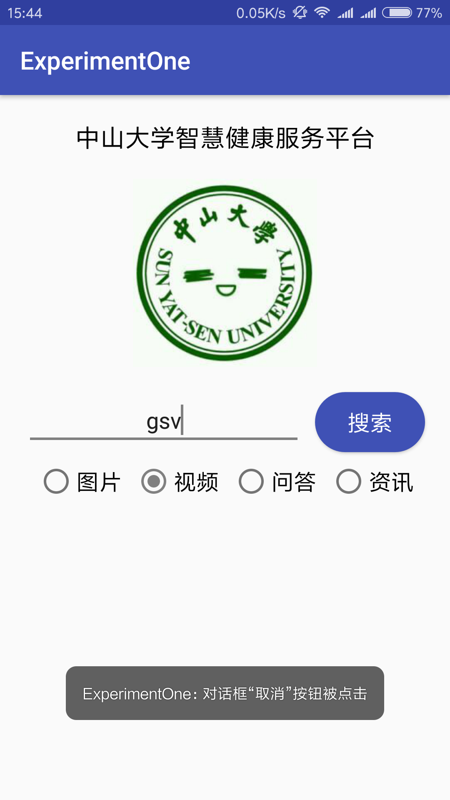
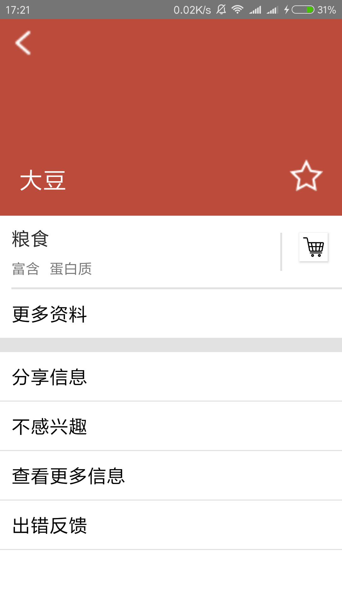

# 中山大学数据科学与计算机学院本科生实验报告
## （2018年秋季学期）
| 课程名称 | 手机平台应用开发 | 任课老师 | 郑贵锋 |
| :------------: | :-------------: | :------------: | :-------------: |
| 年级 | 2016级 | 专业（方向） |  电子政务|
| 学号 | 16340211 | 姓名 |  王广浩|
| 电话 |  17620124723| Email | 1299927852@qq.com |
| 开始日期 | 2018.10.1 | 完成日期 |2018.10.9|

- - - -

# 第三周任务

## 一、实验题目

基本的UI界面设计
- - - -

## 二、实现内容
实现一个Android应用，界面呈现如图中的效果。  
  
#### 要求  
* 该界面为应用启动后看到的第一个界面。  
* 各控件的要求
   1. 标题字体大小**20sp**，与顶部距离**20dp**，居中；
   2. 图片与上下控件的间距均为**20dp**，居中；  
   3. 输入框整体距左右屏幕各间距**20dp**，内容（包括提示内容）如图所示，内容字体大小**18sp**；  
   4. 按钮与输入框间距**10dp**，文字大小**18sp**。按钮背景框左右边框与文字间距**10dp**，上下边框与文字间距**5dp**，圆角半径**180dp**，背景色为**#3F51B5**；  
   5. 四个单选按钮整体居中，与输入框间距10dp，字体大小**18sp**，各个单选按钮之间间距**10dp**，默认选中的按钮为第一个。

#### 使用的组件
TextView、EditText、ConstraintLayout、Button、ImageView、RadioGroup、RadioButton。 

- - - -

## 三、课堂实验结果
### (1)实验截图
  
  
  

### (2)实验步骤以及关键代码
  首先在布局文件中创建一个新的XML文件，然后安装指导中的，采用约束布局，先做最顶层的标题和图片
```xml

   	android:layout_width="match_parent"
    android:layout_height="match_parent"
    tools:context=".MainActivity">

    <TextView
        android:id="@+id/title"
        android:layout_width="wrap_content"
        android:layout_height="wrap_content"
        android:layout_marginTop="20dp"
        android:text="中山大学智慧健康服务平台"
        android:textColor="@color/black"
        android:textSize="20sp"
        app:layout_constraintLeft_toLeftOf="parent"
        app:layout_constraintRight_toRightOf="parent"
        app:layout_constraintTop_toTopOf="parent" />

    <ImageView
        android:id="@+id/image"
        android:layout_width="wrap_content"
        android:layout_height="wrap_content"
        android:layout_marginTop="20dp"
        android:src="@mipmap/sysu"
        app:layout_constraintLeft_toLeftOf="parent"
        app:layout_constraintRight_toRightOf="parent"
        app:layout_constraintTop_toBottomOf="@id/title" />
```
之后是是搜索框还有搜索按钮
```xml
	<EditText
        android:id="@+id/text1"
        android:layout_width="0dp"
        android:layout_height="wrap_content"
        android:layout_marginLeft="20dp"
        android:layout_marginTop="20dp"
        android:gravity="center"
        android:hint="请输入搜索内容"
        android:textSize="18sp"
        app:layout_constraintLeft_toLeftOf="parent"
        app:layout_constraintRight_toLeftOf="@id/button"
        app:layout_constraintTop_toBottomOf="@id/image" />

    <Button
        android:id="@+id/button"
        android:layout_width="wrap_content"
        android:layout_height="wrap_content"
        android:layout_marginRight="20dp"
        android:layout_marginTop="20dp"
        android:layout_marginLeft="10dp"
        android:text="搜索"
        android:textColor="#FFFFFF"
        android:background="@drawable/buttonstyle"
        android:textSize="18sp"
        app:layout_constraintRight_toRightOf="parent"
        app:layout_constraintLeft_toRightOf="@id/text1"
        app:layout_constraintTop_toBottomOf="@id/image" />
```
```xml
<?xml version="1.0" encoding="utf-8"?>
<shape xmlns:android="http://schemas.android.com/apk/res/android">
    <solid android:color="#3F51B5"/>
    <corners android:radius="180dp"/>
    <padding
        android:top="5dp"
        android:bottom="5dp"
        android:left="10dp"
        android:right="10dp"/>
</shape>
```
还有组单选按钮
```xml
<RadioGroup
        android:id="@+id/radioGroup"
        android:layout_width="wrap_content"
        android:layout_height="wrap_content"
        app:layout_constraintTop_toBottomOf="@id/text1"
        android:layout_marginTop="10dp"
        app:layout_constraintLeft_toLeftOf="parent"
        app:layout_constraintRight_toRightOf="parent"
        android:orientation="horizontal">

        <RadioButton
            android:id="@+id/button1"
            style="@style/myButton"
            android:checked="true"
            android:text="图片"
            android:layout_marginLeft="10dp" />
        <RadioButton
            android:id="@+id/button2"
            style="@style/myButton"
            android:text="视频" />
        <RadioButton
            android:id="@+id/button3"
            style="@style/myButton"
            android:text="问答" />
        <RadioButton
            android:id="@+id/button4"
            style="@style/myButton"
            android:text="资讯" />
</RadioGroup>
```
```xml
<resources>

    <!-- Base application theme. -->
    <style name="AppTheme" parent="Base.Theme.AppCompat.Light.DarkActionBar">
        <!-- Customize your theme here. -->
        <item name="colorPrimary">@color/colorPrimary</item>
        <item name="colorPrimaryDark">@color/colorPrimaryDark</item>
        <item name="colorAccent">@color/gray</item>

    </style>
    <style name="myButton">
        <item name="android:layout_width">wrap_content</item>
        <item name="android:layout_height">wrap_content</item>
        <item name="android:textSize">18sp</item>
        <item name="android:layout_weight">1</item>
        <item name="android:layout_marginRight">10dp</item>
    </style>
</resources>
```
### (3)实验遇到的困难以及解决思路
实验中首先遇到的问题就是如何实现空出20dp，直接想到的是直接规定标题的位置，然后发现使用约束布局没有办法指定绝对位置，然后在手册中发现layout_marginTop可以解决这个问题。之后就基本没有大的问题，最后看到自己的界面做好之后，下划线竟然是粉色，看的很别扭，之后在网上找了教程修改了一下。另外安卓自带的虚拟机太卡了，最后还是用的真机。
- - - -

## 四、课后实验结果

- - - -

## 五、实验思考及感想
本次实验主要是基本的UI设计，熟悉安卓中的基本的控件，与java不同的是，采用了XML来生成布局，可以使用自己定义的风格，颜色，字符串，形状等，同时代码看起来很整齐，可以很直接的就能找到代码出错的地方。这次实验主要是对控件的位置以及控件中字体进行相应的操作，符合所给的要求，做出来还是很美观的。

- - - -


# 第四周任务

- - - -

## 一、实验题目
基础的事件处理

- - - -

## 二、实现内容
实现一个Android应用，界面呈现如图中的效果。  

  
#### 要求  
* 该界面为应用启动后看到的第一个界面。  
* 各控件处理的要求
   1. 点击搜索按钮：
      * 如果搜索内容为空，弹出Toast信息“**搜索内容不能为空**”。
      * 如果搜索内容为“Health”，根据选中的RadioButton项弹出如下对话框。  
  
点击“确定”，弹出Toast信息——**对话框“确定”按钮被点击**。  
点击“取消”，弹出Toast 信息——**对话框“取消”按钮被点击**。  
否则弹出如下对话框，对话框点击效果同上。  
  
   2. RadioButton选择项切换：选择项切换之后，弹出Toast信息“**XX被选中**”，例如从图片切换到视频，弹出Toast信息“**视频被选中**”  

- - - -

## 三、课堂实验结果
### (1)实验截图





### (2)实验步骤以及关键代码

#####   在MainActivity中编写java文件。首先是加载布局，之后进行一些控件的获取

```java
 public class MainActivity extends AppCompatActivity {
    @Override
    protected void onCreate(Bundle savedInstanceState) {
        //加载布局
        super.onCreate(savedInstanceState);
        setContentView(R.layout.activity_main);

        final Button button = (Button) findViewById(R.id.button);
        final EditText searchContent = (EditText) findViewById(R.id.text1);
        final AlertDialog.Builder dialog = new AlertDialog.Builder(MainActivity.this);
        final RadioGroup radioGroup = (RadioGroup)findViewById(R.id.radioGroup);
```

##### 之后进行定义弹出的窗口，以及确定和取消按钮和相应的事件

```java
        //窗口生成
        dialog.setTitle("提示");
        // RadioButton rButton = findViewById(radioGroup.getCheckedRadioButtonId());
        dialog.setNegativeButton("取消", new DialogInterface.OnClickListener() {
            @Override
            public void onClick(DialogInterface dialogInterface, int i) {
                // 点击后的事件处理
                Toast.makeText(MainActivity.this, "对话框“取消”按钮被点击", Toast.LENGTH_SHORT).show();
            }
        });
        dialog.setPositiveButton("确定", new DialogInterface.OnClickListener() {
            @Override
            public void onClick(DialogInterface dialogInterface, int i) {
                // 点击后的事件处理
                Toast.makeText(MainActivity.this, "对话框“确定”按钮被点击", Toast.LENGTH_SHORT).show();
            }
        });


```
##### radioGroup的侦听事件

```
//侦听组单选按钮
        radioGroup.setOnCheckedChangeListener(new RadioGroup.OnCheckedChangeListener(){
            @Override
            public void onCheckedChanged(RadioGroup group, int checkedId) {
                final RadioButton rbutton = (RadioButton) findViewById(group.getCheckedRadioButtonId());
                Toast.makeText(getApplication(),rbutton.getText().toString()+"被选中", Toast.LENGTH_SHORT).show();

            }
        });
```
##### 侦听搜索按键按钮

```java
        //侦听搜索按键按钮
        button.setOnClickListener(new View.OnClickListener() {
            @Override
            public void onClick(View view) {
                RadioButton rbutton = (RadioButton) findViewById(radioGroup.getCheckedRadioButtonId());
                if (TextUtils.isEmpty(searchContent.getText().toString())) {
                    // 弹出Toast消息
                    Toast.makeText(MainActivity.this, "搜索内容不能为空", Toast.LENGTH_SHORT).show();
                } else if (TextUtils.equals(searchContent.getText().toString(), "Health")) {
                    dialog.setMessage(rbutton.getText().toString()+"搜索成功");
                    dialog.show();
                }
                else {
                    dialog.setMessage("搜索失败");
                    dialog.show();
                }
            }
        });
    }
}
```


### (3)实验遇到的困难以及解决思路
开始的时候是想着在组按钮切换侦听事件的时候嵌套写搜索按钮的侦听事件，写出来之后整个程序确实比较简洁，运行也基本符合要求，但是在玩耍自己的应用的时候，突然发现初始的时候也就是在图片的时候无法使用搜索功能，这是因为在初始的时候并没有按钮切换事件的发生，所以无法响应搜索按钮事件，只能在外面重新侦听搜索按钮事件，重新获取此时选中的是组按钮中的那一个。
- - - -

## 四、课后实验结果


- - - -

## 五、实验思考及感想
本次实验主要是一些基本的控件的使用，以及按钮的侦听事件。主要需要注意的是侦听的内外层顺序，其实并没有多大的难度，不过确实了解了一些基本的控件使用。但是觉得这还只是大海中的一粒，只有他们还是写不出什么有意思的安卓应用，相信在以后能够学到更多的安卓知识。

- - - -

# 第五周任务

- - - -

## 一、实验题目

Intent、Bundle的使用以及RecyclerView、ListView的应用

- - - -

## 二、实现内容
本次实验模拟实现一个健康食品列表，有两个界面，第一个界面用于呈现食品列表 如下所示

  
数据在"manual/素材"目录下给出。  
点击右下方的悬浮按钮可以切换到收藏夹  
  
上面两个列表点击任意一项后，可以看到详细的信息：  


#### UI要求  

- 食品列表  
  ​    每一项为一个圆圈和一个名字，圆圈和名字都是垂直居中。圆圈内的内容是该食品的种类，内容要处于圆圈的中心，颜色为白色。食品名字为黑色，圆圈颜色自定义，只需能看见圆圈内的内容即可。

- 收藏夹  
  ​    与食品列表相似

- 食品详情界面  

  1. 界面顶部  
       
        顶部占整个界面的1/3。每个食品详情的顶部颜色在数据中已给出。返回图标处于这块区域的左上角，食品名字处于左下角，星标处于右下角，边距可以自己设置。 **返回图标与名字左对齐，名字与星标底边对齐。** 建议用RelativeLayout实现，以熟悉RelativeLayout的使用。  

  2. 界面中部  

     

     使用的黑色argb编码值为#D5000000，稍微偏灰色的“富含”“蛋白质”的argb编码值为#8A000000。"更多资料"一栏上方有一条分割线，argb编码值为#1E000000。右边收藏符号的左边也有一条分割线，要求与收藏符号高度一致，垂直居中。字体大小自定。"更多资料"下方分割线高度自定。这部分所有的分割线argb编码值都是#1E000000。  

  3. 界面底部  
     
     使用的黑色argb编码值为#D5000000。  

- 标题栏  
  ​    两个界面的标题栏都需要去掉  

#### 功能要求

- 使用RecyclerView实现食品列表。点击某个食品会跳转到该食品的详情界面，呈现该食品的详细信息。长按列表中某个食品会删除该食品，并弹出Toast，提示 **"删除XX"** 。
- 点击右下方的FloatingActionButton，从食品列表切换到收藏夹或从收藏夹切换到食品列表，并且该按钮的图片作出相应改变。
- 使用ListView实现收藏夹。点击收藏夹的某个食品会跳转到食品详情界面，呈现该食品的详细信息。长按收藏夹中的某个食品会弹出对话框询问是否移出该食品，点击确定则移除该食品，点击取消则对话框消失。对话框内容如下图所示。
- 商品详情界面中点击返回图标会返回上一层。点击星标会切换状态，如果原本是空心星星，则会变成实心星星；原本是实心星星，则会变成空心星星。点击收藏图表则将该食品添加到收藏夹并弹出Toast提示 **"已收藏"** 。

------

### 验收内容

- 食品列表和收藏夹中，圆圈是圆的，圆圈内的字居中，圆圈和食品名字垂直居中。
- 食品详情界面中，顶部占三分之一的**实现方法**。以及界面顶部各控件的位置与对齐关系。
- 食品详情界面中，中部收藏符号旁边的分割线上下与符号等高且垂直居中。
- 食品列表用RecyclerView实现，收藏夹用ListView实现，食品详情底部的四个操作列表用ListView实现。
- 单击后跳转各项资料显示正确，星星点击后行为正常，返回图表功能正常。
- 食品列表中的食品长按后能正确删除食品，且删除后列表工作正常（点击其他食品显示信息正确，长按其他食品删除操作正确）。
- 收藏夹中的食品长按后弹出框显示内容正确，点击确定后能正确删除食品，且删除后列表工作正常（点击其他食品显示信息正确，长按其他食品删除操作正确）。
- 长按事件能正确处理，不会报错
- 悬浮按钮的功能正确。
- 从收藏夹界面点击食品X进入食品X的详情界面，点击收藏图标后，点击返回按钮，回到收藏夹界面且收藏夹内多出食品X这一项。若在食品X的详情界面没有点击收藏图标，返回后收藏夹界面也不会多出食品X的条目。
- 详情界面点击返回按钮，是返回上一界面，而非跳转到新的界面中，即不是跳转到新建的食品列表界面或收藏夹界面。
- 点击收藏夹界面的"收藏夹"一项，应用不会出错。
- 不做检查的几项：  
  ​    1. 若圆圈为button控件，点击该圆圈后可以不跳转到详情界面。  
  ​    2. UI要求中要求自定的距离，颜色等均不检查。  
  ​    3. 详情界面顶部，中部可不用RelativeLayout实现。  
  ​    4. 详情界面中点击星星图标，图标的状态不需要保存，即再次进入这一项的详情界面，星星图标仍可以是空心星星。  
  ​    5. 点击收藏按钮后，如果不是点击返回图标返回上一级界面，收藏夹内容可以不改变。  
  ​    6. 多次点击某个食品的详情页面的收藏按钮，收藏夹内可以只出现一个或多个该食品。  
- 如果有以上验收内容存在疑问的话，以demo为准。

- - - -

## 三、课堂实验结果
### (1)实验截图





### (2)实验步骤以及关键代码

首先主页面的代码，采用约束布局。

##### main.xml

```xml
<android.support.v7.widget.RecyclerView
        android:id="@+id/recyclerView"
        android:layout_width="match_parent"
        android:layout_height="wrap_content"
        android:visibility="visible"
        />

    <ListView
        android:id="@+id/collect"
        android:layout_width="match_parent"
        android:layout_height="wrap_content"
        android:visibility="invisible">
    </ListView>

    <android.support.design.widget.FloatingActionButton
        android:id="@+id/fButton"
        android:layout_width="wrap_content"
        android:layout_height="wrap_content"
        android:src="@mipmap/collect"
        app:backgroundTint="@color/white"
        app:backgroundTintMode="src_atop"
        app:layout_constraintBottom_toBottomOf="parent"
        app:layout_constraintRight_toRightOf="parent"
        android:layout_margin="25dp"
    />
```

商品详情的布局,总体采用线性布局，对于上面的界面采用相对布局，以及中间一部分也采用相对布局

##### detail.xml

```xml
<!--相对布局-->
<RelativeLayout
    android:id="@+id/Top"
    android:layout_width="match_parent"
    android:layout_height="0dp"
    android:layout_weight="1"
    android:background="@color/colorPrimaryDark">

    <!--返回-->
    <Button
        android:id="@+id/Back"
        android:layout_width="50dp"
        android:layout_height="50dp"
        android:layout_marginStart="10dp"
        android:background="@mipmap/back" />

    <!--星-->
    <Button
        android:id="@+id/Star"
        android:layout_width="35dp"
        android:layout_height="35dp"
        android:layout_alignParentBottom="true"
        android:layout_alignParentEnd="true"
        android:layout_marginBottom="25dp"
        android:layout_marginEnd="20dp"
        android:background="@mipmap/empty_star" />

    <!--名字-->
    <TextView
        android:id="@+id/Name"
        android:layout_width="wrap_content"
        android:layout_height="40dp"
        android:layout_alignParentBottom="true"
        android:layout_alignParentStart="true"
        android:layout_marginBottom="15dp"
        android:layout_marginStart="20dp"
        android:textSize="25sp"
        android:textColor="@color/white" />
</RelativeLayout>

<!--线性布局-->
<LinearLayout
    android:layout_width="match_parent"
    android:layout_height="0dp"
    android:layout_weight="2"
    android:orientation="vertical">
    <!--相对布局-->
    <RelativeLayout
        android:layout_width="match_parent"
        android:layout_height="wrap_content">

        <!--类别-->
        <TextView
            android:id="@+id/Category"
            android:layout_width="wrap_content"
            android:layout_height="wrap_content"
            android:layout_marginStart="12dp"
            android:layout_marginTop="10dp"
            android:textSize="20sp"
            android:textColor="@color/category" />

        <!--富含-->
        <TextView
            android:id="@+id/contain"
            android:layout_width="wrap_content"
            android:layout_height="wrap_content"
            android:layout_alignStart="@+id/Category"
            android:layout_below="@+id/Category"
            android:textSize="15sp"
            android:layout_marginTop="8dp"
            android:textColor="@color/nutrition" />

        <!--营养-->
        <TextView
            android:id="@+id/Nutrition"
            android:layout_width="wrap_content"
            android:layout_height="wrap_content"
            android:layout_alignBottom="@+id/contain"
            android:layout_marginStart="10dp"
            android:textSize="15sp"
            android:layout_toEndOf="@+id/contain"
            android:textColor="@color/nutrition" />

        <!--收藏-->
        <Button
            android:id="@+id/Collect"
            android:layout_width="30dp"
            android:layout_height="30dp"
            android:layout_alignParentEnd="true"
            android:layout_alignTop="@+id/Category"
            android:layout_marginEnd="15dp"
            android:layout_marginTop="8dp"
            android:background="@mipmap/collect" />

        <!--竖线-->
        <View
            android:layout_width="2dp"
            android:layout_height="40dp"
            android:layout_alignTop="@+id/Collect"
            android:layout_marginEnd="18dp"
            android:layout_toStartOf="@+id/Collect"
            android:background="@color/line" />

        <!--横线-->
        <View
            android:id="@+id/line"
            android:layout_width="match_parent"
            android:layout_height="2dp"
            android:layout_alignStart="@+id/contain"
            android:layout_below="@+id/contain"
            android:layout_marginTop="10dp"
            android:background="@color/line" />

    </RelativeLayout>

    <!--更多资料-->
    <ListView
        android:id="@+id/moreinfor"
        android:layout_width="match_parent"
        android:layout_height="wrap_content"
        android:layout_below="@+id/line" />

    <!--横分隔线-->
    <View
        android:layout_width="match_parent"
        android:layout_height="15dp"
        android:background="@color/line" />

    <!--其余选项-->
    <ListView
        android:layout_width="match_parent"
        android:layout_height="match_parent"
        android:id="@+id/listview" />
</LinearLayout>
```

在主页面中每条商品的显示

##### info.xml

```xml
<TextView
    android:id="@+id/cycle"
    android:layout_width="wrap_content"
    android:layout_height="wrap_content"
    android:textSize="22sp"
    android:textColor="@color/white"
    android:background="@drawable/shape"
    android:gravity="center"/>

<TextView
    android:id="@+id/name"
    android:layout_width="0dp"
    android:layout_height="wrap_content"
    android:textSize="25sp"
    android:layout_weight="1"
    android:textColor="@color/black"
    android:padding="15dp" />
```

自己定义的数据集合类

##### Collection.java

```java
public class Collection implements Serializable {

    private String name;
    private String Cycle;
    private String category;
    private String nutrition;
    private String background_colour;

    public Collection(String name, String Cycle, String category, String nutrition, String background_colour) {
        this.name = name;
        this.Cycle = Cycle;
        this.category = category;
        this.nutrition = nutrition;
        this.background_colour = background_colour;
    }
}
```

自己定义的MyViewHolder和MyRecycleViewAdapter均是按照教程手册上打的。

##### MyViewHolder.java

```java
public class MyViewHolder extends RecyclerView.ViewHolder {
    private SparseArray<View> views;
    private View view;

    public MyViewHolder(Context _context, View _view, ViewGroup _viewGroup) {
        super(_view);
        view = _view;
        views = new SparseArray<View>();
    }

    public static MyViewHolder get(Context _context, ViewGroup _viewGroup, int _layoutId) {
        View _view = LayoutInflater.from(_context).inflate(_layoutId, _viewGroup, false);
        MyViewHolder holder = new MyViewHolder(_context, _view, _viewGroup);
        return holder;
    }

    public <T extends View> T getView(int _viewId) {
        View _view = views.get(_viewId);
        if (_view == null) {
            // 创建view
            _view = view.findViewById(_viewId);
            // 将view存入views
            views.put(_viewId, _view);
        }
        return (T) _view;
    }
}
```
##### MyRecyclerViewAdapter.java

```java
public abstract class MyRecyclerViewAdapter<T> extends RecyclerView.Adapter<MyViewHolder> {
    private Context MyContext;
    private int MylayoutId;
    private List<T> Mydata;
    private OnItemClickListener onItemClickListener = null;

    public abstract void convert(MyViewHolder holder, T t);

    public MyRecyclerViewAdapter(Context _context, int _layoutId, List<T> _data) {
        MyContext = _context;
        MylayoutId = _layoutId;
        Mydata = _data;
    }

    @Override
    public MyViewHolder onCreateViewHolder(ViewGroup parent, int viewType) {
        MyViewHolder holder = MyViewHolder.get(MyContext, parent, MylayoutId);
        return holder;
    }

    @Override
    public void onBindViewHolder(final MyViewHolder holder, int position) {
        convert(holder, Mydata.get(position)); // convert函数需要重写，下面会讲
        if (onItemClickListener != null) {
            holder.itemView.setOnClickListener(new View.OnClickListener() {
                @Override
                public void onClick(View view) {
                    onItemClickListener.onClick(holder.getAdapterPosition());
                }
            });
            holder.itemView.setOnLongClickListener(new View.OnLongClickListener() {
                @Override
                public boolean onLongClick(View view) {
                    onItemClickListener.onLongClick(holder.getAdapterPosition());
                    return false;
                }
            });
        }
    }

    @Override
    public int getItemCount() {
        return this.Mydata.size();
    }

    public interface OnItemClickListener {
        void onClick(int position);

        void onLongClick(int position);
    }

    public void setOnItemClickListener(OnItemClickListener _onItemClickListener) {
        this.onItemClickListener = _onItemClickListener;
    }

}
```

 DetailsActivity类，用于显示商品详细信息

#####  DetailsActivity.java

```java
public class DetailsActivity extends AppCompatActivity {
    private boolean tag = false;

    @Override
    protected void onCreate(Bundle savedInstanceState) {

        super.onCreate(savedInstanceState);
        setContentView(R.layout.details);
        Collection c = (Collection) getIntent().getSerializableExtra("Collection");
        RelativeLayout relativeLayout = (RelativeLayout) findViewById(R.id.Top);
        relativeLayout.setBackgroundColor(Color.parseColor(c.getBackground()));

        /* 商品参数获取 */
        TextView name = (TextView) findViewById(R.id.Name);
        TextView Category = (TextView) findViewById(R.id.Category);
        TextView contain = (TextView) findViewById(R.id.contain);
        TextView Nutrition = (TextView) findViewById(R.id.Nutrition);
        name.setText(c.getName());
        Category.setText(c.getCategory());
        contain.setText("富含"); 
        Nutrition.setText(c.getNutrition());
        /* ListView其他选项 */
        String[] operations1 = new String[] { "更多资料" };
        ArrayAdapter<String> arrayAdapter1 = new ArrayAdapter<>(this, R.layout.underlist, operations1);
        ListView listView1 = (ListView) findViewById(R.id.moreinfor);
        listView1.setAdapter(arrayAdapter1);
        String[] options = new String[] { "分享信息", "不感兴趣", "查看更多信息", "出错反馈" };
        ArrayAdapter<String> arrayAdapter = new ArrayAdapter<>(this, R.layout.underlist, options);
        ListView listView = (ListView) findViewById(R.id.listview);
        listView.setAdapter(arrayAdapter);

        /* 返回按钮侦听 */
        Button back = (Button) findViewById(R.id.Back);
        back.setOnClickListener(new View.OnClickListener() {
            @Override
            public void onClick(View v) {
                finish();
            }
        });

        /* 星星切换 */
        final Button star = (Button) findViewById(R.id.Star);
        star.setOnClickListener(new View.OnClickListener() {
            @Override
            public void onClick(View v) {
                if (!tag) {
                    star.setBackground(getResources().getDrawable(R.mipmap.full_star));
                    tag = true;
                } else {
                    star.setBackground(getResources().getDrawable(R.mipmap.empty_star));
                    tag = false;
                }
            }
        });

        /* 收藏按钮侦听 */
        Button collect = (Button) findViewById(R.id.Collect);
        ;
        final TextView Name = findViewById(R.id.Name);
        final TextView Catogary = findViewById(R.id.Category);
        collect.setOnClickListener(new View.OnClickListener() {
            @Override
            public void onClick(View view) {
                Map<String, Object> temp = new LinkedHashMap<>();
                temp.put("cycle", Catogary.getText().toString().substring(0, 1));
                temp.put("name", Name.getText().toString());
                Toast.makeText(DetailsActivity.this, "已收藏", Toast.LENGTH_SHORT).show();
                Intent intent = new Intent(DetailsActivity.this, MainActivity.class);
                Bundle bundle = new Bundle();
                bundle.putSerializable("favoratethings", (Serializable) temp);
                intent.putExtras(bundle);
                setResult(1, intent);
            }
        });

    }
}
```

MainActivity，用于主页面和收藏页面的内部算法实现

##### MainActivity.java

```java
public class MainActivity extends AppCompatActivity {
    boolean click = true;
    FloatingActionButton fButton;
    ListView collect;
    List<Map<String, Object>> collectthings;
    SimpleAdapter mySimpleAdapter;

    @Override
    protected void onActivityResult(int requestCode, int resultCode, Intent intent) {
        if (requestCode == 1 && resultCode == 1) {
            Map<String, Object> t = (Map<String, Object>) intent.getExtras().get("favoratethings");
            this.collectthings.add(t);
            mySimpleAdapter.notifyDataSetChanged();
        }
    }

    @Override
    protected void onCreate(Bundle savedInstanceState) {
        super.onCreate(savedInstanceState);
        setContentView(R.layout.activity_main);
        collect = (ListView) findViewById(R.id.collect);
        fButton = (FloatingActionButton) findViewById(R.id.fButton);
        final RecyclerView recyclerView = (RecyclerView) findViewById(R.id.recyclerView);
        final List<Map<String, Object>> data = new ArrayList<>();
        collectthings = new ArrayList<>();
        Map<String, Object> title = new LinkedHashMap<>();
        title.put("cycle", "*");
        title.put("name", "收藏夹");
        collectthings.add(title);

        /* 收藏按钮侦听 */
        fButton.setOnClickListener(new View.OnClickListener() {
            @Override
            public void onClick(View view) {
                if (click) {
                    collect.setVisibility(View.VISIBLE);
                    recyclerView.setVisibility(View.INVISIBLE);
                    fButton.setImageDrawable(getResources().getDrawable(R.mipmap.mainpage));
                } else {
                    collect.setVisibility(View.INVISIBLE);
                    recyclerView.setVisibility(View.VISIBLE);
                    fButton.setImageDrawable(getResources().getDrawable(R.mipmap.collect));
                }
                click = !click;
            }
        });

        /* 初始化商品 */
        final List<Collection> goodslist = new ArrayList<Collection>() {
            {
                add(new Collection("大豆", "粮", "粮食", "蛋白质", "#BB4C3B"));
                add(new Collection("十字花科蔬菜", "蔬", "蔬菜", "维生素C", "#C48D30"));
                add(new Collection("牛奶", "饮", "饮品", "钙", "#4469B0"));
                add(new Collection("海鱼", "肉", "肉食", "蛋白质", "#20A17B"));
                add(new Collection("菌菇类", "蔬", "蔬菜", "微量元素", "#BB4C3B"));
                add(new Collection("番茄", "蔬", "蔬菜", "番茄红素", "#4469B0"));
                add(new Collection("胡萝卜", "蔬", "蔬菜", "胡萝卜素", "#20A17B"));
                add(new Collection("荞麦", "粮", "粮食", "膳食纤维", "#BB4C3B"));
                add(new Collection("鸡蛋", "杂", "杂", "几乎所有营养物质", "#C48D30")); }
            

        };
        for (int i = 0; i < goodslist.size(); i++) {
            Map<String, Object> temp = new LinkedHashMap<>();
            temp.put("cycle", goodslist.get(i).getCycle());
            temp.put("name", goodslist.get(i).getName());
            data.add(temp);
        }

        /* RecycleView按钮侦听 */
        recyclerView.setLayoutManager(new LinearLayoutManager(this));
        final MyRecyclerViewAdapter myAdapter = new MyRecyclerViewAdapter<Collection>(MainActivity.this, R.layout.goods,
                goodslist) {
            @Override
            public void convert(MyViewHolder holder, Collection s) {
                TextView name = holder.getView(R.id.name);
                name.setText(s.getName());
                TextView cycle = holder.getView(R.id.cycle);
                cycle.setText(s.getCycle());
            }
        };

        myAdapter.setOnItemClickListener(new MyRecyclerViewAdapter.OnItemClickListener() {
            @Override
            public void onClick(int position) {
                Intent intent = new Intent(MainActivity.this, DetailsActivity.class);
                Collection temp = goodslist.get(position);
                intent.putExtra("Collection", temp);
                startActivityForResult(intent, 1);
            }

            @Override
            public void onLongClick(int position) {
                Toast.makeText(getApplication(), "删除" + goodslist.get(position).getName(), Toast.LENGTH_SHORT).show();
                for (int i = 0; i < collectthings.size(); i++) {
                    if (data.get(position).equals(collectthings.get(i))){
                        collectthings.remove(i);
                        break;
                    }
                }
                data.remove(position);
                goodslist.remove(position);
                myAdapter.notifyDataSetChanged();
            }
        });

        /* 设置动画效果 */
        ScaleInAnimationAdapter scaleInAnimationAdapter = new ScaleInAnimationAdapter(myAdapter);
        scaleInAnimationAdapter.setDuration(1000);
        recyclerView.setAdapter((scaleInAnimationAdapter));
        recyclerView.setItemAnimator(new OvershootInLeftAnimator());

        /* collect单击侦听 */
        mySimpleAdapter = new SimpleAdapter(this, collectthings, R.layout.goods, new String[] { "cycle", "name" },
                new int[] { R.id.cycle, R.id.name });
        collect.setAdapter(mySimpleAdapter);

        collect.setOnItemClickListener(new AdapterView.OnItemClickListener() {

            public void onItemClick(AdapterView<?> adapterView, View view, int i, long l) {
                if (i > 0) {
                    Intent intent = new Intent(MainActivity.this, DetailsActivity.class);
                    int pos = 0;
                    final Iterator iter = collectthings.get(i).keySet().iterator();
                    String key = iter.next().toString();
                    String name = collectthings.get(i).get(key).toString();

                    for (pos = 0; pos < goodslist.size(); pos++) {
                        if (name.equals(goodslist.get(pos).getName())) {
                            break;
                        }
                    }
                    if (pos < goodslist.size()) {
                        Collection temp = goodslist.get(pos);
                        intent.putExtra("Collection", temp);
                        startActivity(intent);
                    } else {
                        Toast.makeText(getApplication(), "该食物已被删除", Toast.LENGTH_SHORT).show();
                    }
                }
            }
        });

        /* collect长按侦听 */
        collect.setOnItemLongClickListener(new AdapterView.OnItemLongClickListener() {
            @Override
            public boolean onItemLongClick(AdapterView<?> parent, View view, final int position, long id) {
                if (position > 0) {
                    final Iterator iter = collectthings.get(position).keySet().iterator();
                    Toast.makeText(getApplication(), "删除" + collectthings.get(position).get(iter.next().toString()), 
                            Toast.LENGTH_SHORT).show();
                    collectthings.remove(position);
                    mySimpleAdapter.notifyDataSetChanged();
                }
                return true;
            }
        });
    }
}
```


- - - -

## 四、课后实验结果


- - - -

## 五、实验思考及感想（实验遇到的困难以及解决思路）

​	首先先吐槽一下这个Android Studio，上次的实验打开好好的，结果新建项目后grade怎么都是不过，不管是改host，按照FAQ上的修改源，还是直接暴力科学上网，都是不行。之后果断选择重装Studio，但是又抱了一些侥幸心理，没有重新下载SDK，结果还是不行，无奈只能重新下载近10个G的SDK，并在站长工具上找到了个最快的IP地址，下好后终于可以了，开始自己的打码之旅。感觉这个IDE和VS差的很多，也可能是谷歌并不在中国运营吧，没有服务器，所以针对Grade这种东西难以搞定。

​	然后对于实验本身说一下吧。本次实验真的是比较难的，需要用到很多新的组件，也需要自己定义容器来封装变量，还有各种数据，各种跳转，还有一些Listview和RecycleView以及相适应的Adapter，总之就是很迷，Adapter还有很多种使用方法，看给的教程看的云里雾里。不过总体目标和实现要求给了出来，还给了已经做好的APK程序包，在手机上运行一波，把玩一下，对于要求也是理解了很多。

​	首先开始做布局。主页面的话，按照我的理解，应该有3个组件，第一个应该是主页面显示商品的RecycleView，第二个是收藏页面的ListView，第三个是用于切换的FloatingActionButton。同时设置RecycleView是可见的，FloatingActionButton不可见。

​	对于主页面要求使用RecycleView，就按照给的说明，将所有的数据封装成一个类，跳转时将这个类序列化，并在声明时插入implements Serializable。对于RecycleView这个组件感觉还是很麻烦的，尽管有手册中直接给好的MyRecycleViewAdapter,但是对于如何使用还是很迷茫，无奈只能求助万能的CSDN博客，里面有一些相似的例子，按着进行修改就可以了，不过还是不是特别懂一些用法，相信以后用的多了，自然就懂了。悬浮的按钮教程中也是给了出来，直接按照着敲就可以了，在添加一个侦听事件。不过对于那个依赖文件的添加还是有很大的锅，按我的版本应该是28.0.0，但是加上就是不能grade，无奈科学上网一波，解决而这个问题。还有ListView,不过原来基本和MyRecycleViewAdapter差不多，会了一个另一个就可以了。对于按钮点击后的效果使用一个函数封装，在这个界面切换后进行生效。

​	在商品详细的界面中，布局还是有些难的，首先外部应该是使用一个线性布局，但对于最上面的部分，要采用相对布局，同时在相对布局中设置背景颜色，返回按钮、星星按钮和商品名称都在这个布局中。然后是另一个相对布局，里面是种类和富含的物质以及购物车还有2条线。

后面就可以直接采用线性布局实现了。

​	还有就是在检查后的一些bug，比如TA说的在删除商品和收藏的时候不用弹出会话框确认，直接删除，这个还是比较好改的，但是改玩运行的时候发现在删除列表的商品后，如果此商品被收藏了，收藏夹并没有被删除，果断重新修改RecycleView侦听长按的函数，加了一个遍历选择收藏夹的内容并删除。

​	总体来说此次实验，被实验环境坑了很多，什么各种Grade fail还有一些依赖找不到，一些组件无法识别，重要的还有在AndroidManifest中添加第二个商品详情的java类文件，否则就会出现点击商品出现闪退现象。从项目二来看，大部分是基于这次项目的，以后会更加熟悉这部分的内容。

---