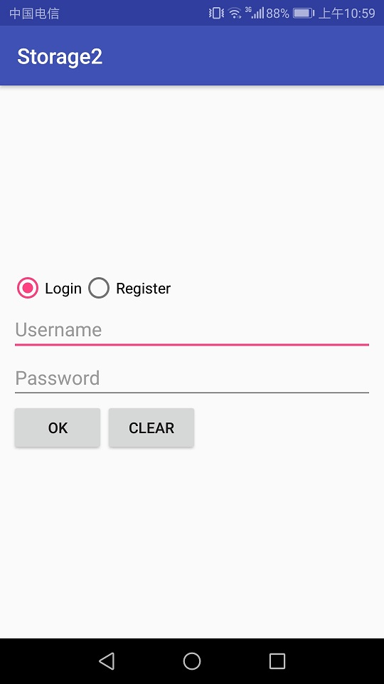
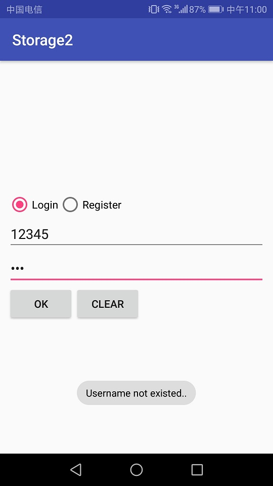
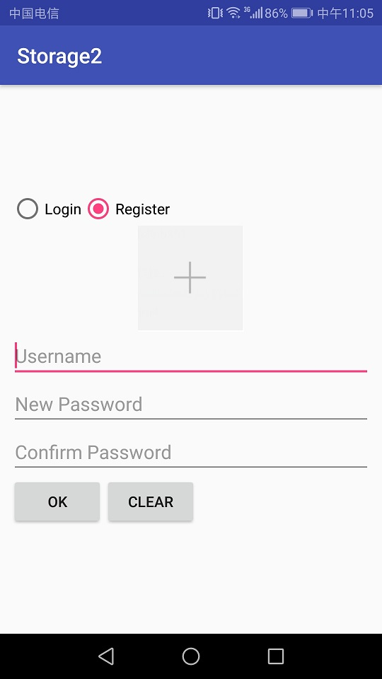
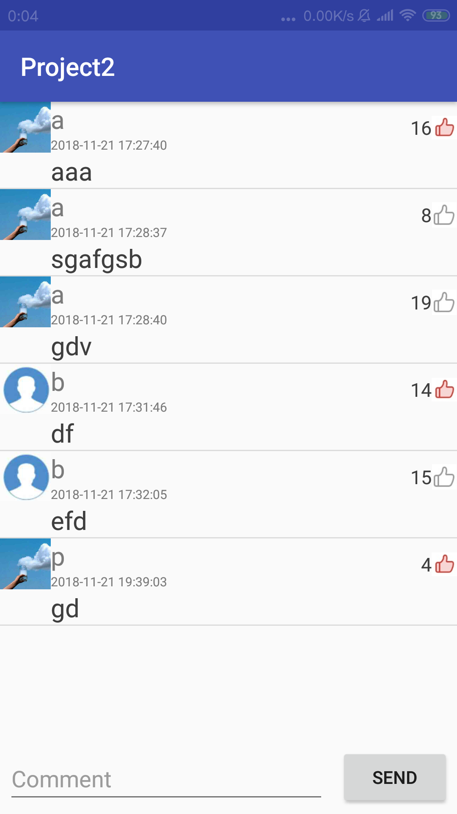
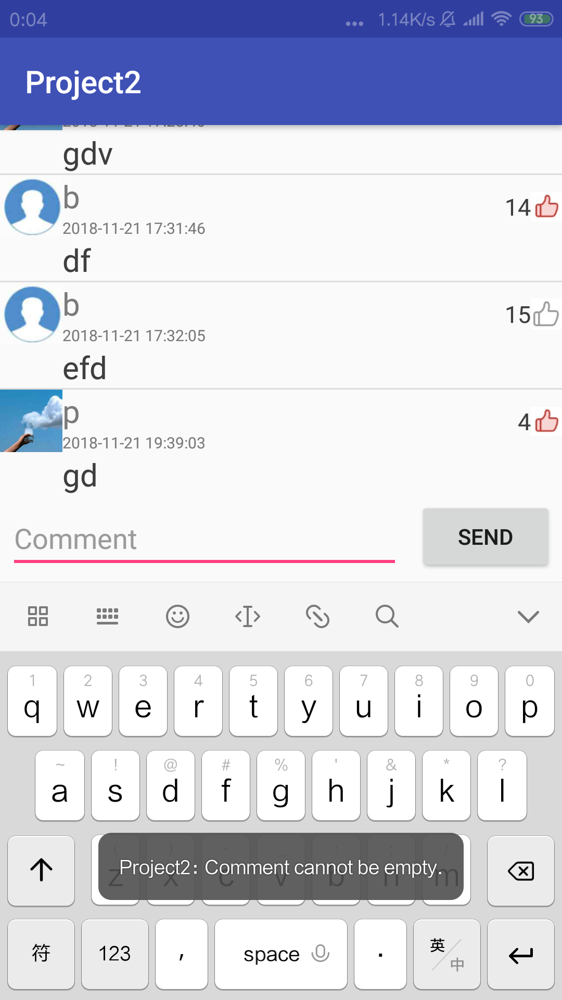

# 中山大学数据科学与计算机学院本科生实验报告

## （2018年秋季学期）
| 课程名称 | 手机平台应用开发 |   任课老师   |      郑贵锋       |
| :------: | :--------------: | :----------: | :---------------: |
|   年级   |      2016级      | 专业（方向） |     电子政务      |
|   学号   |     16340211     |     姓名     |      王广浩       |
|   电话   |   17620124723    |    Email     | 1299927852@qq.com |
| 开始日期 |    2018.11.1     |   完成日期   |    2018.11.14     |

---

[TOC]


# 数据存储（一）

## 一、实验题目

数据存储（一）

---

## 二、实现内容

#### 要求  
* Figure 1：首次进入，呈现创建密码界面。  
   
* Figure 2：若密码不匹配，弹出Toast提示。  
   
* Figure 3：若密码为空，弹出Toast提示。  
   
* Figure 4：退出后第二次进入呈现输入密码界面。  
   
* Figure 5：若密码不正确，弹出Toast提示。  
   
* Figure 6：文件加载失败，弹出Toast提示。  
   
* Figure 7：成功保存文件，弹出Toast提示。  
   
* Figure 8：成功导入文件，弹出Toast提示。  
   
1.  如Figure 1至Figure 8所示，本次实验演示应用包含两个Activity。 
2.  首先是密码输入Activity：
    * 若应用首次启动，则界面呈现出两个输入框，分别为新密码输入框和确认密码输入框。  
    * 输入框下方有两个按钮：  
        - OK按钮点击后：  
            + 若New Password为空，则发出Toast提示。见Figure 3。
            + 若New Password与Confirm Password不匹配，则发出Toast提示，见Figure 2。
            + 若两密码匹配，则保存此密码，并进入文件编辑Activity。
        - CLEAR按钮点击后：清楚两输入框的内容。  
    * 完成创建密码后，退出应用再进入应用，则只呈现一个密码输入框，见Figure 4。
        - 点击OK按钮后，若输入的密码与之前的密码不匹配，则弹出Toast提示，见Figure 5。
        - 点击CLEAR按钮后，清除密码输入框的内容。
    * **出于演示和学习的目的，本次实验我们使用SharedPreferences来保存密码。但实际应用中不会使用这种方式来存储敏感信息，而是采用更安全的机制。见[这里](http://stackoverflow.com/questions/1925486/android-storing-username-and-password)和[这里](http://stackoverflow.com/questions/785973/what-is-the-most-appropriate-way-to-store-user-settings-in-android-application/786588)。**
3.  文件编辑Activity：
    * 界面底部有三个按钮，高度一致，顶对齐，按钮水平均匀分布，三个按钮上方除ActionBar和StatusBar之外的全部空间由一个EditText占据（保留margin）。EditText内的文字竖直方向置顶，左对齐。
    * 在编辑区域输入任意内容，点击SAVE按钮后能保存到指定文件（文件名随意）。成功保存后，弹出Toast提示，见Figure 8。
    * 点击CLEAR按钮，能清空编辑区域的内容。
    * 点击LOAD按钮，能够从同一文件导入内容，并显示到编辑框中。若成功导入，则弹出Toast提示。见Figure 7.若读取文件过程中出现异常（如文件不存在），则弹出Toast提示。见Figure 6.
4.  特殊要求：进入文件编辑Activity后，若点击返回按钮，则直接返回Home界面，不再返回密码输入Activity。

---

### 验收内容
1. 布局显示与Figure 1 至 Figure 8一致。
2. 应用逻辑与上文描述一致。
    * 异常情况弹出Toast提示。
    * 创建密码后重新启动应用，直接显示单个输入框输入密码。
    * 文本编辑页面：能够正常保存和读取文件。
3. 在实验报告中简要描述Internal Storage和External Storage的区别，以及它们的适用场景。
4. 代码+实验报告（先在实验课上检查，检查后再pr）

---

## 三、课堂实验结果
### (1)实验截图


### (2)实验步骤以及关键代码
主页面布局

```xml
<LinearLayout xmlns:android="http://schemas.android.com/apk/res/android"
    android:id="@+id/input"
    android:layout_width="match_parent"
    android:layout_height="wrap_content"
    android:layout_gravity="center"
    android:layout_marginLeft="10dp"
    android:layout_marginRight="10dp"
    android:layout_marginTop="20dp"
    android:orientation="vertical">

    <EditText
        android:id="@+id/NewPassword"
        android:layout_width="match_parent"
        android:layout_height="wrap_content"
        android:hint="@string/New_p"
        android:inputType="textPassword"
        android:textAlignment="textStart"
        android:textSize="18sp" />

    <EditText
        android:id="@+id/ConfirmPassword"
        android:layout_width="match_parent"
        android:layout_height="wrap_content"
        android:hint="@string/Con_p"
        android:inputType="textPassword"
        android:textAlignment="textStart"
        android:textSize="18sp" />

    <LinearLayout
        android:layout_width="wrap_content"
        android:layout_height="wrap_content"
        android:layout_marginTop="15dp"
        android:orientation="horizontal">


        <Button
            android:id="@+id/ok_btn"
            style="@style/Button"
            android:layout_marginLeft="4dp"
            android:text="@string/OK" />

        <Button
            android:id="@+id/clear_btn0"
            style="@style/Button"
            android:layout_marginLeft="10dp"
            android:text="@string/CLEAR" />

    </LinearLayout>

</LinearLayout>
```

编辑框布局

```xml
<?xml version="1.0" encoding="utf-8"?>
<android.support.constraint.ConstraintLayout xmlns:android="http://schemas.android.com/apk/res/android"
    android:layout_width="match_parent"
    android:layout_height="match_parent">

    <LinearLayout
        android:layout_width="match_parent"
        android:layout_height="match_parent"
        android:orientation="vertical">

        <EditText
            android:id="@+id/file"
            android:layout_width="match_parent"
            android:layout_height="wrap_content"
            android:layout_weight="1"
            android:gravity="top"/>

        <RelativeLayout
            android:id="@+id/FileButtons"
            android:layout_width="fill_parent"
            android:layout_height="wrap_content">
            <Button
                android:id="@+id/save_btn"
                android:layout_width="wrap_content"
                android:layout_height="wrap_content"
                android:layout_weight="1"
                android:layout_marginLeft="30dp"
                android:layout_marginRight="20dp"
                android:text="@string/SAVE" />
            <Button
                android:id="@+id/load_btn"
                android:layout_width="wrap_content"
                android:layout_height="wrap_content"
                android:layout_toRightOf="@id/save_btn"
                android:layout_weight="1"
                android:text="@string/LOAD" />
            <Button
                android:id="@+id/clear_btn"
                android:layout_width="wrap_content"
                android:layout_height="wrap_content"
                android:layout_toRightOf="@id/load_btn"
                android:layout_weight="1"
                android:layout_marginLeft="20dp"
                android:text="@string/CLEAR" />
        </RelativeLayout>
    </LinearLayout>
</android.support.constraint.ConstraintLayout>
```

AndroidManifest.xml

```xml
<?xml version="1.0" encoding="utf-8"?>
<manifest xmlns:android="http://schemas.android.com/apk/res/android"
    package="com.example.wang.myapplication">

    <application
        android:allowBackup="true"
        android:icon="@mipmap/ic_launcher"
        android:label="Storage1"
        android:roundIcon="@mipmap/ic_launcher_round"
        android:supportsRtl="true"
        android:theme="@style/AppTheme">
        <activity android:name=".MainActivity" android:noHistory="true">
            <intent-filter>
                <action android:name="android.intent.action.MAIN" />

                <category android:name="android.intent.category.LAUNCHER" />
            </intent-filter>
        </activity>
        <activity android:name=".EditorActivity"></activity>
    </application>

</manifest>
```

MainActivity.java

```java
package com.example.wang.myapplication;

import android.content.Context;
import android.content.Intent;
import android.content.SharedPreferences;
import android.content.pm.PackageManager;
import android.support.v7.app.AppCompatActivity;
import android.os.Bundle;
import android.text.TextUtils;
import android.view.View;
import android.widget.Button;
import android.widget.EditText;
import android.widget.Toast;

public class MainActivity extends AppCompatActivity {

    public static final String PREFERENCE_NAME = "Password";
    public static final String PREFERENCE_PACKAGE = "com.example.wang.myapplication";
    public static final int MODE = Context.MODE_PRIVATE;
    private boolean tag = true;

    @Override
    protected void onCreate(Bundle savedInstanceState) {
        super.onCreate(savedInstanceState);
        setContentView(R.layout.activity_main);
        final EditText new_password = findViewById(R.id.NewPassword);
        final EditText con_password = findViewById(R.id.ConfirmPassword);
        final Button ok = findViewById(R.id.ok_btn);
        final Button clear = findViewById(R.id.clear_btn0);
        Context context = null;
        try {
            context = this.createPackageContext(PREFERENCE_PACKAGE,Context.CONTEXT_IGNORE_SECURITY);
        }
        catch (PackageManager.NameNotFoundException e) {
            e.printStackTrace();
        }
        SharedPreferences sharedPref = context.getSharedPreferences(PREFERENCE_NAME, MODE);
        final SharedPreferences.Editor editor = sharedPref.edit();
        final String spassword = sharedPref.getString("Password", null);
        if (spassword != null) {
            tag = false;
            new_password.setVisibility(View.INVISIBLE);
            con_password.setHint("Password");
        }

        //清除按钮侦听
        clear.setOnClickListener(new View.OnClickListener() {
            @Override
            public void onClick(View view) {
                con_password.setText("");
                new_password.setText("");
            }
        });

        // OK按钮侦听
        ok.setOnClickListener(new View.OnClickListener() {
            @Override
            public void onClick(View view) {
                String password1 = new_password.getText().toString();
                String password2 = con_password.getText().toString();
                //注册时
                if(tag) {
                    if (TextUtils.isEmpty(password1) && TextUtils.isEmpty(password2)){
                        Toast.makeText(MainActivity.this, "Password cannot be empty.", Toast.LENGTH_SHORT).show();
                    }
                    else if (!password1.equals(password2)) {
                        Toast.makeText(MainActivity.this, "Password Mismatch.", Toast.LENGTH_SHORT).show();
                    }
                    else {
                        editor.putString("Password", password1);
                        editor.commit();
                        tag = false;
                        new_password.setVisibility(View.INVISIBLE);
                        con_password.setHint("Password");
                        con_password.setText("");
                        Intent intent = new Intent(MainActivity.this, EditorActivity.class);
                        startActivity(intent);
                    }
                }
                //登陆时
                else {
                    if (TextUtils.isEmpty(password2)) {
                        Toast.makeText(MainActivity.this, "Password cannot be empty.", Toast.LENGTH_SHORT).show();
                    }
                    else if (password2.equals(spassword) || password2.equals(password1)){
                        con_password.setText("");
                        Intent intent = new Intent(MainActivity.this, EditorActivity.class);
                        startActivity(intent);
                    }
                    else {
                        Toast.makeText(MainActivity.this, "Invalid Password.", Toast.LENGTH_SHORT).show();
                    }
                }
            }
        });
    }
}
```

EditorActivity.java

```java
package com.example.wang.myapplication;

import android.content.Intent;
import android.os.Bundle;
import android.support.v7.app.AppCompatActivity;
import android.view.View;
import android.widget.Button;
import android.widget.EditText;
import android.widget.Toast;

import java.io.FileInputStream;
import java.io.FileOutputStream;
import java.io.IOException;

public class EditorActivity extends AppCompatActivity {

    private String filename = "test_text";

    @Override
    protected void onCreate(Bundle savedInstanceState) {
        super.onCreate(savedInstanceState);
        setContentView(R.layout.actvity_edit);
        Button save = findViewById(R.id.save_btn);
        Button load = findViewById(R.id.load_btn);
        Button clear = findViewById(R.id.clear_btn);
        final EditText file = findViewById(R.id.file);

        //SAVE按钮侦听
        save.setOnClickListener(new View.OnClickListener() {
            @Override
            public void onClick(View view) {
                try (FileOutputStream fileOutputStream = openFileOutput(filename, MODE_PRIVATE)) {
                    String input = file.getText().toString();
                    fileOutputStream.write(input.getBytes());
                    Toast.makeText(EditorActivity.this, "Save successfully.", Toast.LENGTH_SHORT).show();
                } catch (IOException ex) {
                    Toast.makeText(EditorActivity.this, "Fail to save file.", Toast.LENGTH_SHORT).show();
                }
            }
        });
        //LOAD按钮侦听
        load.setOnClickListener(new View.OnClickListener() {
            @Override
            public void onClick(View view) {
                try (FileInputStream fileInputStream = openFileInput(filename)) {
                    byte[] contents = new byte[fileInputStream.available()];
                    fileInputStream.read(contents);
                    file.setText(new String(contents));
                    Toast.makeText(EditorActivity.this, "Load successfully.", Toast.LENGTH_SHORT).show();
                } catch (IOException ex) {
                    Toast.makeText(EditorActivity.this, "Fail to load file.", Toast.LENGTH_SHORT).show();
                }
            }
        });

        clear.setOnClickListener(new View.OnClickListener() {
            @Override
            public void onClick(View view) {
                file.setText("");
            }
        });

    }
    @Override
    public void onBackPressed(){
        super.onBackPressed();
        Intent intent = new Intent(Intent.ACTION_MAIN);
        intent.addCategory(Intent.CATEGORY_HOME);
        startActivity(intent);
    }
}
```


### (3)实验遇到的困难以及解决思路

- 无法找到/data/data/<package name>/shared_prefs/ 目录 ：使用DDMS的文件浏览器，但是网上大多是2.3的版本，android3.1.4版本在左下角可以快速找到
- 从文本编辑页面直接退到主页面，之后从主页面再次进入：开始并没有使用noHistory模式，而是选择重载了`onBackPressed()`函数，让其可以直接返回主页面，但是在第一次开启应用时候，在文本编辑页面返回后再次进入会进入到一个登陆界面，但此时没有进行文件读取，所以无法登陆，最后采用在注册成功登陆界面的时候保存当时密码，用于在返回后重新登陆时的验证。不过后来发现了noHistory这种更好的方法。

---

## 四、课后实验结果
Internal Storage和External Storage的区别，以及它们的适用场景

内部存储： 
/data/data/目录下都是已安装的应用程序的安装目录， 该目录下包含的文件都是以包名作为文件名的目录/data/data/packagename/。 内部存储的文件是应用的私有文件，其他应用（和用户）不能访问这些文件。每个应用访问自己的内部存储是不需要权限的。 当用户卸载应用时，这些文件也会被移除。 context.getDir(String name, String mode)可创建并返回一个内部存储的文件，mode用于指示文件的创建模式，指定为MODE_PRIVATE 将会把文件设为应用的私有文件。 内部存储中的两个重要目录：app文件夹和data文件夹。

外部存储可以是外置SD卡 ，也可以是内置存储卡 的部分分区。SD卡使用的是FAT（File Allocation Table）的文件系统，不支持访问模式和权限控制，但可以通过Linux文件系统的文件访问权限的控制保证文件的私密性。SD卡适用于保存大尺寸的文件或者是一些无需设置访问权限的文件，可以保存录制的大容量的视频文件和音频文件等。在使用外部存储执行任何工作之前，应始终调用 getExternalStorageState() 以检查介质是否可用。介质可能已装载到计算机，处于缺失、只读或其他某种状态。

1. Android4.4以前访问私有目录和公共目录都需要申请 WRITE_EXTERNAL_STORAGE 权限
2. Android4.4以后访问私有目录不需要申请权限，但公共目录是需要申请 WRITE_EXTERNAL_STORAGE 权限

---

## 五、实验思考及感想
本次实验主要是熟悉一些基本的文件操作，主要是内部储存的操作，其实实验内容比较简单，可能是顾及到期中的项目吧。不过整个实验的知识容量还是挺大的，还附带了Activity之间的切换的小部分知识。同时也加深了对于UI控件的使用，比如密码模式，获取EditText的文本内容，还有一些布局的熟悉，但总体来说比较简单，同时开发中遇到的困难也比较少。

---

#### 作业要求
* 命名要求：学号_姓名_实验编号，例如12345678_张三_lab1.md
* 实验报告提交格式为md
* 实验内容不允许抄袭，我们要进行代码相似度对比。如发现抄袭，按0分处理

---

# 数据存储（二）

---

## 一、实验题目
数据存储（二）

---

## 二、实现内容
### 实验内容


实现一个评论应用，本次实验虽然号称是（二），但是和（一）无法合并到同一个项目当中，因此本实验应当新建一个项目，而不是在（一）的基础上继续开发。

#### 要求  

<table>
    <tr>
        <td >点击Login切换到登录界面</td>
        <td >图1.2 若Username为空，则发出Toast提示</td>
    </tr>
    <tr>
        <td>图1.3 若Password为空，则发出Toast提示</td>
        <td >图1.4 若Username不存在，则发出Toast提示 </td>
    </tr>
    <tr>
        <td> 图1.5 若密码不正确，则发出Toast提示</td>
        <td></td>
    </tr>
    <tr>
        <td>图2.1 点击Register切换到注册页面</td>
        <td >图2.2 若Username为空，则发出Toast提示 </td>
    </tr>
    <tr>
        <td>图2.3 若New Password为空，则发出Toast提示</td>
        <td >图2.4 若New Password与Confirm Password不匹配，则发出Toast提示 </td>
    </tr>
    <tr>
        <td>图2.5 若Username已经存在，则发出Toast提示</td>
        <td > </td>
    </tr>  
    <tr>
        <td>图3.1 评论页面</td>
        <td >图3.2 若EditText为空，则发出Toast提示 </td>
    </tr>  
    <tr>
        <td>图3.3 短按评论：弹出对话框，显示该评论的用户以及通讯录中该用户的电话号码</td>
        <td >图3.4 短按评论：弹出对话框，显示该评论的用户以及通讯录中该用户的电话号码 </td>
    </tr>  
    <tr>
        <td>图3.5 弹出是否删除的对话框</td>
        <td >图3.6 弹出是否举报的对话框 </td>
    </tr>  
    <tr>
        <td>图4.1 进入手机图库进行图片选择</td>
        <td >图4.2 ImageView显示本次选择的图片 </td>
    </tr>  
    <tr>
        <td>图4.3 在评论页面，每条Item应当正确显示用户的头像</td>
        <td > </td>
    </tr>  
</table>


* #### 技术要求： 
    1. 使用SQLite数据库保存用户的相关信息和评论的相关信息，使得每次运行程序都可以使用数据库进行用户的登陆与注册，以及显示数据库中的评论；
    2. 使用ContentProvider来获取对应用户的电话号码；
* #### 功能要求：  
    1. 如图1至图8所示，本次实验演示应包含2个Activity。
    2. 首页Activity包含登录功能和注册功能，通过radioButton在两个页面进行切换,在登陆界面输入正确的用户名和密码后跳转到评论页面。
    3. 评论Activity,界面由ListView、EditText和Button组成，ListView中展示数据库中保存的评论信息，在EditText写评论，点击Send按钮发送评论。
    4. 首页Activity：
        * 应用启动时，界面初始化为登录界面，通过Login和Register两个RadioButton进行登录与注册之间的切换。
        * 点击Login切换到登录界面（见图1.1），可以保留注册界面时的Username，但不保存密码：
            - OK按钮点击后：
                + 若Username为空，则发出Toast提示。见图1.2.
                + 若Password为空，则发出Toast提示。见图1.3.
                + 若Username不存在，则发出Toast提示。见图1.4.
                + 若密码不正确，则发出Toast提示。见图1.5.
            - CLEAR按钮点击后：清除两个输入框的内容。
        * 点击Register切换到注册页面（见图2.1），可以保留登录界面时的Username，但不保存密码，在输入框和RadioButto之间存在一个头像ImageView，水平居中：
            - OK按钮点击后：
                + 若Username为空，则发出Toast提示。见图2.2.
                + 若New Password为空，则发出Toast提示。见图2.3.
                + 若New Password与Confirm Password不匹配，则发出Toast提示。见图2.4.
                + 若Username已经存在，则发出Toast提示。见图2.5. 
            - CLEAR按钮点击后：清除三个输入框的内容。
    5. 评论页面：
        * 界面底部有一个EditText和一个按钮，高度一致，EditText占据按钮左边的全部空间。上方的全部剩余空间由一个ListView占据（保留margin）。见图3.1.
        * ListView中的每条Item，包含了头像、点赞按钮这两个ImageView和用户名、评论时间、评论内容、点赞数这4个TextView。
            - 用户名、评论时间、评论内容在头像的右边。
            - 点赞按钮在Item的最右边，而且在用户名+评论时间的总高度上处于竖直方向上居中，**注意：总高度不包括评论占据的高度**
            - 点赞数在点赞按钮的左边，竖直方向居中要求同点赞按钮。
            - **以下样式供参考，不做强制要求，但要求至少美观：**
                + Item整体margin：10dp，
                + 头像width、hight：40sp，
                + 用户名textColor：#7a7a7a、textSize：20sp
                + 评论时间textColor：#7a7a7a、textSize：10sp
                + 评论textColor：#3e3e3e、textSize：20sp
                + 点赞数textSize：15sp 
        * 点击EditText写评论
        * 点击Send按钮发送评论
            - 若EditText为空，则发出Toast提示。如图3.2.
            - 若EditText不为空，则发送评论，在数据库和ListView中添加新评论。
        * ListView中的Item点击事件：
            - 短按评论：弹出对话框，显示该评论的用户以及通讯录中该用户的电话号码。如图3.3和图3.4.
            - 长按评论：
                + 若该评论为当前用户发送的，弹出是否删除的对话框,若选择了Yes，则删除该条评论并更新数据库和ListView。如图3.5.
                + 若该评论不为当前用户发送的，弹出是否举报的对话框，若选择了Yes，则弹出Toast提示，不需做任何数据库和ListView的更改。如图3.6.

    **附加内容（加分项，本次实验与（一）合计100分，加分项每项占10分）**

    1. **头像**
        在用户注册页面可以选择用户头像，ImageView初始化为图add，如图2.1。点击ImageView，进入手机图库进行图片选择。如图4.1.
        * 如果正确选择了一张图片，则ImageView显示本次选择的图片。如图4.2.
        * 如果没有正确选择图片（如在图片选择页面点击了取消或按了手机的BACK键），则ImageView保留本次点击事件发生前的状态，如初始的＋号图片，如图4.1，或者是上一个被正确选择的图像。如图4.2.
          在评论页面，每条Item应当正确显示用户的头像，如果用户没有在注册页面选择头像，则使用默认头像。如图4.3.
    2. **点赞**
        在评论界面，点赞按钮可以被点击，点赞数可以正常统计，用户点赞状态可以被正常记录，白色的未点赞状态经用户点击后变为红色的点赞状态，点赞数加1；再次点击点赞按钮可取消点赞，点赞数减1.要求用数据库记录点赞的信息，使得应用重启后用户的点赞状态，评论的点赞数可以正常显示，注意：用户的对每条评论的点赞状态是唯一的，即不同用户对每条评论的点赞状态应当分开记录，同一用户对不同评论的点赞状态也应当分开记录。同理，每条评论的点赞数也应当分开记录。请参考demo自行体会。

    **对附加内容的补充（不想做加分项的看这里）**

    1. **头像**
        在用户注册页面的ImageView显示为默认头像，且不需要添加任何的点击事件监听器，在评论页面的用户头像也使用默认头像。
    2. **点赞**
        不需要为点赞按钮添加点击事件监听器，关于点赞状态和点赞数使用随机数进行生成即可，也不要求用数据库记录点赞状态和点赞数。  

    3. **虽然点击事件的逻辑可以不做，但是界面的样式是必须按照前文做的！**

---

### 验收内容
1. 布局显示上文描述一致。
2. 应用逻辑与上文描述一致。
3. 在实验报告中写明本次实验的数据库中全部的表的信息，以及重要的SQL语句（如创建、查询、插入、删除等），对完成加分项的同学要额外写明如何用数据库存头像，如何设计评论与用户之间点赞关系的关联表。
4. 完成加分项“点赞”的同学在实验报告中写明如何实现的点击事件，以及点赞状态和点赞数是如何获取的。
5. 代码+实验报告（先在实验课上检查，检查后再pr）

---

## 三、课堂实验结果
---
### (1)实验截图








---
### (2)实验步骤以及关键代码

#### 程序结构：


#### 布局文件：

##### activity_main.xml

主页UI设计

```xml
<LinearLayout xmlns:android="http://schemas.android.com/apk/res/android"
    android:id="@+id/input"
    android:layout_width="match_parent"
    android:layout_height="wrap_content"
    android:layout_gravity="center"
    android:layout_marginLeft="10dp"
    android:layout_marginRight="10dp"
    android:layout_marginTop="20dp"
    android:orientation="vertical">

    <RadioGroup
        android:id="@+id/radioGroup"
        android:layout_width="wrap_content"
        android:layout_height="wrap_content"
        android:layout_marginTop="10dp"
        android:orientation="horizontal">

        <RadioButton
            android:id="@+id/Login"
            style="@style/Button1"
            android:checked="true"
            android:text="Login"
            android:layout_marginLeft="10dp" />
        <RadioButton
            android:id="@+id/Register"
            style="@style/Button1"
            android:text="Register" />

    </RadioGroup>

    <ImageView
        android:id="@+id/image"
        android:layout_width="80dp"
        android:layout_height="80dp"
        android:layout_gravity="center"
        android:src="@mipmap/add"
        android:visibility="gone"/>

    <EditText
        android:id="@+id/User"
        android:layout_width="match_parent"
        android:layout_height="wrap_content"
        android:hint="@string/user"
        android:inputType="none"
        android:textAlignment="textStart"
        android:textSize="18sp" />
    <EditText
        android:id="@+id/Password"
        android:layout_width="match_parent"
        android:layout_height="wrap_content"
        android:hint="@string/password"
        android:inputType="textPassword"
        android:textAlignment="textStart"
        android:textSize="18sp" />

    <EditText
        android:id="@+id/NewPassword"
        android:layout_width="match_parent"
        android:layout_height="wrap_content"
        android:hint="@string/password"
        android:inputType="textPassword"
        android:textAlignment="textStart"
        android:textSize="18sp"
        android:visibility="gone"/>

    <EditText
        android:id="@+id/ConfirmPassword"
        android:layout_width="match_parent"
        android:layout_height="wrap_content"
        android:hint="@string/Con_p"
        android:inputType="textPassword"
        android:textAlignment="textStart"
        android:textSize="18sp"
        android:visibility="gone"/>


    <LinearLayout
        android:layout_width="wrap_content"
        android:layout_height="wrap_content"
        android:layout_marginTop="15dp"
        android:orientation="horizontal">

        <Button
            android:id="@+id/ok_btn"
            style="@style/Button"
            android:layout_marginLeft="4dp"
            android:text="@string/OK" />

        <Button
            android:id="@+id/clear_btn0"
            style="@style/Button"
            android:layout_marginLeft="10dp"
            android:text="@string/CLEAR" />

    </LinearLayout>

</LinearLayout>
```

##### activity_comment.xml

负责评论页的UI设计

```xml
<?xml version="1.0" encoding="utf-8"?>
<RelativeLayout xmlns:android="http://schemas.android.com/apk/res/android"
    xmlns:tools="http://schemas.android.com/tools"
    android:layout_width="match_parent"
    android:layout_height="match_parent">

    <ListView
        android:id="@+id/listView"
        android:layout_width="wrap_content"
        android:layout_height="wrap_content"
        android:layout_alignParentTop="true"
        android:layout_above="@id/Comment"/>


    <EditText
        android:id="@+id/Comment"
        android:layout_width="wrap_content"
        android:layout_height="wrap_content"
        android:layout_alignParentBottom="true"
        android:layout_alignParentLeft="true"
        android:layout_toLeftOf="@+id/send_btn"
        android:layout_margin="5dp"
        android:hint="@string/COMMENT"
        android:inputType="text"
        android:textAlignment="textStart"
        android:textSize="18sp" />
    <Button
        android:id="@+id/send_btn"
        android:layout_width="wrap_content"
        android:layout_height="wrap_content"
        android:layout_alignParentBottom="true"
        android:layout_alignParentRight="true"
        android:layout_margin="5dp"
        android:text="@string/SEND" />
</RelativeLayout>
```

##### item.xml

用于listview控件

```xml
<?xml version="1.0" encoding="utf-8"?>
<android.support.constraint.ConstraintLayout xmlns:android="http://schemas.android.com/apk/res/android"
    android:layout_width="match_parent"
    android:layout_height="match_parent"                                          	     android:descendantFocusability="blocksDescendants"
    xmlns:app="http://schemas.android.com/apk/res-auto"
    android:layout_margin="10dp">

    <!-- 定义一个用于显示头像的ImageView -->
    <ImageView
        android:id="@+id/myicon"
        android:layout_width="40sp"
        android:layout_height="40sp"
        android:src="@mipmap/me"
        app:layout_constraintLeft_toLeftOf="parent"/>

    <TextView
        android:id="@+id/name"
        android:layout_width="wrap_content"
        android:layout_height="wrap_content"
        app:layout_constraintTop_toTopOf="parent"
        app:layout_constraintLeft_toRightOf="@id/myicon"
        android:textColor="#7a7a7a"
        android:text="name"
        android:textSize="20sp" />
    <TextView
        android:id="@+id/date"
        android:layout_width="wrap_content"
        android:layout_height="wrap_content"
        android:inputType="datetime"
        app:layout_constraintTop_toBottomOf="@id/name"
        app:layout_constraintLeft_toRightOf="@id/myicon"
        android:textColor="#7a7a7a"
        android:text="date"
        android:textSize="10sp" />
    <TextView
        android:id="@+id/says"
        android:layout_width="wrap_content"
        android:layout_height="wrap_content"
        android:textColor="#3e3e3e"
        app:layout_constraintTop_toBottomOf="@id/date"
        app:layout_constraintLeft_toRightOf="@id/myicon"
        android:text="comment"
        android:textSize="20sp" />

    <ImageView
        android:id="@+id/zan"
        android:layout_width="20dp"
        android:layout_height="20dp"
        app:layout_constraintRight_toRightOf="parent"
        app:layout_constraintTop_toTopOf="@+id/name"
        app:layout_constraintBottom_toBottomOf="@id/date"
        android:src="@mipmap/white" />

    <TextView
        android:id="@+id/num"
        android:layout_width="wrap_content"
        android:layout_height="wrap_content"
        android:inputType="numberDecimal"
        android:textColor="#3e3e3e"
        app:layout_constraintBottom_toBottomOf="@id/zan"
        app:layout_constraintRight_toLeftOf="@id/zan"
        android:text="15"
        android:textSize="15sp" />

</android.support.constraint.ConstraintLayout>
```

#### JAVA文件：

##### myDB.java

自定义数据库

```java
package com.example.wang.project2;

import android.content.ContentValues;
import android.content.Context;
import android.database.sqlite.SQLiteDatabase;
import android.database.sqlite.SQLiteOpenHelper;
import android.util.Log;
import android.widget.Toast;

public class myDB extends SQLiteOpenHelper {
    private static final String DB_NAME= "db_name";
    private  static final String TABLE_NAME1 = "user";
    private  static final String TABLE_NAME2 = "comment";
    private static final int DB_VERSION = 1;

    public myDB(Context context, String name, SQLiteDatabase.CursorFactory factory, int version) {
        super(context, name, factory, version);
    }

    @Override
    public void onCreate(SQLiteDatabase sqLiteDatabase) {
        String CREATE_TABLE1 = "CREATE TABLE if not exists "
                + TABLE_NAME1
                + " (name TEXT PRIMARY KEY, password TEXT, icon BLOB)";
        sqLiteDatabase.execSQL(CREATE_TABLE1);
        String CREATE_TABLE2 = "CREATE TABLE "
                + TABLE_NAME2
                + " (date TEXT PRIMARY KEY, name TEXT,speak TEXT,num INTEGER,zan INTEGER)";
        sqLiteDatabase.execSQL(CREATE_TABLE2);
    }
    @Override
    public void onUpgrade(SQLiteDatabase sqLiteDatabase, int i, int ii) {
    }
}
```

##### CommentInfo.java

评论封装类，包含评论的各个属性

```java
package com.example.wang.project2;

import android.graphics.Bitmap;

public class CommentInfo  {
    private String Name;
    private String Speak;
    private Bitmap aIcon;
    private String Date;
    private int Num;
    private int Zan;

    public CommentInfo() {
    }

    public CommentInfo(String Name, String Speak, Bitmap aIcon, String Date, int Num,int Zan) {
        this.Name = Name;
        this.Speak = Speak;
        this.aIcon = aIcon;
        this.Date = Date;
        this.Num = Num;
        this.Zan = Zan;
    }

    public String getName() {
        return Name;
    }

    public String getSpeak() {
        return Speak;
    }

    public Bitmap getIcon() {
        return aIcon;
    }
    public int getNum(){
        return Num;
    }
    public int getZan(){
        return Zan;
    }
    public String getDate(){
        return Date;
    }

    public void setName(String Name) {
        this.Name = Name;
    }

    public void setSpeak(String Speak) {
        this.Speak = Speak;
    }


    public void setNum(int Num) {
        this.Num = Num;
    }
}
```

##### MyAdapter.java

自定义Adapter

```java
package com.example.wang.project2;

import android.content.Context;
import android.view.LayoutInflater;
import android.view.View;
import android.view.ViewGroup;
import android.widget.BaseAdapter;
import android.widget.ImageView;
import android.widget.TextView;

import java.util.LinkedList;

public class MyAdapter extends BaseAdapter {

    private LinkedList<CommentInfo> mData;
    private Context mContext;

    public MyAdapter(LinkedList<CommentInfo> mData, Context mContext) {
        this.mData = mData;
        this.mContext = mContext;
    }

    @Override
    public int getCount() {
        return mData.size();
    }

    @Override
    public long getItemId(int i) {
        return i;
    }

    public void add(CommentInfo data) {
        if (mData == null) {
            mData = new LinkedList<>();
        }
        mData.add(data);
        notifyDataSetChanged();
    }
    public void remove(int position) {
        if(mData != null) {
            mData.remove(position);
        }
        notifyDataSetChanged();
    }

    @Override
    public View getView(int position, View convertView, ViewGroup parent) {
        convertView = LayoutInflater.from(mContext).inflate(R.layout.item,parent,false);
        ImageView img_icon = (ImageView) convertView.findViewById(R.id.myicon);
        ImageView img_zan = (ImageView) convertView.findViewById(R.id.zan);
        TextView txt_aNum = (TextView) convertView.findViewById(R.id.num);
        TextView txt_aDate = (TextView) convertView.findViewById(R.id.date);
        TextView txt_aName = (TextView) convertView.findViewById(R.id.name);
        TextView txt_aSpeak = (TextView) convertView.findViewById(R.id.says);
        img_icon.setImageBitmap(mData.get(position).getIcon());
        txt_aName.setText(mData.get(position).getName());
        txt_aSpeak.setText(mData.get(position).getSpeak());
        txt_aDate.setText(mData.get(position).getDate());
        txt_aNum.setText(String.valueOf(mData.get(position).getNum()));
        img_zan.setImageResource(mData.get(position).getZan());
        return convertView;
    }

    @Override
    public Object getItem(int i) {
        return i;
    }
}
```

##### MainActivity.java

控制用户登录注册

```java
package com.example.wang.project2;

import android.content.ContentValues;
import android.content.Context;
import android.content.Intent;
import android.content.SharedPreferences;
import android.content.pm.PackageManager;
import android.database.Cursor;
import android.database.sqlite.SQLiteDatabase;
import android.graphics.Bitmap;
import android.graphics.BitmapFactory;
import android.net.Uri;
import android.support.v7.app.AppCompatActivity;
import android.os.Bundle;
import android.text.TextUtils;
import android.view.View;
import android.widget.Button;
import android.widget.EditText;
import android.widget.ImageButton;
import android.widget.ImageView;
import android.widget.RadioButton;
import android.widget.RadioGroup;
import android.widget.Toast;

import java.io.ByteArrayOutputStream;
import java.io.IOException;
import java.net.URISyntaxException;

public class MainActivity extends AppCompatActivity {

    public static final String PREFERENCE_PACKAGE = "com.example.wang.myapplication";
    public static final int MODE = Context.MODE_PRIVATE;
    private static final String DB_NAME= "db_name";
    private static final String TABLE_NAME = "user";
    private boolean isRig = false;
    private ImageView imageButton;
    private Bitmap bitmap;
    public myDB dbHelper = new myDB(MainActivity.this,DB_NAME,null,1);

    @Override
    protected void onCreate(Bundle savedInstanceState) {
        super.onCreate(savedInstanceState);
        setContentView(R.layout.activity_main);
        bitmap=BitmapFactory.decodeResource(getResources(), R.mipmap.me);
        final EditText user = findViewById(R.id.User);
        final EditText password = findViewById(R.id.Password);
        final EditText new_password = findViewById(R.id.NewPassword);
        final EditText con_password = findViewById(R.id.ConfirmPassword);
        final Button ok = findViewById(R.id.ok_btn);
        final Button clear = findViewById(R.id.clear_btn0);
        imageButton = findViewById(R.id.image);
        final RadioGroup radioGroup = findViewById(R.id.radioGroup);
        radioGroup.setOnCheckedChangeListener(new RadioGroup.OnCheckedChangeListener(){
            @Override
            public void onCheckedChanged(RadioGroup group, int checkedId) {
                final RadioButton rbutton = (RadioButton) findViewById(group.getCheckedRadioButtonId());
                if (rbutton.getText().toString().equals("Register")) {
                    imageButton.setVisibility(View.VISIBLE);
                    user.setVisibility(View.VISIBLE);
                    password.setVisibility(View.GONE);
                    new_password.setVisibility(View.VISIBLE);
                    con_password.setVisibility(View.VISIBLE);
                    isRig = true;
                }
                else {
                    imageButton.setVisibility(View.GONE);
                    user.setVisibility(View.VISIBLE);
                    password.setVisibility(View.VISIBLE);
                    new_password.setVisibility(View.GONE);
                    con_password.setVisibility(View.GONE);
                    isRig = false;
                }
            }
        });

        //清除按钮侦听
        clear.setOnClickListener(new View.OnClickListener() {
            @Override
            public void onClick(View view) {
                con_password.setText("");
                new_password.setText("");
                user.setText("");
                password.setText("");
            }
        });

        // OK按钮侦听
        ok.setOnClickListener(new View.OnClickListener() {
            @Override
            public void onClick(View view) {
                //注册时
                String username = user.getText().toString();
                String passwords = password.getText().toString();//字符串密码
                String password1 = new_password.getText().toString();
                String password2 = con_password.getText().toString();

                if(isRig) {
                    if (TextUtils.isEmpty(username)){//用户名为空
                        Toast.makeText(MainActivity.this, "Username cannot be empty.", Toast.LENGTH_SHORT).show();
                    }
                    else if (TextUtils.isEmpty(password1) && TextUtils.isEmpty(password2)){//密码为空
                        Toast.makeText(MainActivity.this, "Password cannot be empty.", Toast.LENGTH_SHORT).show();
                    }
                    else if (!password1.equals(password2)) {
                        Toast.makeText(MainActivity.this, "Password Mismatch.", Toast.LENGTH_SHORT).show();
                    }
                    else {
                        SQLiteDatabase db = dbHelper.getWritableDatabase();
                        Cursor cursor = db.query(TABLE_NAME,null, "name = ?",
                                new String[] {username},
                                null, null, null);
                        if (cursor.getCount() == 0){
                            ContentValues values = new ContentValues();
                            values.put("name", username);
                            values.put("password", password1);
                            final ByteArrayOutputStream os = new ByteArrayOutputStream();
                            bitmap.compress(Bitmap.CompressFormat.JPEG, 30, os);
                            values.put("icon", os.toByteArray());
                            db.insert(TABLE_NAME, null, values);
                            db.close();
                        }
                        else {
                            Toast.makeText(MainActivity.this, "Username already existed.", Toast.LENGTH_SHORT).show();
                        }
                        cursor.close();
                        db.close();
                    }
                }
                //登陆时
                else {
                    if (TextUtils.isEmpty(username)){//用户名为空
                        Toast.makeText(MainActivity.this, "Username cannot be empty.", Toast.LENGTH_SHORT).show();
                    }
                    if (passwords.equals("")) {//密码为空
                        Toast.makeText(MainActivity.this, "Password cannot be empty.", Toast.LENGTH_SHORT).show();
                    }
                    else {//都不为空

                        SQLiteDatabase db = dbHelper.getWritableDatabase();
                        Cursor cursor = db.query(TABLE_NAME,null, "name = ?",
                                new String[] {username},
                                null, null, null);
                        if (cursor.getCount() >0){
                            cursor.moveToNext();
                            String correctPass = cursor.getString(1);//正确密码
                            if (passwords.equals(correctPass)){
                                Intent intent = new Intent(MainActivity.this, CommentActivity.class);
                                Bundle bd = new Bundle();
                                bd.putString("name",username);
                                intent.putExtras(bd);
                                startActivity(intent);
                            }
                            else {
                                Toast.makeText(MainActivity.this, "Invalid Password.", Toast.LENGTH_SHORT).show();
                            }
                        }
                        else {//密码错误
                            Toast.makeText(MainActivity.this, "Username not existed.", Toast.LENGTH_SHORT).show();
                        }
                        cursor.close();
                        db.close();
                    }
                }
            }
        });

        imageButton.setOnClickListener(new View.OnClickListener() {
            @Override
            public void onClick(View view) {
                // 激活系统图库，选择一张图片
                Intent intent = new Intent();
                intent.setAction(Intent.ACTION_PICK);
                intent.setType("image/*");
                startActivityForResult(intent, 0);
            }
        });
    }
    @Override
    protected void onActivityResult(int requestCode, int resultCode, Intent data) {

        if (data != null) {
            // 得到图片的全路径
            Uri uri = data.getData();
            // 通过路径加载图片
            //这里省去了图片缩放操作，如果图片过大，可能会导致内存泄漏
            //图片缩放的实现，请看：https://blog.csdn.net/reality_jie_blog/article/details/16891095
            //imageButton.setImageURI(uri);
            try{
                bitmap = BitmapFactory.decodeStream(this.getContentResolver().openInputStream(uri));
            }catch (IOException e) {
                e.printStackTrace();
            }

            imageButton.setImageBitmap(bitmap);
        }
        super.onActivityResult(requestCode, resultCode, data);
    }

}
```

##### CommentActivity.java

评论页面加载

```java
package com.example.wang.project2;

import android.Manifest;
import android.content.ContentValues;
import android.content.Context;
import android.content.DialogInterface;
import android.content.Intent;
import android.content.pm.PackageManager;
import android.database.Cursor;
import android.database.sqlite.SQLiteDatabase;
import android.graphics.Bitmap;
import android.graphics.BitmapFactory;
import android.os.Build;
import android.os.Bundle;
import android.provider.ContactsContract;
import android.support.v4.app.ActivityCompat;
import android.support.v7.app.AlertDialog;
import android.support.v7.app.AppCompatActivity;
import android.text.TextUtils;
import android.view.View;
import android.widget.AdapterView;
import android.widget.Button;
import android.widget.EditText;
import android.widget.ListView;
import android.widget.Toast;

import org.w3c.dom.Comment;

import java.text.SimpleDateFormat;
import java.util.Date;
import java.util.LinkedList;
import java.util.List;
import java.util.Random;

public class CommentActivity extends AppCompatActivity {
    private List<CommentInfo> mData = null;
    private Context mContext;
    private MyAdapter mAdapter = null;
    private ListView list_item;
    private EditText comment;
    private Button sendbtn;
    private static final String DB_NAME= "db_name";
    private static final String TABLE_NAME = "comment";
    public myDB dbHelper = new myDB(CommentActivity.this,DB_NAME,null,1);
    private Bitmap bitmap;
    @Override
    protected void onCreate(Bundle savedInstanceState) {
        super.onCreate(savedInstanceState);
        setContentView(R.layout.activity_comment);
        comment = findViewById(R.id.Comment);
        sendbtn = findViewById(R.id.send_btn);
        mContext = CommentActivity.this;
        list_item = (ListView) findViewById(R.id.listView);
        mData = new LinkedList<CommentInfo>();
        final AlertDialog.Builder dialog = new AlertDialog.Builder(CommentActivity.this);
        final AlertDialog.Builder dialog1 = new AlertDialog.Builder(CommentActivity.this);
        final AlertDialog.Builder dialog2 = new AlertDialog.Builder(CommentActivity.this);
        //数据库读取
        SQLiteDatabase db = dbHelper.getWritableDatabase();
        Cursor cursor = db.query(TABLE_NAME,null, null, null, null, null, null);
        if (cursor.getCount() != 0 ){
            cursor.moveToNext();
            do {
                String user_name = cursor.getString(1);
                Cursor cursor1 = db.query("user",null, "name = ?",new String[] {user_name}, null, null, null, null);
                if (cursor1.getCount() != 0 ){
                    cursor1.moveToNext();
                    byte[] in=cursor1.getBlob(cursor1.getColumnIndex("icon"));
                    bitmap= BitmapFactory.decodeByteArray(in,0,in.length);
                }
                cursor1.close();
                mData.add(new CommentInfo(cursor.getString(1),cursor.getString(2),
                        bitmap,cursor.getString(0),cursor.getInt(3),cursor.getInt(4)));
            } while (cursor.moveToNext());
        }
        cursor.close();
        db.close();
        //添加item
        mAdapter = new MyAdapter((LinkedList<CommentInfo>) mData, mContext);
        list_item.setAdapter(mAdapter);
        //设置弹窗
        dialog.setTitle("Info");
        dialog.setPositiveButton("OK", new DialogInterface.OnClickListener() {
            @Override
            public void onClick(DialogInterface dialogInterface, int i) {
                // 点击后的事件处理
            }
        });

        //发送按钮侦听
        sendbtn.setOnClickListener(new View.OnClickListener() {
            @Override
            public void onClick(View view) {
                String commentstr=comment.getText().toString();
                if (TextUtils.isEmpty(commentstr)){//用户名为空
                    Toast.makeText(CommentActivity.this, "Comment cannot be empty.", Toast.LENGTH_SHORT).show();
                }
                else {
                    SQLiteDatabase db = dbHelper.getWritableDatabase();
                    SimpleDateFormat myTime=new SimpleDateFormat("yyyy-MM-dd HH:mm:ss");
                    Date date = new Date(System.currentTimeMillis());
                    Intent intent = getIntent();
                    Bundle bd = intent.getExtras();
                    String username = bd.getString("name");

                    Cursor cursor = db.query("user",null, "name = ?",new String[] {username}, null, null, null, null);
                    if (cursor.getCount() != 0 ){
                        cursor.moveToNext();
                        byte[] in=cursor.getBlob(cursor.getColumnIndex("icon"));
                        bitmap= BitmapFactory.decodeByteArray(in,0,in.length);

                    }
                    cursor.close();

                    ContentValues cv = new ContentValues();
                    Random random = new Random();
                    int num = random.nextInt(20);
                    int zan = random.nextInt(2);
                    if (zan >= 1) {
                        cv.put("zan",R.mipmap.red);
                        mAdapter.add(new CommentInfo(username,commentstr,bitmap
                                ,myTime.format(date),num,R.mipmap.red));
                    }
                    else {
                        cv.put("zan",R.mipmap.white);
                        mAdapter.add(new CommentInfo(username,commentstr,bitmap
                                ,myTime.format(date),num,R.mipmap.white));
                    }
                    cv.put("date", myTime.format(date));
                    cv.put("name", username);
                    cv.put("speak", commentstr);
                    cv.put("num",num);
                    db.insert(TABLE_NAME, null, cv);
                    db.close();
                    comment.setText("");
                }
            }
        });
        //listview短按
        list_item.setOnItemClickListener(new AdapterView.OnItemClickListener() {
            public void onItemClick(AdapterView<?> adapterView, View view, int i, long l) {
                String username = mData.get(i).getName();
                if (Build.VERSION.SDK_INT >= Build.VERSION_CODES.M) {
                    if( getApplicationContext().checkSelfPermission( Manifest.permission.READ_CONTACTS ) != PackageManager.PERMISSION_GRANTED )
                        ActivityCompat.requestPermissions(CommentActivity.this, new String[]{Manifest.permission.READ_CONTACTS}, 1);
                }
                Cursor cursor = getContentResolver().query(ContactsContract.CommonDataKinds.Phone.CONTENT_URI,null, ContactsContract.CommonDataKinds.Phone.DISPLAY_NAME + " = \"" + username + "\"", null, null);
                String number = "\nPhone: ";
                if (cursor.getCount() != 0 ){
                    cursor.moveToFirst();
                    do {
                        number += cursor.getString(cursor.getColumnIndex(ContactsContract.CommonDataKinds.Phone.NUMBER)) + "         ";
                    } while (cursor.moveToNext());
                }
                else {
                    number = "\nPhone number not exist.";
                }
                dialog.setMessage("Username: "+ username + number);
                dialog.show();
            }
        });

        dialog1.setTitle("Delete or Not?");
        dialog1.setNegativeButton("NO", new DialogInterface.OnClickListener() {
            @Override
            public void onClick(DialogInterface dialogInterface, int i) {
                // 点击后的事件处理

            }
        });
        dialog2.setTitle("Report or Not?");
        dialog2.setPositiveButton("YES", new DialogInterface.OnClickListener() {
            @Override
            public void onClick(DialogInterface dialogInterface, int i) {
                // 点击后的事件处理
                Toast.makeText(CommentActivity.this,"Report successfully.",Toast.LENGTH_SHORT).show();
            }
        });
        dialog2.setNegativeButton("NO", new DialogInterface.OnClickListener() {
            @Override
            public void onClick(DialogInterface dialogInterface, int i) {
                // 点击后的事件处理

            }
        });

        //listview长按
        list_item.setOnItemLongClickListener(new AdapterView.OnItemLongClickListener() {
            @Override
            public boolean onItemLongClick(AdapterView<?> parent, View view, final int position, long id) {
                dialog1.setPositiveButton("YES", new DialogInterface.OnClickListener() {
                    @Override
                    public void onClick(DialogInterface dialogInterface, int i) {
                        // 点击后的事件处理
                        String date = mData.get(position).getDate();
                        SQLiteDatabase db = dbHelper.getWritableDatabase();
                        String whereClause = "date =?";
                        String[] whereArgs = {date};
                        db.delete(TABLE_NAME,whereClause,whereArgs);
                        db.close();
                        mAdapter.remove(position);
                    }
                });
                if (position >= 0) {
                    String username = mData.get(position).getName();
                    Intent intent = getIntent();
                    Bundle bd = intent.getExtras();
                    String username1 = bd.getString("name");
                    if (username.equals(username1)){
                        dialog1.show();
                    }
                    else {
                        dialog2.show();
                    }
                }
                return true;
            }
        });
    }
}
```

---
### (3)实验遇到的困难以及解决思路

- 首页布局时，在切换登陆和注册时，组件的位置和显示问题  解决办法：原先使用的是invisible，这个只是让组件不可见，但还会占据位置，改成`view.setVisibility(View.GONE);`就可以了

- 评论页布局时，总是出现一些不正常的问题  解决办法：开始使用的是线性部局，难以调节各个控件的位置和距离，改为相对布局之后，可以根据父组件和兄弟组件的位置进行布局，不过在完成整个布局后发现用约束布局应该更快，效果更好

- 单选按钮点击没有效果  解决办法：前后的逻辑设计错误，导致无论如何进入的都是登陆界面，修改了整个if条件和控制变量，解决。

- 在选择头像进入图库时，闪退  解决办法：删除nohistory属性

- 数据库访问，无法找到对应表名  解决办法：因为数据库加入了CREATE TABLE if not exists 属性，储存了早期的数据库，并没有对应的表名，在data\data\project2\database下删除原来的数据库，新建后就可以使用。

- 无法读取通信录  解决办法：在高于API22的版本，除了在mainifests中添加权限，还需要在每次使用的时候动态申请权限

  ```java
  if (Build.VERSION.SDK_INT >= Build.VERSION_CODES.M) {
      if( getApplicationContext().checkSelfPermission( Manifest.permission.READ_CONTACTS ) != PackageManager.PERMISSION_GRANTED )
          ActivityCompat.requestPermissions(CommentActivity.this, new String[]{Manifest.permission.READ_CONTACTS}, 1);
  }
  ```

- 如何储存头像问题  解决办法：将头像uri获取为bitmap，之后将imageView图像设置为获取到的bitmap

- 在数据存储头像  解决办法：在数据库中使用BLOB储存头像，使用

  ```java
  final ByteArrayOutputStream os = new ByteArrayOutputStream();
  bitmap.compress(Bitmap.CompressFormat.JPEG, 30, os);
  ```

  将bitmap压缩为字节流，在存储为BLOB文件。

---

## 四、实验思考及感想

本次实验内容还是很多的，基本上算是前面所有的内容的整合，整个实现起来也是有些难度的。不过实现的后效果还是不错的，总的来说可以算是一个app了，增加了对图片的访问，通信录的访问，还是数据库存储和读取，比较偏向于现实化。相比上周只是简单的文件储存和读取，这周的任务确实多了很多。不过这也考验自己的能力，同时新的内容并不是很多，主要是对旧内容的复习，可能TA的本意也是让我们复习过去的内容吧。总的来说这次的实验还是比较耗时的，遇到的问题也比较多，希望下次实验努力！

---