# 中山大学数据科学与计算机学院本科生实验报告

## （2018年秋季学期）
| 课程名称 | 手机平台应用开发 |   任课老师   |      郑贵锋       |
| :------: | :--------------: | :----------: | :---------------: |
|   年级   |      2016级      | 专业（方向） |     电子政务      |
|   学号   |     16340211     |     姓名     |      王广浩       |
|   电话   |   17620124723    |    Email     | 1299927852@qq.com |
| 开始日期 |    2018.11.1     |   完成日期   |    2018.11.14     |

---

#  第十四周任务

## 一、实验题目

WEB API

---

## 二、实现内容

#### 实现一个bilibili的用户视频信息获取软件
<table>
    <tr>
        <td >打开程序主页面</td>
        <td >输入用户id，要求正整数int类型，不满足的弹Toast提示即可</td>
    </tr>
    <tr>
        <td >输入用户id，点击搜索，网络没打开则弹Toast提示网络连接失败</td>
        <td >网络打开情况下，输入用户id，不存在相应数据的弹Toast提示</td>
    </tr>
    <tr>
        <td >输入用户id = 2，点击搜索，展示图片/播放数/评论/时长/创建时间/标题/简介内容</td>
        <td >再次输入用户id = 7，接着上次结果继续展示以上内容</td>
    </tr>
</table>

* 搜索框只允许正整数int类型，不符合的需要弹Toast提示
*  当手机处于飞行模式或关闭wifi和移动数据的网络连接时，需要弹Toast提示
*  由于bilibili的API返回状态有很多，这次我们特别的限制在以下几点
    * 基础信息API接口为： `https://space.bilibili.com/ajax/top/showTop?mid=<user_id>`
    * 图片信息API接口为基础信息API返回的URL，cover字段
    * 只针对前40的用户id进行处理，即`user_id <= 40`
    * [2,7,10,19,20,24,32]都存在数据，需要正确显示
* **在图片加载出来前需要有一个加载条，不要求与加载进度同步**
* 布局和样式没有强制要求，只需要展示图片/播放数/评论/时长/创建时间/标题/简介的内容即可，可以自由发挥
* **布局需要使用到CardView和RecyclerView**
* 每个item最少使用2个CardView，布局怎样好看可以自由发挥，不发挥也行
* 不完成加分项的同学可以不显示SeekBar
* 输入框以及按钮需要一直处于顶部

---
### 验收内容
1. 图片/播放数/评论/时长/创建时间/标题/简介 显示是否齐全正确，
2. 是否存在加载条
3. Toast信息是否准确，特别地，针对用户网络连接状态和数据不存在情况的Toast要有区别
4. 多次搜索时是否正常
5. 代码+实验报告
6. 好看的界面会酌情加分，不要弄得像demo那么丑= =

---
### 加分项
<table>
    <tr>
        <td >拖动SeekBar，显示相应位置的预览图</td>
        <td >拖动SeekBar，显示相应位置的预览图</td>
    </tr>
</table>

* 拖动前后均显示原图片
* 模拟bilibili网页PC端，完成可拖动的预览功能
* 拖动seekBar，预览图会相应改变
* 前40的用户id中，32不存在预览图，可以忽略也可以跟demo一样将seekbar的enable设置为false
* 需要额外使用两个API接口，分别为
    * 利用之前API获得的信息，得到aid传入`https://api.bilibili.com/pvideo?aid=<aid>`
    * 利用`api.bilibili.com`得到的信息，解析image字段得到`"http://i3.hdslb.com/bfs/videoshot/3668745.jpg` 的图片
    * 分割该图片即可完成预览功能
* 加分项存在一定难度，需要不少额外编码，**可不做**。
* 32不存在预览图，可忽略或处理该异常情况

---

## 三、课堂实验结果

### (1)实验截图


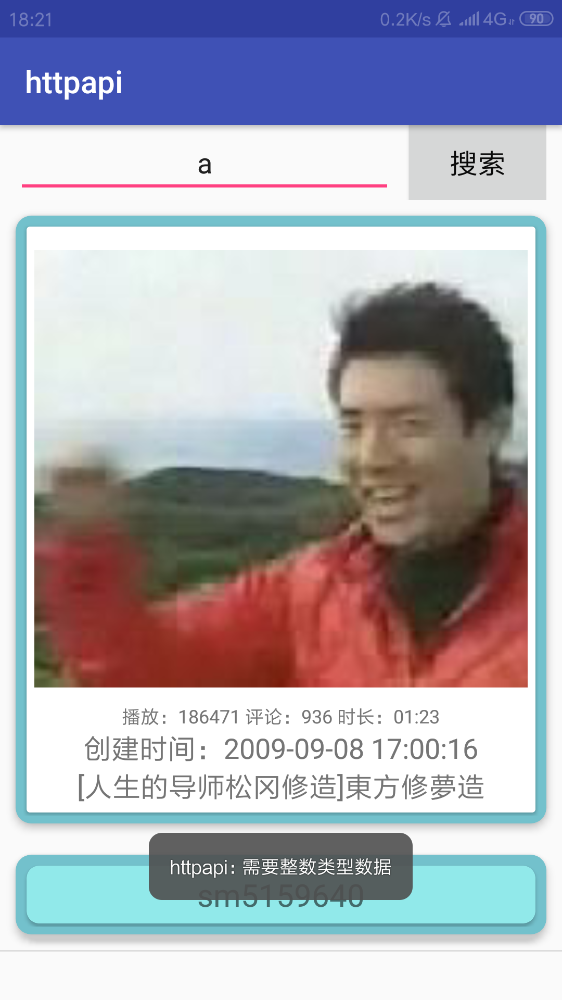

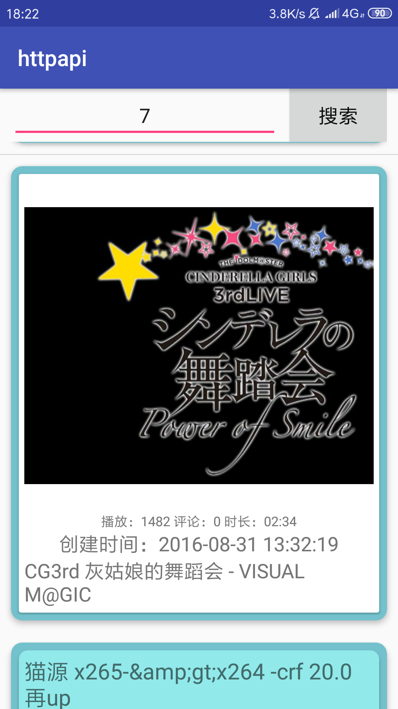

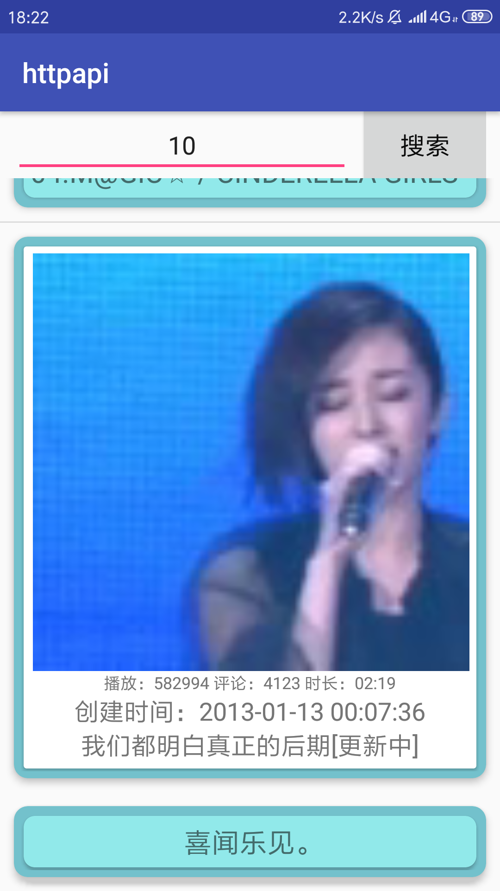

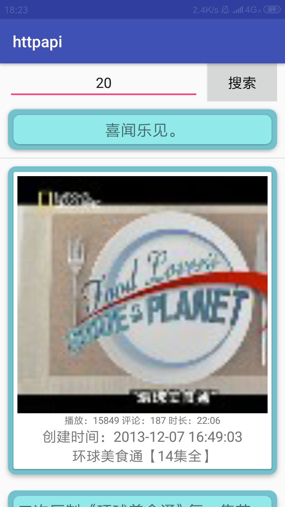

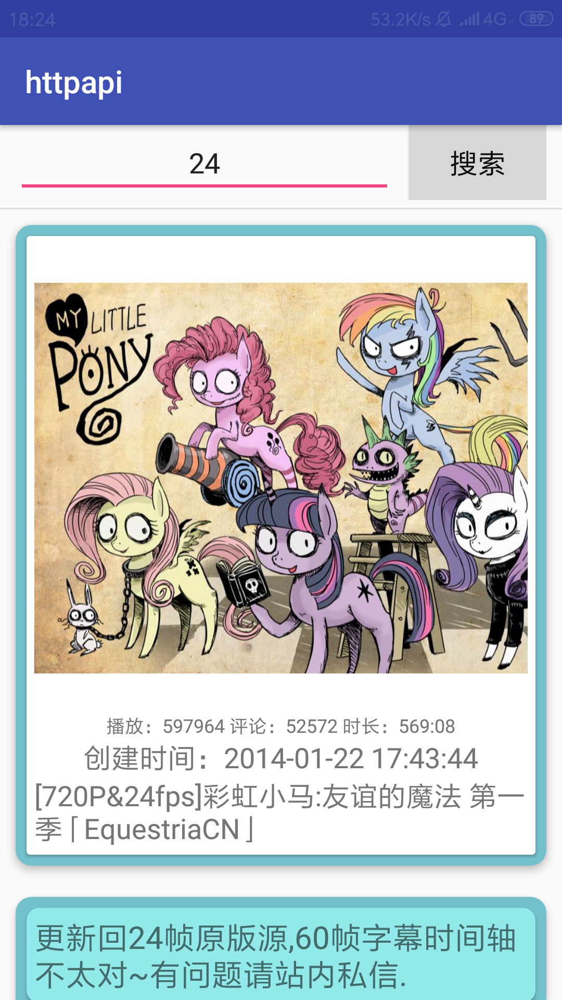

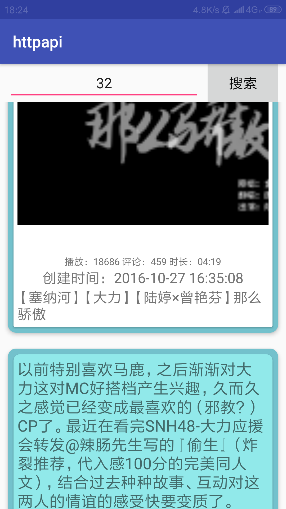

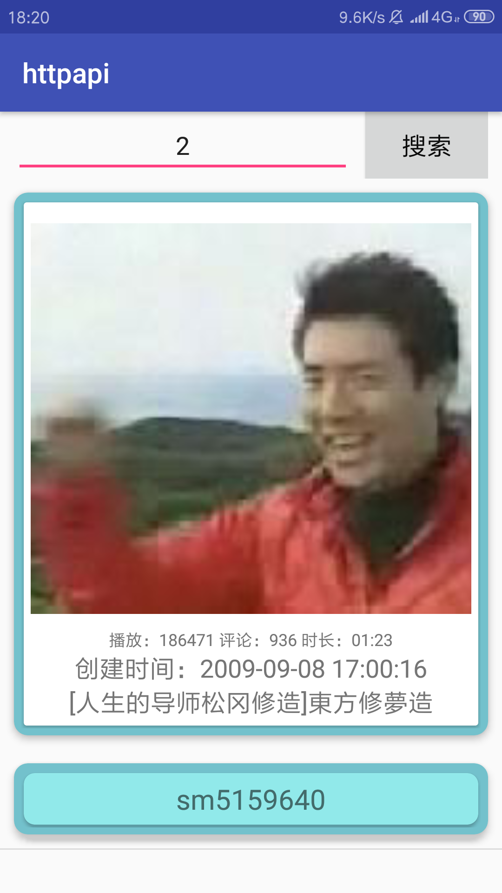


### (2)实验步骤以及关键代码

#### 布局文件：

##### activity_main.xml

```xml
<?xml version="1.0" encoding="utf-8"?>
<LinearLayout xmlns:android="http://schemas.android.com/apk/res/android"
    android:layout_width="match_parent"
    android:layout_height="match_parent"
    android:orientation="vertical">

    <LinearLayout
        android:id="@+id/linear"
        android:orientation="horizontal"
        android:layout_width="fill_parent"
        android:layout_height="wrap_content"
        android:layout_marginLeft="10dp"
        android:layout_marginRight="10dp">

        <EditText
            android:id="@+id/key"
            android:layout_width="fill_parent"
            android:layout_height="wrap_content"
            android:layout_weight="1"
            android:textSize="18sp"
            android:gravity="center_horizontal"
            android:layout_marginRight="10dp"
            android:hint="input user_id"/>

        <Button
            android:id="@+id/search"
            android:layout_width="wrap_content"
            android:layout_height="wrap_content"
            android:textSize="18sp"
            android:textColor="#0A0A0A"
            android:background="#D6D7D7"
            android:text="搜索"/>

    </LinearLayout>

    <ProgressBar
        android:id="@+id/progress"
        android:layout_width="wrap_content"
        android:layout_height="wrap_content"
        android:layout_gravity="center"
        android:visibility="gone"
        android:layout_centerInParent="true" />

    <ListView
        android:id="@+id/list"
        android:layout_width="fill_parent"
        android:layout_height="wrap_content"
        android:layout_weight="1"
        android:gravity="top"/>

</LinearLayout>
```

##### item.xml

```xml
<?xml version="1.0" encoding="utf-8"?>
<LinearLayout xmlns:android="http://schemas.android.com/apk/res/android"
    android:layout_width="match_parent"
    android:layout_height="match_parent"
    android:orientation="vertical">

    <android.support.v7.widget.CardView
        app:cardCornerRadius="10dp"
        android:layout_width="match_parent"
        android:layout_height="wrap_content"
        android:layout_margin="10dp"
        app:contentPadding="5dp"
        app:cardBackgroundColor="#73c1cc"
        android:foreground="?attr/selectableItemBackground"
        app:cardElevation="4dp"

        xmlns:android="http://schemas.android.com/apk/res/android"
        xmlns:app="http://schemas.android.com/apk/res-auto">

        <android.support.v7.widget.CardView
            android:layout_width="match_parent"
            android:layout_height="wrap_content"
            android:layout_margin="2dp"
            app:contentPadding="5dp"
            xmlns:android="http://schemas.android.com/apk/res/android"
            xmlns:app="http://schemas.android.com/apk/res-auto">

            <LinearLayout
                android:layout_width="wrap_content"
                android:layout_height="wrap_content"
                android:orientation="vertical">
                <ImageView
                    android:id="@+id/preview"
                    android:layout_width="400dp"
                    android:layout_height="300dp" />

                <TextView
                    android:id="@+id/info1"
                    android:layout_width="wrap_content"
                    android:layout_height="wrap_content"
                    android:textSize="12sp"
                    android:layout_gravity="center_horizontal"/>

                <TextView
                    android:id="@+id/info2"
                    android:layout_width="wrap_content"
                    android:layout_height="wrap_content"
                    android:textSize="18sp"
                    android:layout_gravity="center_horizontal"/>

                <TextView
                    android:id="@+id/info3"
                    android:layout_width="wrap_content"
                    android:layout_height="wrap_content"
                    android:textSize="18sp"
                    android:layout_gravity="center_horizontal"/>

            </LinearLayout>

        </android.support.v7.widget.CardView>
    </android.support.v7.widget.CardView>

    <android.support.v7.widget.CardView
        app:cardCornerRadius="10dp"
        android:layout_width="match_parent"
        android:layout_height="wrap_content"
        android:layout_margin="10dp"
        app:contentPadding="5dp"
        app:cardBackgroundColor="#73c1cc"
        android:foreground="?attr/selectableItemBackground"
        app:cardElevation="4dp"

        xmlns:android="http://schemas.android.com/apk/res/android"
        xmlns:app="http://schemas.android.com/apk/res-auto">

        <android.support.v7.widget.CardView
            app:cardCornerRadius="8dp"
            android:layout_width="match_parent"
            android:layout_height="wrap_content"
            android:layout_margin="2dp"
            app:cardBackgroundColor="#91E9EA"
            app:contentPadding="5dp"

            xmlns:android="http://schemas.android.com/apk/res/android"
            xmlns:app="http://schemas.android.com/apk/res-auto">

            <TextView
                android:id="@+id/author"
                android:layout_gravity="center"
                android:textSize="20dp"
                android:layout_width="wrap_content"
                android:layout_height="wrap_content" />

        </android.support.v7.widget.CardView>

    </android.support.v7.widget.CardView>
</LinearLayout>
```

##### AndroidManifest.xml

```xml
<?xml version="1.0" encoding="utf-8"?>
<manifest xmlns:android="http://schemas.android.com/apk/res/android"
    package="com.example.wang.webapp">

    <application
        android:allowBackup="true"
        android:icon="@mipmap/ic_launcher"
        android:label="@string/app_name"
        android:roundIcon="@mipmap/ic_launcher_round"
        android:supportsRtl="true"
        android:theme="@style/AppTheme">
        <activity android:name=".MainActivity">
            <intent-filter>
                <action android:name="android.intent.action.MAIN" />

                <category android:name="android.intent.category.LAUNCHER" />
            </intent-filter>
        </activity>
    </application>
    <uses-permission android:name="android.permission.INTERNET"></uses-permission>
    <uses-permission android:name="android.permission.CHANGE_NETWORK_STATE"></uses-permission>
    <uses-permission android:name="android.permission.ACCESS_NETWORK_STATE"></uses-permission>

</manifest>
```

#### Java文件：

##### MainActivity.java

```java
package com.example.wang.webapp;

import android.content.Context;
import android.graphics.Bitmap;
import android.graphics.BitmapFactory;
import android.net.ConnectivityManager;
import android.net.NetworkInfo;
import android.os.Handler;
import android.os.Message;
import android.support.v7.app.AppCompatActivity;
import android.os.Bundle;
import android.util.Log;
import android.view.View;
import android.widget.Button;
import android.widget.EditText;
import android.widget.ListView;
import android.widget.ProgressBar;
import android.widget.Toast;

import com.google.gson.Gson;

import java.io.BufferedInputStream;
import java.io.BufferedReader;
import java.io.ByteArrayOutputStream;
import java.io.IOException;
import java.io.InputStream;
import java.io.InputStreamReader;
import java.net.HttpURLConnection;
import java.net.URL;
import java.net.URLConnection;
import java.util.ArrayList;
import java.util.List;

import rx.Observable;
import rx.Observer;
import rx.Subscriber;
import rx.android.schedulers.AndroidSchedulers;
import rx.schedulers.Schedulers;

public class MainActivity extends AppCompatActivity {
    EditText input;
    Button fbt;
    ProgressBar pro;
    ListView list;
    String base = "https://space.bilibili.com/ajax/top/showTop?mid=";
    String info = "";
    List<RecyclerObj> mList = new ArrayList<>();
    MyAdapter adapter;

    public static boolean isConn(Context context){
        ConnectivityManager connectivityManager = (ConnectivityManager) context
                .getSystemService(Context.CONNECTIVITY_SERVICE);
        if (connectivityManager != null) {
            NetworkInfo[] networkInfo = connectivityManager.getAllNetworkInfo();
            if (networkInfo != null&&networkInfo.length>0) {
                for (int i = 0; i < networkInfo.length; i++) {
                    if (networkInfo[i].getState() == NetworkInfo.State.CONNECTED) {
                        return true;
                    }
                }
            }
        }
        return false;
    }

    public String streamToString(InputStream is) {
        try {
            ByteArrayOutputStream baos = new ByteArrayOutputStream();
            byte[] buffer = new byte[1024];
            int len = 0;
            while ((len = is.read(buffer)) != -1) {
                baos.write(buffer, 0, len);
            }
            baos.close();
            is.close();
            byte[] byteArray = baos.toByteArray();
            return new String(byteArray);
        } catch (Exception e) {
            e.printStackTrace();
            return null;
        }
    }

    @Override
    protected void onCreate(Bundle savedInstanceState) {
        super.onCreate(savedInstanceState);
        setContentView(R.layout.activity_main);
        input = findViewById(R.id.key);
        fbt = findViewById(R.id.search);
        pro = findViewById(R.id.progress);
        list = findViewById(R.id.list);
        adapter = new MyAdapter(MainActivity.this, mList);
        list.setAdapter(adapter);
        fbt.setOnClickListener(new View.OnClickListener() {
            @Override
            public void onClick(View view) {
                final String key = input.getText().toString();
                if (key.isEmpty() || key.matches("^[0-9]*$") == false) {
                    Toast.makeText(MainActivity.this, "需要整数类型数据", Toast.LENGTH_SHORT).show();
                }
                else if (key.isEmpty() || key.equals("0")) {
                    Toast.makeText(com.example.wang.webapp.BiliActivity.this, "需要正整数类型数据", Toast.LENGTH_SHORT).show();
                }
                else if(isConn(MainActivity.this) == false) {
                    Toast.makeText(MainActivity.this, "网络连接失败", Toast.LENGTH_SHORT).show();
                }
                else {
                    pro.setVisibility(View.VISIBLE);

                    Observer<Bundle> observer = new Observer<Bundle>() {
                        @Override
                        public void onNext(Bundle s) {
                            pro.setVisibility(View.GONE);
                            //传递成功
                            adapter.refresh(mList);
                        }

                        @Override
                        public void onCompleted() {
                            pro.setVisibility(View.GONE);
                        }

                        @Override
                        public void onError(Throwable e) {
                            pro.setVisibility(View.GONE);
                            Toast.makeText(MainActivity.this, "数据库中不存在记录", Toast.LENGTH_SHORT).show();
                        }
                    };

                    Observable observable = Observable.create(new Observable.OnSubscribe<Bundle>() {
                        @Override
                        public void call(Subscriber<? super Bundle> subscriber) {
                            get_info(key);
                            //通过第10个字符是不是t即是否为true，判断是否存在
                            if (info.indexOf("true") != 10) {
                                Toast.makeText(MainActivity.this, "数据库中不存在记录", Toast.LENGTH_SHORT).show();
                            }
                            else {
                                RecyclerObj recyclerObj = new Gson().fromJson(info, RecyclerObj.class);
                                try{
                                    URL imgUrl = new URL(recyclerObj.getData().getCover());
                                    HttpURLConnection urlConn = (HttpURLConnection )imgUrl.openConnection();
                                    //urlConn.setDoInput(true);
                                    urlConn.setRequestMethod("GET");
                                    urlConn.connect();
                                    // 将得到的数据转化成InputStream
                                    InputStream is = urlConn.getInputStream();
                                    // 将InputStream转换成Bitmap
                                    Bitmap bitmap = BitmapFactory.decodeStream(is);
                                    recyclerObj.setBmp(bitmap);
                                    Bundle bundle = new Bundle();
                                    bundle.putParcelable("bitmap", bitmap);
                                    subscriber.onNext(bundle);
                                    is.close();
                                }catch (IOException e){
                                    e.printStackTrace();
                                }
                                mList.add(recyclerObj);
                            }
                            //subscriber.onNext(info);
                        }
                    })
                            .subscribeOn(Schedulers.computation())
                            .observeOn(AndroidSchedulers.mainThread());
                    observable.subscribe(observer);


                }
            }
        });


    }

    private void get_info(String key) {
        try {
            URL myURL = new URL(base+key);
            // 打开URL链接
            HttpURLConnection urlConn = (HttpURLConnection )myURL.openConnection();
            urlConn.setRequestMethod("GET");
            urlConn.connect();

            if (urlConn.getResponseCode() == 200) {
                // 获取返回的数据
                info = streamToString(urlConn.getInputStream());
            }
            urlConn.disconnect();
        }
        catch (Exception e) {
            e.printStackTrace();
        }
    }
}
```

##### MyAdapter.java

```java
package com.example.wang.webapp;

import android.content.Context;
import android.graphics.Bitmap;
import android.graphics.BitmapFactory;
import android.util.Log;
import android.view.LayoutInflater;
import android.view.View;
import android.view.ViewGroup;
import android.widget.BaseAdapter;
import android.widget.ImageView;
import android.widget.SeekBar;
import android.widget.TextView;

import java.util.List;
import java.util.Map;

public class MyAdapter extends BaseAdapter {
    private Context mContext;
    private List<RecyclerObj> mList;
    public MyAdapter(Context context, List<RecyclerObj> List) {
        mContext = context;
        mList = List;
    }

    class ViewHolder {
        ImageView preview;
        SeekBar time;
        TextView info1;
        TextView info2;
        TextView info3;
        TextView author;
    }

    @Override
    public int getCount() {
        return mList.size();
    }

    @Override
    public Object getItem(int i) {
        return mList.get(i);
    }

    @Override
    public long getItemId(int i) {
        return i;
    }

    @Override
    public View getView(final int i, View view, ViewGroup parent) {
        final ViewHolder viewHolder;
        if (view == null) {
            viewHolder = new ViewHolder();
            view =  LayoutInflater.from(mContext).inflate(R.layout.item,parent,false);
            viewHolder.preview = view.findViewById(R.id.preview);
            viewHolder.time = view.findViewById(R.id.time);
            viewHolder.info1 = view.findViewById(R.id.info1);
            viewHolder.info2 = view.findViewById(R.id.info2);
            viewHolder.info3 = view.findViewById(R.id.info3);
            viewHolder.author = view.findViewById(R.id.author);
            view.setTag(viewHolder);
        } else {
            viewHolder = (ViewHolder) view.getTag();
        }
        
        viewHolder.preview.setImageBitmap(mList.get(i).getBmp());

        viewHolder.info1.setText(mList.get(i).getData().get_info1());
        viewHolder.info2.setText(mList.get(i).getData().get_info2());
        viewHolder.info3.setText(mList.get(i).getData().getTitle());
        viewHolder.author.setText(mList.get(i).getData().getContent());
        return view;
    }
    

    public void refresh( List<RecyclerObj> list) {
        mList = list;
        notifyDataSetChanged();
    }

}

```

##### RecyclerObj

```java
package com.example.wang.webapp;

import android.graphics.Bitmap;

public class RecyclerObj {
    private Boolean status;
    private Data data;
    private Bitmap bmp;
    public static class Data  {
        private int aid;
        private int state;
        private String cover;
        private String title;
        private String content;
        private int play;
        private String duration;
        private int video_review;
        private String create;
        private String rec;
        private int count;

        public int getAid() {
            return aid;
        }

        public int getCount() {
            return count;
        }

        public int getPlay() {
            return play;
        }

        public int getState() {
            return state;
        }

        public int getVideo_review() {
            return video_review;
        }

        public String getContent() {
            return content;
        }

        public String getCover() {
            return cover;
        }

        public String getCreate() {
            return create;
        }

        public String getDuration() {
            return duration;
        }

        public String getRec() {
            return rec;
        }

        public String getTitle() {
            return title;
        }

        public void setAid(int aid) {
            this.aid = aid;
        }

        public void setContent(String content) {
            this.content = content;
        }

        public void setCount(int count) {
            this.count = count;
        }

        public void setCover(String cover) {
            this.cover = cover;
        }

        public void setCreate(String create) {
            this.create = create;
        }

        public void setDuration(String duration) {
            this.duration = duration;
        }

        public void setPlay(int play) {
            this.play = play;
        }

        public void setRec(String rec) {
            this.rec = rec;
        }

        public void setState(int state) {
            this.state = state;
        }

        public void setTitle(String title) {
            this.title = title;
        }

        public void setVideo_review(int video_review) {
            this.video_review = video_review;
        }

        public String get_info1() {
            return "播放： "+ getPlay()+""+" 评论： "+getVideo_review()+""+" 时长： "+getDuration();
        }

        public String get_info2() {
            return "创建时间： "+getCreate();
        }

    }

    public Boolean getStatus() {
        return status;
    }

    public Data getData() {
        return data;
    }

    public void setData(Data data) {
        this.data = data;
    }

    public void setStatus(Boolean status) {
        this.status = status;
    }

    public void setBmp(Bitmap bmp) {
        this.bmp = bmp;
    }

    public Bitmap getBmp() {
        return bmp;
    }

}
```

### (3)实验遇到的困难以及解决思路

- 加载图片闪退闪退   解决办法：下载图片没有单独放在一个线程中，重新给他设了个线程图片存为bitmap，同时存入对象中。
- 图片显示大小不一致  解决办法：图片设置固定大小，但是宽和高同样比较大时，上下白边比较严重
- 是否为整型  解决办法：通过正则表达式实现
- CardView使用  解决办法：https://blog.csdn.net/kingsonying/article/details/78875998

---


---

## 四、实验思考及感想
本次实验基本内容不算太难，主要是对于json的解析以及基本的网络编程。本实验采用了HttpURLConnection进行连接，相对于直接从URL获取，错误处理更加完善，同时可以对URL进行检查，可以避免错误地传输过多的数据。同时HttpURLConnection获取一些有关URL对象所引用的资源信息如：HTTP状态、头信息、内容的长度、类型和日期时间等。json的解析直接采用了`RecyclerObj recyclerObj = new Gson().fromJson(info, RecyclerObj.class);` ，可以对json中每个数据进行查找赋值。多线程方面仍然使用Rxjava，下载图片等耗时操作在被观察者中实现，同时在新的计算线程中操作，更新UI在订阅者实现，同时在主线程操作。

---

# 第十五周任务
---

### 一、实验目的
1. 理解Restful接口
2. 学会使用Retrofit2
3. 复习使用RxJava
4. 学会使用OkHttp

---
### 二、实验内容
#### 实现一个github用户repos以及issues应用
<table>
    <tr>
        <td >主界面有两个跳转按钮分别对应两次作业</td>
        <td >github界面，输入用户名搜索该用户所有可提交issue的repo，每个item可点击</td>
    </tr>
    <tr>
        <td >repo详情界面，显示该repo所有的issues</td>
        <td >加分项：在该用户的该repo下增加一条issue，输入title和body即可</td>
    </tr>
</table>

* 教程位于`./manual/tutorial_retrofit.md`
* 每次点击搜索按钮都会清空上次搜索结果再进行新一轮的搜索
* 获取repos时需要处理以下异常：HTTP 404 以及 用户没有任何repo
* 只显示 has_issues = true 的repo（即fork的他人的项目不会显示）
* repo显示的样式自由发挥，显示的内容可以自由增加（不能减少）
* repo的item可以点击跳转至下一界面
* 该repo不存在任何issue时需要弹Toast提示
* 不完成加分项的同学只需要显示所有issues即可，样式自由发挥，内容可以增加

#### 加分项

* 加分项旨在学习Retrofit2的POST请求，加深Rest API的理解
* demo需要你们额外提供TOKEN参数，这点不必实现，实现了反而不利于检查
* 提交的代码可以删除掉你的token等授权信息
* 仅处理提交成功与提交失败两种状态
* issue提交成功后需要刷新展示出来

* **加分项注意事项**
* **不要在他人repo下随意提交issue测试，自己新建一个repo即可**
* **管理好自己的github授权（token，client id等），验收结束后请删除对应授权**

---

**demo为app-retrofit.apk**
**demo测试于API28**
**过于频繁的请求会造成403 demo暂时失效的现象**

---
#### 完成期限
第十六周各班实验课进行检查，未通过者需在下一周进行修改与重新检查。

---

### 三、课堂实验结果
---
### （1）实验截图

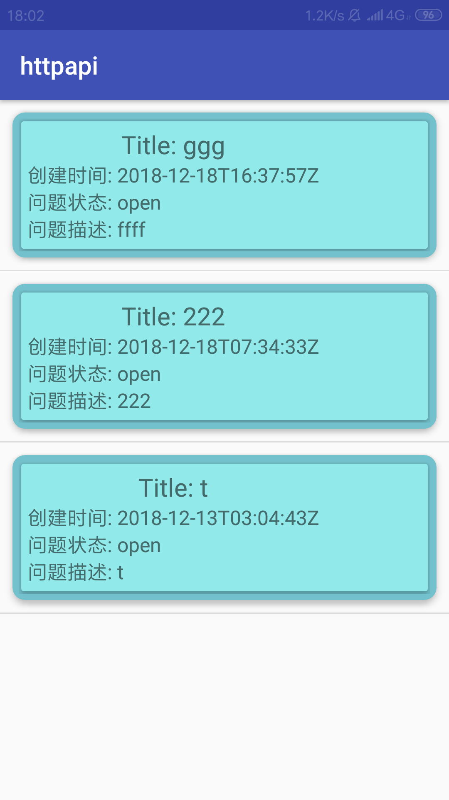

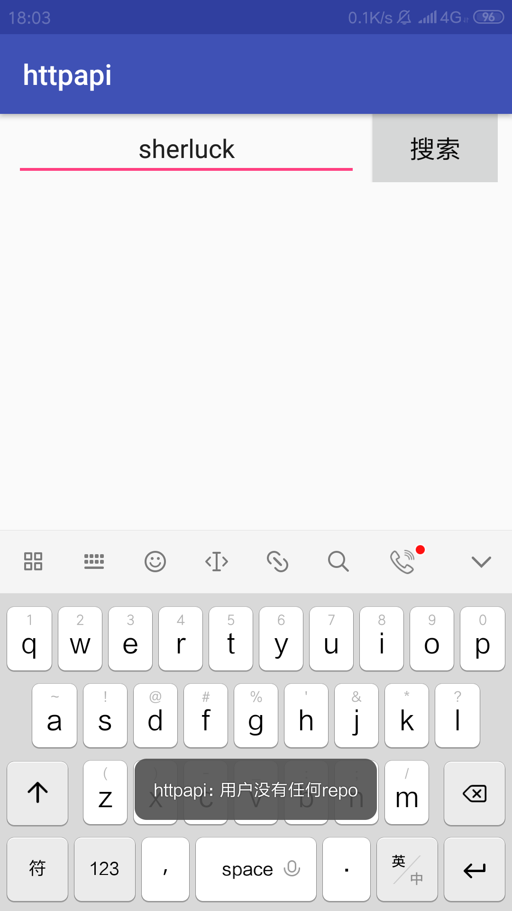

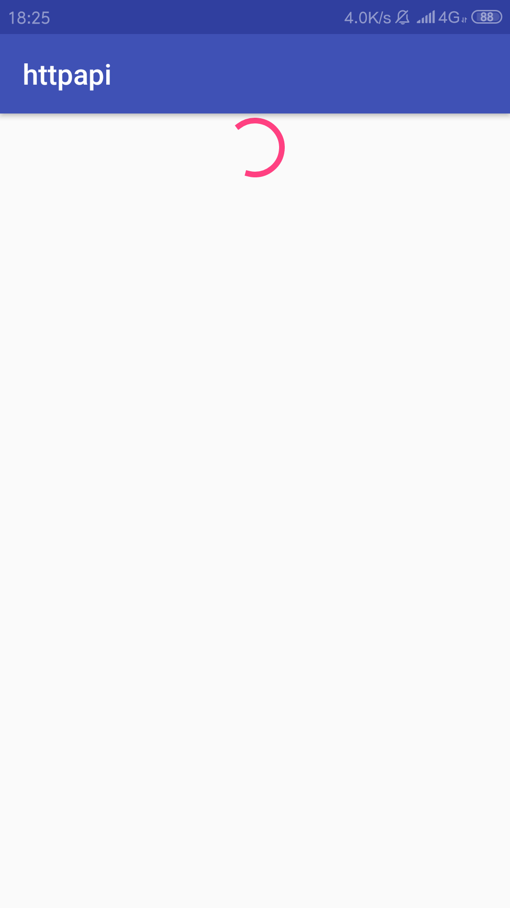

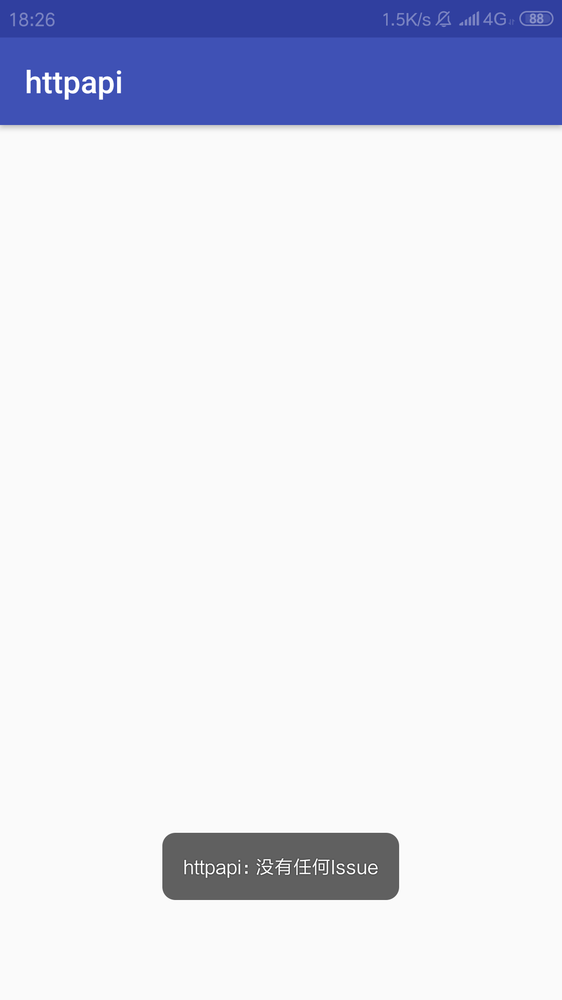

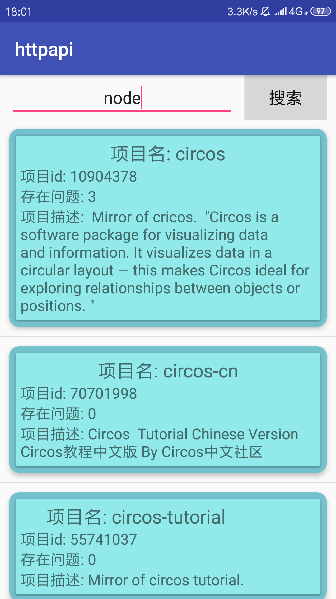

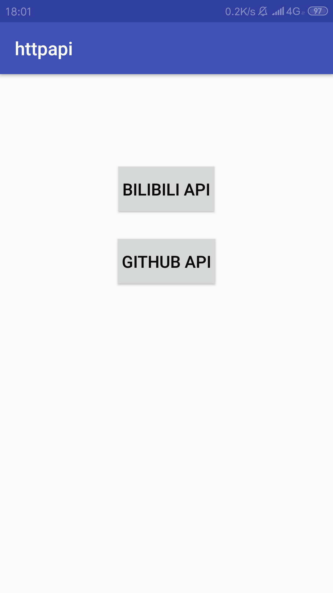

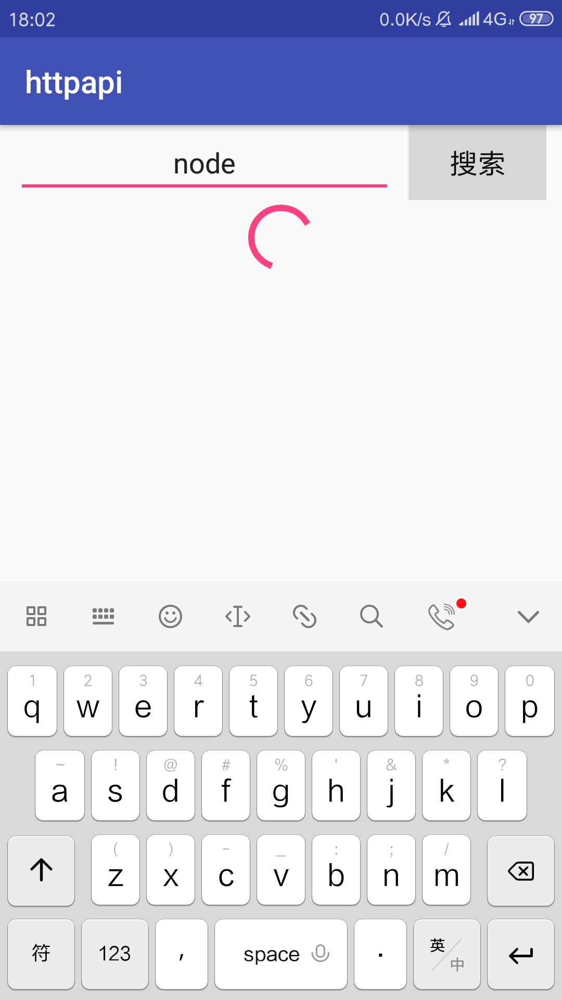

---
### （2）实验步骤以及关键代码

#### 布局文件：

##### activity_main.xml

```xml
<?xml version="1.0" encoding="utf-8"?>
<LinearLayout xmlns:android="http://schemas.android.com/apk/res/android"
    android:layout_width="match_parent"
    android:layout_height="match_parent"
    android:orientation="vertical">

    <Button
        android:id="@+id/bili"
        android:layout_width="wrap_content"
        android:layout_height="wrap_content"
        android:layout_marginTop="100dp"
        android:textSize="18sp"
        android:layout_gravity="center"
        android:textColor="#0A0A0A"
        android:background="#D6D7D7"
        android:text=" BILIBILI API "/>

    <Button
        android:id="@+id/github"
        android:layout_width="wrap_content"
        android:layout_height="wrap_content"
        android:layout_gravity="center"
        android:layout_marginTop="30dp"
        android:textSize="18sp"
        android:textColor="#0A0A0A"
        android:background="#D6D7D7"
        android:text=" GITHUB API "/>

</LinearLayout>
```

##### item.xml

```xml
<?xml version="1.0" encoding="utf-8"?>
<LinearLayout xmlns:android="http://schemas.android.com/apk/res/android"
    android:layout_width="match_parent"
    android:layout_height="match_parent"
    android:orientation="vertical">

    <android.support.v7.widget.CardView
        app:cardCornerRadius="10dp"
        android:layout_width="match_parent"
        android:layout_height="wrap_content"
        android:layout_margin="10dp"
        app:contentPadding="5dp"
        app:cardBackgroundColor="#73c1cc"
        android:foreground="?attr/selectableItemBackground"
        app:cardElevation="4dp"

        xmlns:android="http://schemas.android.com/apk/res/android"
        xmlns:app="http://schemas.android.com/apk/res-auto">

        <android.support.v7.widget.CardView
            android:layout_width="match_parent"
            android:layout_height="wrap_content"
            android:layout_margin="2dp"
            app:contentPadding="5dp"
            xmlns:android="http://schemas.android.com/apk/res/android"
            xmlns:app="http://schemas.android.com/apk/res-auto">

            <LinearLayout
                android:layout_width="wrap_content"
                android:layout_height="wrap_content"
                android:orientation="vertical">
                <ImageView
                    android:id="@+id/preview"
                    android:layout_width="400dp"
                    android:layout_height="300dp" />

                <TextView
                    android:id="@+id/info1"
                    android:layout_width="wrap_content"
                    android:layout_height="wrap_content"
                    android:textSize="12sp"
                    android:layout_gravity="center_horizontal"/>

                <TextView
                    android:id="@+id/info2"
                    android:layout_width="wrap_content"
                    android:layout_height="wrap_content"
                    android:textSize="18sp"
                    android:layout_gravity="center_horizontal"/>

                <TextView
                    android:id="@+id/info3"
                    android:layout_width="wrap_content"
                    android:layout_height="wrap_content"
                    android:textSize="18sp"
                    android:layout_gravity="center_horizontal"/>

            </LinearLayout>

        </android.support.v7.widget.CardView>
    </android.support.v7.widget.CardView>

    <android.support.v7.widget.CardView
        app:cardCornerRadius="10dp"
        android:layout_width="match_parent"
        android:layout_height="wrap_content"
        android:layout_margin="10dp"
        app:contentPadding="5dp"
        app:cardBackgroundColor="#73c1cc"
        android:foreground="?attr/selectableItemBackground"
        app:cardElevation="4dp"

        xmlns:android="http://schemas.android.com/apk/res/android"
        xmlns:app="http://schemas.android.com/apk/res-auto">

        <android.support.v7.widget.CardView
            app:cardCornerRadius="8dp"
            android:layout_width="match_parent"
            android:layout_height="wrap_content"
            android:layout_margin="2dp"
            app:cardBackgroundColor="#91E9EA"
            app:contentPadding="5dp"

            xmlns:android="http://schemas.android.com/apk/res/android"
            xmlns:app="http://schemas.android.com/apk/res-auto">

            <TextView
                android:id="@+id/author"
                android:layout_gravity="center"
                android:textSize="20dp"
                android:layout_width="wrap_content"
                android:layout_height="wrap_content" />

        </android.support.v7.widget.CardView>

    </android.support.v7.widget.CardView>
</LinearLayout>
```

##### git_item.xml

```xml
<?xml version="1.0" encoding="utf-8"?>
<LinearLayout xmlns:android="http://schemas.android.com/apk/res/android"
    android:layout_width="match_parent"
    android:layout_height="match_parent"
    android:orientation="vertical">

    <android.support.v7.widget.CardView
    app:cardCornerRadius="10dp"
    android:layout_width="match_parent"
    android:layout_height="wrap_content"
    android:layout_margin="10dp"
    app:contentPadding="5dp"
    app:cardBackgroundColor="#73c1cc"
    android:foreground="?attr/selectableItemBackground"
    app:cardElevation="4dp"

    xmlns:android="http://schemas.android.com/apk/res/android"
    xmlns:app="http://schemas.android.com/apk/res-auto">
        <android.support.v7.widget.CardView
            android:id="@+id/cardview1"
            android:layout_width="match_parent"
            android:layout_height="wrap_content"
            android:layout_margin="2dp"
            app:contentPadding="5dp"
            app:cardBackgroundColor="#91E9EA"
            android:foreground="?attr/selectableItemBackground"
            app:cardElevation="4dp"

            xmlns:android="http://schemas.android.com/apk/res/android"
            xmlns:app="http://schemas.android.com/apk/res-auto">

            <LinearLayout
                android:layout_width="wrap_content"
                android:layout_height="wrap_content"
                android:orientation="vertical">

                <TextView
                    android:id="@+id/name1"
                    android:layout_width="wrap_content"
                    android:layout_height="wrap_content"
                    android:textSize="20sp"
                    android:layout_gravity="center_horizontal"/>

                <TextView
                    android:id="@+id/id1"
                    android:layout_width="wrap_content"
                    android:layout_height="wrap_content"
                    android:textSize="16sp"
                    android:layout_gravity="left"/>

                <TextView
                    android:id="@+id/issue1"
                    android:layout_width="wrap_content"
                    android:layout_height="wrap_content"
                    android:textSize="16sp"
                    android:layout_gravity="left"/>

                <TextView
                    android:id="@+id/detail"
                    android:layout_width="wrap_content"
                    android:layout_height="wrap_content"
                    android:textSize="16sp"
                    android:layout_gravity="left"/>

            </LinearLayout>

        </android.support.v7.widget.CardView>
    </android.support.v7.widget.CardView>

</LinearLayout>
```

##### github.xml

```xml
<?xml version="1.0" encoding="utf-8"?>
<LinearLayout xmlns:android="http://schemas.android.com/apk/res/android"
    android:layout_width="match_parent"
    android:layout_height="match_parent"
    android:orientation="vertical">

    <LinearLayout
        android:id="@+id/linear1"
        android:orientation="horizontal"
        android:layout_width="fill_parent"
        android:layout_height="wrap_content"
        android:layout_marginLeft="10dp"
        android:layout_marginRight="10dp">

        <EditText
            android:id="@+id/key1"
            android:layout_width="fill_parent"
            android:layout_height="wrap_content"
            android:layout_weight="1"
            android:textSize="18sp"
            android:gravity="center_horizontal"
            android:layout_marginRight="10dp"
            android:hint="input user"/>

        <Button
            android:id="@+id/search1"
            android:layout_width="wrap_content"
            android:layout_height="wrap_content"
            android:textSize="18sp"
            android:textColor="#0A0A0A"
            android:background="#D6D7D7"
            android:text="搜索"/>

    </LinearLayout>

    <ProgressBar
        android:id="@+id/progress1"
        android:layout_width="wrap_content"
        android:layout_height="wrap_content"
        android:layout_gravity="center"
        android:visibility="gone"
        android:layout_centerInParent="true" />

    <ListView
        android:id="@+id/list1"
        android:layout_width="fill_parent"
        android:layout_height="wrap_content"
        android:layout_weight="1"
        android:gravity="top"/>

</LinearLayout>
```

##### isssue.xml

```xml
<?xml version="1.0" encoding="utf-8"?>
<LinearLayout xmlns:android="http://schemas.android.com/apk/res/android"
    android:layout_width="match_parent"
    android:layout_height="match_parent"
    android:orientation="vertical">>

    <ProgressBar
        android:id="@+id/progress2"
        android:layout_width="wrap_content"
        android:layout_height="wrap_content"
        android:layout_gravity="center"
        android:visibility="gone"
        android:layout_centerInParent="true" />

    <ListView
        android:id="@+id/list2"
        android:layout_width="fill_parent"
        android:layout_height="wrap_content"
        android:layout_weight="1"
        android:gravity="top"/>

</LinearLayout>
```

##### issue_item.xml

```xml
<?xml version="1.0" encoding="utf-8"?>
<LinearLayout xmlns:android="http://schemas.android.com/apk/res/android"
    android:layout_width="match_parent"
    android:layout_height="match_parent"
    android:orientation="vertical">

    <android.support.v7.widget.CardView
        app:cardCornerRadius="10dp"
        android:layout_width="match_parent"
        android:layout_height="wrap_content"
        android:layout_margin="10dp"
        app:contentPadding="5dp"
        app:cardBackgroundColor="#73c1cc"
        android:foreground="?attr/selectableItemBackground"
        app:cardElevation="4dp"

        xmlns:android="http://schemas.android.com/apk/res/android"
        xmlns:app="http://schemas.android.com/apk/res-auto">

        <android.support.v7.widget.CardView
            android:id="@+id/cardview1"
            android:layout_width="match_parent"
            android:layout_height="wrap_content"
            android:layout_margin="2dp"
            app:contentPadding="5dp"
            app:cardBackgroundColor="#91E9EA"
            android:foreground="?attr/selectableItemBackground"
            app:cardElevation="4dp"

            xmlns:android="http://schemas.android.com/apk/res/android"
            xmlns:app="http://schemas.android.com/apk/res-auto">

            <LinearLayout
                android:layout_width="wrap_content"
                android:layout_height="wrap_content"
                android:orientation="vertical">

                <TextView
                    android:id="@+id/name2"
                    android:layout_width="wrap_content"
                    android:layout_height="wrap_content"
                    android:textSize="20sp"
                    android:layout_gravity="center_horizontal"/>

                <TextView
                    android:id="@+id/date2"
                    android:layout_width="wrap_content"
                    android:layout_height="wrap_content"
                    android:textSize="16sp"
                    android:layout_gravity="left"/>

                <TextView
                    android:id="@+id/state2"
                    android:layout_width="wrap_content"
                    android:layout_height="wrap_content"
                    android:textSize="16sp"
                    android:layout_gravity="left"/>

                <TextView
                    android:id="@+id/detai2"
                    android:layout_width="wrap_content"
                    android:layout_height="wrap_content"
                    android:textSize="16sp"
                    android:layout_gravity="left"/>

            </LinearLayout>

        </android.support.v7.widget.CardView>
    </android.support.v7.widget.CardView>

</LinearLayout>
```

##### AndroidManifest.xml

```xml
<?xml version="1.0" encoding="utf-8"?>
<manifest xmlns:android="http://schemas.android.com/apk/res/android"
    package="com.example.wang.webapp">

    <application
        android:allowBackup="true"
        android:icon="@mipmap/ic_launcher"
        android:label="@string/app_name"
        android:roundIcon="@mipmap/ic_launcher_round"
        android:supportsRtl="true"
        android:theme="@style/AppTheme">
        <activity android:name=".MainActivity">
            <intent-filter>
                <action android:name="android.intent.action.MAIN" />

                <category android:name="android.intent.category.LAUNCHER" />
            </intent-filter>
        </activity>
        <activity android:name=".BiliActivity" />
        <activity android:name=".GithubActivity" />
        <activity android:name=".IssueActivity" />
    </application>
    <uses-permission android:name="android.permission.INTERNET"></uses-permission>
    <uses-permission android:name="android.permission.CHANGE_NETWORK_STATE"></uses-permission>
    <uses-permission android:name="android.permission.ACCESS_NETWORK_STATE"></uses-permission>

</manifest>
```

##### bilibili.xml

```xml
<?xml version="1.0" encoding="utf-8"?>
<LinearLayout xmlns:android="http://schemas.android.com/apk/res/android"
    android:layout_width="match_parent"
    android:layout_height="match_parent"
    android:orientation="vertical">

    <LinearLayout
        android:id="@+id/linear"
        android:orientation="horizontal"
        android:layout_width="fill_parent"
        android:layout_height="wrap_content"
        android:layout_marginLeft="10dp"
        android:layout_marginRight="10dp">

        <EditText
            android:id="@+id/key"
            android:layout_width="fill_parent"
            android:layout_height="wrap_content"
            android:layout_weight="1"
            android:textSize="18sp"
            android:gravity="center_horizontal"
            android:layout_marginRight="10dp"
            android:hint="input user_id"/>

        <Button
            android:id="@+id/search"
            android:layout_width="wrap_content"
            android:layout_height="wrap_content"
            android:textSize="18sp"
            android:textColor="#0A0A0A"
            android:background="#D6D7D7"
            android:text="搜索"/>

    </LinearLayout>

    <ProgressBar
        android:id="@+id/progress"
        android:layout_width="wrap_content"
        android:layout_height="wrap_content"
        android:layout_gravity="center"
        android:visibility="gone"
        android:layout_centerInParent="true" />

    <ListView
        android:id="@+id/list"
        android:layout_width="fill_parent"
        android:layout_height="wrap_content"
        android:layout_weight="1"
        android:gravity="top"/>

</LinearLayout>
```

#### Java文件：

##### MainActivity.java

```java
package com.example.wang.webapp;

import android.content.Context;
import android.content.Intent;
import android.graphics.Bitmap;
import android.graphics.BitmapFactory;
import android.net.ConnectivityManager;
import android.net.NetworkInfo;
import android.os.Handler;
import android.os.Message;
import android.support.v7.app.AppCompatActivity;
import android.os.Bundle;
import android.util.Log;
import android.view.View;
import android.widget.Button;
import android.widget.EditText;
import android.widget.ListView;
import android.widget.ProgressBar;
import android.widget.Toast;

import com.google.gson.Gson;

import java.io.BufferedInputStream;
import java.io.BufferedReader;
import java.io.ByteArrayOutputStream;
import java.io.IOException;
import java.io.InputStream;
import java.io.InputStreamReader;
import java.net.HttpURLConnection;
import java.net.URL;
import java.net.URLConnection;
import java.util.ArrayList;
import java.util.List;

import rx.Observable;
import rx.Observer;
import rx.Subscriber;
import rx.android.schedulers.AndroidSchedulers;
import rx.schedulers.Schedulers;

public class MainActivity extends AppCompatActivity {

    Button bili;
    Button github;
    @Override
    protected void onCreate(Bundle savedInstanceState) {
        super.onCreate(savedInstanceState);
        setContentView(R.layout.activity_main);
        bili = findViewById(R.id.bili);
        github = findViewById(R.id.github);
        bili.setOnClickListener(new View.OnClickListener() {
            @Override
            public void onClick(View v) {
                Intent intent = new Intent(MainActivity.this, BiliActivity.class);
                startActivity(intent);
            }
        });

        github.setOnClickListener(new View.OnClickListener() {
            @Override
            public void onClick(View v) {
                Intent intent = new Intent(MainActivity.this, GithubActivity.class);
                startActivity(intent);
            }
        });

    }
}

```

##### MyAdapter.java

```java
package com.example.wang.webapp;

import android.content.Context;
import android.graphics.Bitmap;
import android.graphics.BitmapFactory;
import android.util.Log;
import android.view.LayoutInflater;
import android.view.View;
import android.view.ViewGroup;
import android.widget.BaseAdapter;
import android.widget.ImageView;
import android.widget.SeekBar;
import android.widget.TextView;

import java.util.List;
import java.util.Map;

public class MyAdapter extends BaseAdapter {
    private Context mContext;
    private List<RecyclerObj> mList;

    public List<RecyclerObj> getmList() {
        return mList;
    }

    public void setmList(List<RecyclerObj> mList) {
        this.mList = mList;
    }


    public MyAdapter(Context context, List<RecyclerObj> List) {
        mContext = context;
        mList = List;
    }

    class ViewHolder {
        ImageView preview;
        SeekBar time;
        TextView info1;
        TextView info2;
        TextView info3;
        TextView author;
    }

    @Override
    public int getCount() {
        return mList.size();
    }

    @Override
    public Object getItem(int i) {
        return mList.get(i);
    }

    @Override
    public long getItemId(int i) {
        return i;
    }

    @Override
    public View getView(final int i, View view, ViewGroup parent) {
        final ViewHolder viewHolder;
        if (view == null) {
            viewHolder = new ViewHolder();
            view =  LayoutInflater.from(mContext).inflate(R.layout.item,parent,false);
            viewHolder.preview = view.findViewById(R.id.preview);
            viewHolder.time = view.findViewById(R.id.time);
            viewHolder.info1 = view.findViewById(R.id.info1);
            viewHolder.info2 = view.findViewById(R.id.info2);
            viewHolder.info3 = view.findViewById(R.id.info3);
            viewHolder.author = view.findViewById(R.id.author);
            view.setTag(viewHolder);
        } else {
            viewHolder = (ViewHolder) view.getTag();
        }

        viewHolder.preview.setImageBitmap(mList.get(i).getBmp());

        viewHolder.info1.setText(mList.get(i).getData().get_info1());
        viewHolder.info2.setText(mList.get(i).getData().get_info2());
        viewHolder.info3.setText(mList.get(i).getData().getTitle());
        viewHolder.author.setText(mList.get(i).getData().getContent());
        return view;
    }


    public void refresh( List<RecyclerObj> list) {
        mList = list;
        notifyDataSetChanged();
    }

}

```

##### RecyclerObj.java

```java
package com.example.wang.webapp;

import android.graphics.Bitmap;

public class RecyclerObj {
    private Boolean status;
    private Data data;
    private Bitmap bmp;
    public static class Data  {
        private int aid;
        private int state;
        private String cover;
        private String title;
        private String content;
        private int play;
        private String duration;
        private int video_review;
        private String create;
        private String rec;
        private int count;

        public int getAid() {
            return aid;
        }

        public int getCount() {
            return count;
        }

        public int getPlay() {
            return play;
        }

        public int getState() {
            return state;
        }

        public int getVideo_review() {
            return video_review;
        }

        public String getContent() {
            return content;
        }

        public String getCover() {
            return cover;
        }

        public String getCreate() {
            return create;
        }

        public String getDuration() {
            return duration;
        }

        public String getRec() {
            return rec;
        }

        public String getTitle() {
            return title;
        }

        public void setAid(int aid) {
            this.aid = aid;
        }

        public void setContent(String content) {
            this.content = content;
        }

        public void setCount(int count) {
            this.count = count;
        }

        public void setCover(String cover) {
            this.cover = cover;
        }

        public void setCreate(String create) {
            this.create = create;
        }

        public void setDuration(String duration) {
            this.duration = duration;
        }

        public void setPlay(int play) {
            this.play = play;
        }

        public void setRec(String rec) {
            this.rec = rec;
        }

        public void setState(int state) {
            this.state = state;
        }

        public void setTitle(String title) {
            this.title = title;
        }

        public void setVideo_review(int video_review) {
            this.video_review = video_review;
        }

        public String get_info1() {
            return "播放： "+ getPlay()+""+" 评论： "+getVideo_review()+""+" 时长： "+getDuration();
        }

        public String get_info2() {
            return "创建时间： "+getCreate();
        }

    }

    public Boolean getStatus() {
        return status;
    }

    public Data getData() {
        return data;
    }

    public void setData(Data data) {
        this.data = data;
    }

    public void setStatus(Boolean status) {
        this.status = status;
    }

    public void setBmp(Bitmap bmp) {
        this.bmp = bmp;
    }

    public Bitmap getBmp() {
        return bmp;
    }

}
```

##### BiliActivity.java

```java
package com.example.wang.webapp;

import android.content.Context;
import android.graphics.Bitmap;
import android.graphics.BitmapFactory;
import android.net.ConnectivityManager;
import android.net.NetworkInfo;
import android.os.Handler;
import android.os.Message;
import android.support.v7.app.AppCompatActivity;
import android.os.Bundle;
import android.util.Log;
import android.view.View;
import android.widget.Button;
import android.widget.EditText;
import android.widget.ListView;
import android.widget.ProgressBar;
import android.widget.Toast;

import com.example.wang.webapp.MyAdapter;
import com.example.wang.webapp.R;
import com.example.wang.webapp.RecyclerObj;
import com.google.gson.Gson;

import java.io.BufferedInputStream;
import java.io.BufferedReader;
import java.io.ByteArrayOutputStream;
import java.io.IOException;
import java.io.InputStream;
import java.io.InputStreamReader;
import java.net.HttpURLConnection;
import java.net.URL;
import java.net.URLConnection;
import java.util.ArrayList;
import java.util.List;

import rx.Observable;
import rx.Observer;
import rx.Subscriber;
import rx.android.schedulers.AndroidSchedulers;
import rx.schedulers.Schedulers;

public class BiliActivity extends AppCompatActivity {
    EditText input;
    Button fbt;
    ProgressBar pro;
    ListView list;
    String base = "https://space.bilibili.com/ajax/top/showTop?mid=";
    String info = "";
    List<RecyclerObj> mList = new ArrayList<>();
    MyAdapter adapter;

    public static boolean isConn(Context context){
        ConnectivityManager connectivityManager = (ConnectivityManager) context
                .getSystemService(Context.CONNECTIVITY_SERVICE);
        if (connectivityManager != null) {
            NetworkInfo[] networkInfo = connectivityManager.getAllNetworkInfo();
            if (networkInfo != null&&networkInfo.length>0) {
                for (int i = 0; i < networkInfo.length; i++) {
                    if (networkInfo[i].getState() == NetworkInfo.State.CONNECTED) {
                        return true;
                    }
                }
            }
        }
        return false;
    }

    public String streamToString(InputStream is) {
        try {
            ByteArrayOutputStream baos = new ByteArrayOutputStream();
            byte[] buffer = new byte[1024];
            int len = 0;
            while ((len = is.read(buffer)) != -1) {
                baos.write(buffer, 0, len);
            }
            baos.close();
            is.close();
            byte[] byteArray = baos.toByteArray();
            return new String(byteArray);
        } catch (Exception e) {
            e.printStackTrace();
            return null;
        }
    }

    @Override
    protected void onCreate(Bundle savedInstanceState) {
        super.onCreate(savedInstanceState);
        setContentView(R.layout.bilibili);
        input = findViewById(R.id.key);
        fbt = findViewById(R.id.search);
        pro = findViewById(R.id.progress);
        list = findViewById(R.id.list);
        adapter = new MyAdapter(com.example.wang.webapp.BiliActivity.this, mList);
        list.setAdapter(adapter);
        fbt.setOnClickListener(new View.OnClickListener() {
            @Override
            public void onClick(View view) {
                final String key = input.getText().toString();
                if(isConn(com.example.wang.webapp.BiliActivity.this) == false) {
                    Toast.makeText(com.example.wang.webapp.BiliActivity.this, "网络连接失败", Toast.LENGTH_SHORT).show();
                }
                else if (key.isEmpty() || key.matches("^[0-9]*$") == false) {
                    Toast.makeText(com.example.wang.webapp.BiliActivity.this, "需要整数类型数据", Toast.LENGTH_SHORT).show();
                }
                else if (key.isEmpty() || key.equals("0")) {
                    Toast.makeText(com.example.wang.webapp.BiliActivity.this, "需要（0,40）的数据", Toast.LENGTH_SHORT).show();
                }
                else {
                    pro.setVisibility(View.VISIBLE);

                    Observer<Bundle> observer = new Observer<Bundle>() {
                        @Override
                        public void onNext(Bundle s) {
                            pro.setVisibility(View.GONE);
                            //传递成功
                            adapter.refresh(mList);
                        }

                        @Override
                        public void onCompleted() {
                            pro.setVisibility(View.GONE);
                        }

                        @Override
                        public void onError(Throwable e) {
                            pro.setVisibility(View.GONE);
                            Toast.makeText(com.example.wang.webapp.BiliActivity.this, "数据库中不存在记录", Toast.LENGTH_SHORT).show();
                        }
                    };

                    Observable observable = Observable.create(new Observable.OnSubscribe<Bundle>() {
                        @Override
                        public void call(Subscriber<? super Bundle> subscriber) {
                            get_info(key);
                            //通过第10个字符是不是t即是否为true，判断是否存在
                            if (info.charAt(10) != 't') {
                                Toast.makeText(com.example.wang.webapp.BiliActivity.this, "数据库中不存在记录", Toast.LENGTH_SHORT).show();
                            }
                            else {
                                RecyclerObj recyclerObj = new Gson().fromJson(info, RecyclerObj.class);
                                try{
                                    URL imgUrl = new URL(recyclerObj.getData().getCover());
                                    HttpURLConnection urlConn = (HttpURLConnection )imgUrl.openConnection();
                                    //urlConn.setDoInput(true);
                                    urlConn.setRequestMethod("GET");
                                    urlConn.connect();
                                    // 将得到的数据转化成InputStream
                                    InputStream is = urlConn.getInputStream();
                                    // 将InputStream转换成Bitmap
                                    Bitmap bitmap = BitmapFactory.decodeStream(is);
                                    recyclerObj.setBmp(bitmap);
                                    Bundle bundle = new Bundle();
                                    bundle.putParcelable("bitmap", bitmap);
                                    subscriber.onNext(bundle);
                                    is.close();
                                }catch (IOException e){
                                    e.printStackTrace();
                                }
                                mList.add(recyclerObj);
                            }
                            //subscriber.onNext(info);
                        }
                    })
                            .subscribeOn(Schedulers.computation())
                            .observeOn(AndroidSchedulers.mainThread());
                    observable.subscribe(observer);


                }
            }
        });


    }

    private void get_info(String key) {
        try {
            URL myURL = new URL(base+key);
            // 打开URL链接
            HttpURLConnection urlConn = (HttpURLConnection )myURL.openConnection();
            urlConn.setRequestMethod("GET");
            urlConn.connect();

            if (urlConn.getResponseCode() == 200) {
                // 获取返回的数据
                info = streamToString(urlConn.getInputStream());
            }
            urlConn.disconnect();
            if (info.equals("")) {
                Toast.makeText(com.example.wang.webapp.BiliActivity.this, "数据库中不存在记录", Toast.LENGTH_SHORT).show();
            }
        }
        catch (Exception e) {
            e.printStackTrace();
        }
    }
}
```

##### GithubActivity.java

```java
package com.example.wang.webapp;

import android.content.Context;
import android.content.Intent;
import android.graphics.Bitmap;
import android.graphics.BitmapFactory;
import android.net.ConnectivityManager;
import android.net.NetworkInfo;
import android.os.Bundle;
import android.support.v7.app.AppCompatActivity;
import android.support.v7.widget.CardView;
import android.view.View;
import android.widget.AdapterView;
import android.widget.Button;
import android.widget.EditText;
import android.widget.ListView;
import android.widget.ProgressBar;
import android.widget.Toast;

import com.google.gson.Gson;

import java.io.IOException;
import java.io.InputStream;
import java.lang.reflect.ParameterizedType;
import java.net.HttpURLConnection;
import java.net.URL;
import java.util.ArrayList;
import java.util.List;
import java.util.concurrent.TimeUnit;
import okhttp3.OkHttpClient;
import retrofit2.Call;
import retrofit2.CallAdapter;
import retrofit2.Callback;
import retrofit2.Response;
import retrofit2.Retrofit;
import retrofit2.adapter.rxjava.RxJavaCallAdapterFactory;
import retrofit2.converter.gson.GsonConverterFactory;
import rx.Observable;
import rx.Observer;
import rx.Subscriber;
import rx.android.schedulers.AndroidSchedulers;
import rx.functions.Action1;
import rx.schedulers.Schedulers;

public class GithubActivity extends AppCompatActivity {
    EditText input;
    Button fbt;
    ProgressBar pro;
    ListView list;
    List<Repo> mList = new ArrayList<>();
    GitAdapter adapter;
    String key;

    String baseURL = "https://api.github.com/";

    public static boolean isConn(Context context){
        ConnectivityManager connectivityManager = (ConnectivityManager) context
                .getSystemService(Context.CONNECTIVITY_SERVICE);
        if (connectivityManager != null) {
            NetworkInfo[] networkInfo = connectivityManager.getAllNetworkInfo();
            if (networkInfo != null&&networkInfo.length>0) {
                for (int i = 0; i < networkInfo.length; i++) {
                    if (networkInfo[i].getState() == NetworkInfo.State.CONNECTED) {
                        return true;
                    }
                }
            }
        }
        return false;
    }
    @Override
    protected void onCreate(Bundle savedInstanceState) {
        super.onCreate(savedInstanceState);
        setContentView(R.layout.github);

        input = findViewById(R.id.key1);
        fbt = findViewById(R.id.search1);
        pro = findViewById(R.id.progress1);
        list = findViewById(R.id.list1);


        adapter = new GitAdapter(com.example.wang.webapp.GithubActivity.this,mList);
        list.setAdapter(adapter);

        OkHttpClient build = new OkHttpClient.Builder()
                .connectTimeout(2, TimeUnit.SECONDS)
                .readTimeout(2, TimeUnit.SECONDS)
                .writeTimeout(2, TimeUnit.SECONDS)
                .build();

        final Retrofit retrofit = new Retrofit.Builder()
                .baseUrl(baseURL)
                // 本次实验不需要自定义Gson
                .addConverterFactory(GsonConverterFactory.create())
                .addCallAdapterFactory(RxJavaCallAdapterFactory.create())
                // build 即为okhttp声明的变量，下文会讲
                .client(build)
                .build();

        fbt.setOnClickListener(new View.OnClickListener() {
            @Override
            public void onClick(View view) {
                key = input.getText().toString();
                if (isConn(com.example.wang.webapp.GithubActivity.this) == false) {
                    Toast.makeText(com.example.wang.webapp.GithubActivity.this, "网络连接失败", Toast.LENGTH_SHORT).show();
                } else if (key.isEmpty()) {
                    Toast.makeText(com.example.wang.webapp.GithubActivity.this, "用户名为空", Toast.LENGTH_SHORT).show();
                } else {
                    pro.setVisibility(View.VISIBLE);

                    GitHubService repo = retrofit.create(GitHubService.class);
                    repo.getRepo(key).subscribeOn(Schedulers.io())
                            .observeOn(AndroidSchedulers.mainThread())
                            .subscribe(new Subscriber<List<Repo>>() {
                                @Override
                                public void onCompleted() {
                                    pro.setVisibility(View.GONE);
                                    Toast.makeText(GithubActivity.this, "Get Completed", Toast.LENGTH_SHORT).show();
                                }

                                @Override
                                public void onError(Throwable e) {
                                    pro.setVisibility(View.GONE);
                                    Toast.makeText(GithubActivity.this, "HTTP 404", Toast.LENGTH_SHORT).show();
                                }


                                @Override
                                public void onNext(List<Repo> repos) {
                                    mList.clear();
                                    for (int i =0;i < repos.size();i++){
                                        if (repos.get(i).has_issues == true){
                                            mList.add(repos.get(i));
                                        }
                                    }
                                    if (mList.size() == 0){
                                        Toast.makeText(GithubActivity.this, "用户没有任何repo", Toast.LENGTH_SHORT).show();
                                    }
                                    adapter.refresh(mList);
                                    pro.setVisibility(View.GONE);
                                }

                            });
                }
            }
        });
        list.setOnItemClickListener(new AdapterView.OnItemClickListener() {
            public void onItemClick(AdapterView<?> adapterView, View view, int i, long l) {
                Intent intent1 = new Intent(GithubActivity.this,IssueActivity.class);
                Bundle bundle= new Bundle();
                bundle.putString("user",key);
                bundle.putString("name",mList.get(i).name);
                intent1.putExtras(bundle);
                startActivity(intent1);
            }
        });

    }

}
```

##### GitAdapter.java

```java
package com.example.wang.webapp;

import android.content.Context;
import android.graphics.Bitmap;
import android.graphics.BitmapFactory;
import android.support.v7.widget.CardView;
import android.util.Log;
import android.view.LayoutInflater;
import android.view.View;
import android.view.ViewDebug;
import android.view.ViewGroup;
import android.widget.BaseAdapter;
import android.widget.ImageView;
import android.widget.SeekBar;
import android.widget.TextView;

import java.util.List;
import java.util.Map;

public class GitAdapter extends BaseAdapter {
    private Context mContext;
    private List<Repo> mList;
    public GitAdapter(Context context, List<Repo> List) {
        mContext = context;
        mList = List;
    }

    class ViewHolder {
        TextView name;
        TextView id;
        TextView issue;
        TextView detail;
    }

    @Override
    public int getCount() {
        return mList.size();
    }

    @Override
    public Object getItem(int i) {
        return mList.get(i);
    }

    @Override
    public long getItemId(int i) {
        return i;
    }

    @Override
    public View getView(final int i, View view, ViewGroup parent) {
        final ViewHolder viewHolder;
        if (view == null) {
            viewHolder = new ViewHolder();
            view =  LayoutInflater.from(mContext).inflate(R.layout.git_item,parent,false);
            viewHolder.name = view.findViewById(R.id.name1);
            viewHolder.id = view.findViewById(R.id.id1);
            viewHolder.issue = view.findViewById(R.id.issue1);
            viewHolder.detail = view.findViewById(R.id.detail);
            view.setTag(viewHolder);
        } else {
            viewHolder = (ViewHolder) view.getTag();
        }
        if (mList.get(i).getHas_issues() == true){
            viewHolder.name.setText("项目名: "+ mList.get(i).getName());
            viewHolder.id.setText("项目id: "+ mList.get(i).getId());
            viewHolder.issue.setText("存在问题: "+ String.valueOf(mList.get(i).getOpen_issues()));
            viewHolder.detail.setText("项目描述: "+ mList.get(i).getDescription());
        }

        return view;
    }


    public void refresh( List<Repo> list) {
        mList = list;
        notifyDataSetChanged();
    }

}
```

##### GithubService.java

```java
package com.example.wang.webapp;

import java.util.List;

import retrofit2.Call;
import retrofit2.http.GET;
import retrofit2.http.Path;
import rx.Observable;

public interface GitHubService {
    @GET("/users/{user_name}/repos")
        // 这里的List<Repo>即为最终返回的类型，需要保持一致才可解析
        // 之所以使用一个List包裹是因为该接口返回的最外层是一个数组
    //Call<List<Repo>> getRepo(@Path("user_name") String user_name);
    // 特别地，使用rxJava时为
    Observable<List<Repo>> getRepo(@Path("user_name") String user_name);

    @GET("/repos/{user}/{repo}/issues")
    Observable<List<Issue>> getIssues(@Path("user") String user, @Path("repo")String repo);
}
```

##### Repo.java

```java
package com.example.wang.webapp;

public class Repo {
    String name;
    String id;
    String description;
    Boolean has_issues;
    int open_issues;

    public String getId() {
        return id;
    }

    public void setId(String id) {
        this.id = id;
    }

    public String getName() {
        return name;
    }

    public void setName(String name) {
        this.name = name;
    }

    public String getDescription() {
        return description;
    }

    public void setDescription(String description) {
        this.description = description;
    }

    public Boolean getHas_issues() {
        return has_issues;
    }

    public void setHas_issues(Boolean has_issues) {
        this.has_issues = has_issues;
    }

    public int getOpen_issues() {
        return open_issues;
    }

    public void setOpen_issues(int open_issues) {
        this.open_issues = open_issues;
    }

}
```

##### Issue.java

```java
package com.example.wang.webapp;

public class Issue {
    private String title;
    private String created_at;
    private String state;
    private String body;

    public String getTitle() {
        return title;
    }

    public String getBody() {
        return body;
    }

    public String getCreated_at() {
        return created_at;
    }

    public String getState() {
        return state;
    }

    public void setTitle(String title) {
        this.title = title;
    }

    public void setState(String state) {
        this.state = state;
    }

    public void setBody(String body) {
        this.body = body;
    }

    public void setCreated_at(String created_at) {
        this.created_at = created_at;
    }
}
```

##### IssueActivity.java

```java
package com.example.wang.webapp;

import android.content.Context;
import android.content.Intent;
import android.graphics.Bitmap;
import android.graphics.BitmapFactory;
import android.net.ConnectivityManager;
import android.net.NetworkInfo;
import android.os.Bundle;
import android.support.v7.app.AppCompatActivity;
import android.support.v7.widget.CardView;
import android.view.View;
import android.widget.AdapterView;
import android.widget.Button;
import android.widget.EditText;
import android.widget.ListView;
import android.widget.ProgressBar;
import android.widget.Toast;

import com.google.gson.Gson;

import java.io.IOException;
import java.io.InputStream;
import java.lang.reflect.ParameterizedType;
import java.net.HttpURLConnection;
import java.net.URL;
import java.util.ArrayList;
import java.util.List;
import java.util.concurrent.TimeUnit;
import okhttp3.OkHttpClient;
import retrofit2.Call;
import retrofit2.CallAdapter;
import retrofit2.Callback;
import retrofit2.Response;
import retrofit2.Retrofit;
import retrofit2.adapter.rxjava.RxJavaCallAdapterFactory;
import retrofit2.converter.gson.GsonConverterFactory;
import rx.Observable;
import rx.Observer;
import rx.Subscriber;
import rx.android.schedulers.AndroidSchedulers;
import rx.functions.Action1;
import rx.schedulers.Schedulers;

public class IssueActivity extends AppCompatActivity {

    ProgressBar pro;
    ListView list;
    List<Issue> mList = new ArrayList<>();
    IssusAdapter adapter;

    String baseURL = "https://api.github.com/";

    public static boolean isConn(Context context){
        ConnectivityManager connectivityManager = (ConnectivityManager) context
                .getSystemService(Context.CONNECTIVITY_SERVICE);
        if (connectivityManager != null) {
            NetworkInfo[] networkInfo = connectivityManager.getAllNetworkInfo();
            if (networkInfo != null&&networkInfo.length>0) {
                for (int i = 0; i < networkInfo.length; i++) {
                    if (networkInfo[i].getState() == NetworkInfo.State.CONNECTED) {
                        return true;
                    }
                }
            }
        }
        return false;
    }
    @Override
    protected void onCreate(Bundle savedInstanceState) {
        super.onCreate(savedInstanceState);
        setContentView(R.layout.isssue);


        pro = findViewById(R.id.progress2);
        list = findViewById(R.id.list2);


        adapter = new IssusAdapter(com.example.wang.webapp.IssueActivity.this,mList);
        list.setAdapter(adapter);

        OkHttpClient build = new OkHttpClient.Builder()
                .connectTimeout(2, TimeUnit.SECONDS)
                .readTimeout(2, TimeUnit.SECONDS)
                .writeTimeout(2, TimeUnit.SECONDS)
                .build();

        final Retrofit retrofit = new Retrofit.Builder()
                .baseUrl(baseURL)
                // 本次实验不需要自定义Gson
                .addConverterFactory(GsonConverterFactory.create())
                .addCallAdapterFactory(RxJavaCallAdapterFactory.create())
                // build 即为okhttp声明的变量，下文会讲
                .client(build)
                .build();

        pro.setVisibility(View.VISIBLE);

        GitHubService repo = retrofit.create(GitHubService.class);
        Intent intent = getIntent();
        Bundle bundle = intent.getExtras();

        repo.getIssues(bundle.getString("user"),bundle.getString("name")).subscribeOn(Schedulers.io())
                .observeOn(AndroidSchedulers.mainThread())
                .subscribe(new Subscriber<List<Issue>>() {
                    @Override
                    public void onCompleted() {
                        pro.setVisibility(View.GONE);

                    }

                    @Override
                    public void onError(Throwable e) {
                        pro.setVisibility(View.GONE);
                        Toast.makeText(IssueActivity.this, "HTTP 404", Toast.LENGTH_SHORT).show();
                    }


                    @Override
                    public void onNext(List<Issue> repos) {
                        mList.clear();
                        for (int i =0;i < repos.size();i++){

                            mList.add(repos.get(i));

                        }
                        if (mList.size() == 0){
                            Toast.makeText(IssueActivity.this, "没有任何Issue", Toast.LENGTH_SHORT).show();
                        }
                        adapter.refresh(mList);
                        pro.setVisibility(View.GONE);
                    }

                });
;


    }

}
```

##### IssueAdapter.java

```java
package com.example.wang.webapp;

import android.content.Context;
import android.graphics.Bitmap;
import android.graphics.BitmapFactory;
import android.support.v7.widget.CardView;
import android.util.Log;
import android.view.LayoutInflater;
import android.view.View;
import android.view.ViewDebug;
import android.view.ViewGroup;
import android.widget.BaseAdapter;
import android.widget.ImageView;
import android.widget.SeekBar;
import android.widget.TextView;

import java.util.List;
import java.util.Map;

public class IssusAdapter extends BaseAdapter {
    private Context mContext;
    private List<Issue> mList;
    public IssusAdapter(Context context, List<Issue> List) {
        mContext = context;
        mList = List;
    }

    class ViewHolder {
        TextView name;
        TextView date;
        TextView state;
        TextView detail;
    }

    @Override
    public int getCount() {
        return mList.size();
    }

    @Override
    public Object getItem(int i) {
        return mList.get(i);
    }

    @Override
    public long getItemId(int i) {
        return i;
    }

    @Override
    public View getView(final int i, View view, ViewGroup parent) {
        final ViewHolder viewHolder;
        if (view == null) {
            viewHolder = new ViewHolder();
            view =  LayoutInflater.from(mContext).inflate(R.layout.issue_item,parent,false);
            viewHolder.name = view.findViewById(R.id.name2);
            viewHolder.date = view.findViewById(R.id.date2);
            viewHolder.state = view.findViewById(R.id.state2);
            viewHolder.detail = view.findViewById(R.id.detai2);
            view.setTag(viewHolder);
        } else {
            viewHolder = (ViewHolder) view.getTag();
        }
        viewHolder.name.setText("Title: "+ mList.get(i).getTitle());
        viewHolder.date.setText("创建时间: "+ mList.get(i).getCreated_at());
        viewHolder.state.setText("问题状态: "+ mList.get(i).getState());
        viewHolder.detail.setText("问题描述: "+ mList.get(i).getBody());

        return view;
    }


    public void refresh( List<Issue> list) {
        mList = list;
        notifyDataSetChanged();
    }

}
```


---
#### （3）实验遇到的困难以及解决思路

- cardview实现不了示例的带边框卡片 解决办法：使用cardview嵌套进行，同时设置外部不同于内部的背景颜色

- 实现Retrofit的rxjava版本 解决办法：[参考](https://gank.io/post/56e80c2c677659311bed9841)

- 筛选has_issues为true的项目 解决办法：获取到list之后对其进行遍历，选择符合的项拷贝到listview默认的list中

- Github API调用  解决办法：[Github API](https://segmentfault.com/a/1190000015144126?utm_source=tag-newest)

- 添加获取问题的get  解决办法：使用

  ```java
  @GET("/repos/{user}/{repo}/issues")
  Observable<List<Issue>> getIssues(@Path("user") String user, @Path("repo")String repo);
  ```

---

### 四、实验思考及感想

---

本次实验主要是对上次的内容进行修改和扩展，不算太难，但是实现的类和布局相对较多，代码量比较大， 由于时间比较紧，仅完成了基本项，没有实现加分项。同时主要是对于json的解析以及Rest + Retrofit2 + OkHttp + RxJava的应用。主要是对于Retrofit2和RxJava之间的紧密结合，获取github的接口信息在新的计算线程中操作，更新UI在订阅者实现，同时在主线程操作。对于问题和项目，两者的结果基本相同，在实现了一个后另一个很容易就可以写出来。同时将上周的任务从主页面迁出，改为二个按钮，选择不同的按钮以进入两个API。总体来说基本项还是比较容易的。

---

