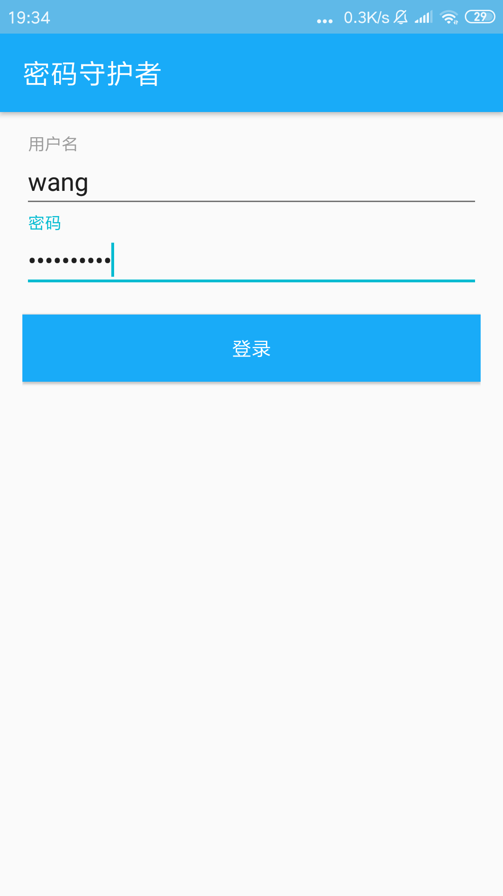
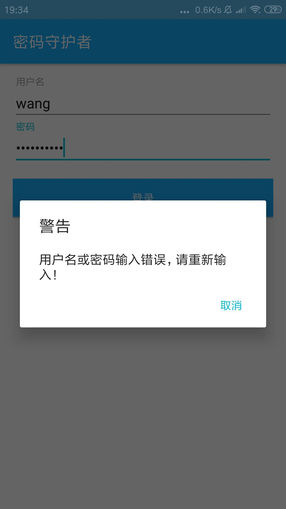
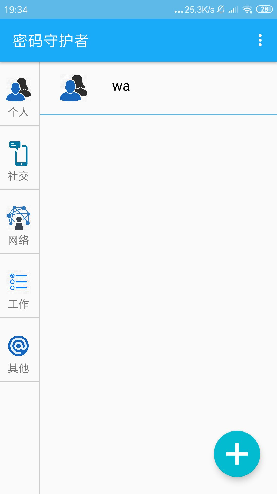
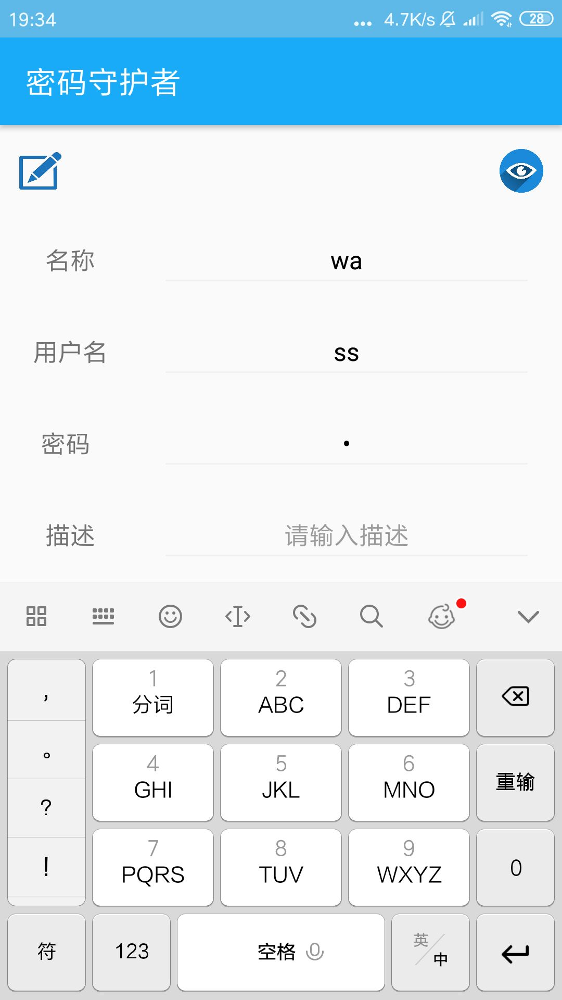

# 中山大学数据科学与计算机学院本科生实验报告

## （2018年秋季学期）
| 课程名称 | 手机平台应用开发 | 任课老师 | 郑贵锋 |
| :------------: | :-------------: | :------------: | :-------------: |
| 年级 | 2016级 | 专业（方向） | 电政 |
| 学号 | 16340211 | 姓名 | 王广浩 |
| 电话 | 17620124723 | Email | 1299927852@qq.com |
| 开始日期 | 2018.12.30 | 完成日期 |2019.1.19|

---

## 一、实验题目

PasswordKeeper：密码守护者

---

## 二、实现内容

负责了APP的底层数据封装、数据库存储、Adapter，同时根据其他组员的需求添加数据存储功能以及为数据加密预留接口。

---

## 三、实验结果
### (1)实验截图

##### 登陆界面，用户名密码存储进行加密储存





##### 应用主页面






### (2)实验步骤以及关键代码

##### User.java

用户数据封装

```java
package com.example.password_keeper.beans;

import org.greenrobot.greendao.annotation.Entity;
import org.greenrobot.greendao.annotation.Generated;
import org.greenrobot.greendao.annotation.Id;

/**
 * 使用者类
 */
@Entity
public class User {
    @Id(autoincrement = true)
    private Long id;
    private String username;
    private String password;

    @Generated(hash = 1681958521)
    public User(Long id, String username, String password) {
        this.id = id;
        this.username = username;
        this.password = password;
    }
    @Generated(hash = 586692638)
    public User() {
    }

    public String getPassword() {
        return this.password;
    }

    public void setPassword(String password) {
        this.password = password;
    }

    public String getUsername() {
        return this.username;
    }

    public void setUsername(String username) {
        this.username = username;
    }

    public Long getId() {
        return this.id;
    }

    public void setId(Long id) {
        this.id = id;
    }

}

```

##### Item.java

密码条目封装

```java

```

##### DaoMaster.java

GreenDao总控类，greenDao的入口，持有数据库对象并且 理Schema的DAO类。内部类OpenHelper以及DevOpenHelper实现了SQLiteOpenHelper，创建了数据库模式。进行数据库连接。

```java
package com.example.password_keeper.greendao;

import android.content.Context;
import android.database.sqlite.SQLiteDatabase;
import android.database.sqlite.SQLiteDatabase.CursorFactory;
import android.util.Log;

import org.greenrobot.greendao.AbstractDaoMaster;
import org.greenrobot.greendao.database.StandardDatabase;
import org.greenrobot.greendao.database.Database;
import org.greenrobot.greendao.database.DatabaseOpenHelper;
import org.greenrobot.greendao.identityscope.IdentityScopeType;


// THIS CODE IS GENERATED BY greenDAO, DO NOT EDIT.
/**
 * Master of DAO (schema version 1): knows all DAOs.
 */
public class DaoMaster extends AbstractDaoMaster {
    public static final int SCHEMA_VERSION = 1;

    /** Creates underlying database table using DAOs. */
    public static void createAllTables(Database db, boolean ifNotExists) {
        ItemDao.createTable(db, ifNotExists);
        UserDao.createTable(db, ifNotExists);
    }

    /** Drops underlying database table using DAOs. */
    public static void dropAllTables(Database db, boolean ifExists) {
        ItemDao.dropTable(db, ifExists);
        UserDao.dropTable(db, ifExists);
    }

    /**
     * WARNING: Drops all table on Upgrade! Use only during development.
     * Convenience method using a {@link DevOpenHelper}.
     */
    public static DaoSession newDevSession(Context context, String name) {
        Database db = new DevOpenHelper(context, name).getWritableDb();
        DaoMaster daoMaster = new DaoMaster(db);
        return daoMaster.newSession();
    }

    public DaoMaster(SQLiteDatabase db) {
        this(new StandardDatabase(db));
    }

    public DaoMaster(Database db) {
        super(db, SCHEMA_VERSION);
        registerDaoClass(ItemDao.class);
        registerDaoClass(UserDao.class);
    }

    public DaoSession newSession() {
        return new DaoSession(db, IdentityScopeType.Session, daoConfigMap);
    }

    public DaoSession newSession(IdentityScopeType type) {
        return new DaoSession(db, type, daoConfigMap);
    }

    /**
     * Calls {@link #createAllTables(Database, boolean)} in {@link #onCreate(Database)} -
     */
    public static abstract class OpenHelper extends DatabaseOpenHelper {
        public OpenHelper(Context context, String name) {
            super(context, name, SCHEMA_VERSION);
        }

        public OpenHelper(Context context, String name, CursorFactory factory) {
            super(context, name, factory, SCHEMA_VERSION);
        }

        @Override
        public void onCreate(Database db) {
            Log.i("greenDAO", "Creating tables for schema version " + SCHEMA_VERSION);
            createAllTables(db, false);
        }
    }

    /** WARNING: Drops all table on Upgrade! Use only during development. */
    public static class DevOpenHelper extends OpenHelper {
        public DevOpenHelper(Context context, String name) {
            super(context, name);
        }

        public DevOpenHelper(Context context, String name, CursorFactory factory) {
            super(context, name, factory);
        }

        @Override
        public void onUpgrade(Database db, int oldVersion, int newVersion) {
            Log.i("greenDAO", "Upgrading schema from version " + oldVersion + " to " + newVersion + " by dropping all tables");
            dropAllTables(db, true);
            onCreate(db);
        }
    }

}

```

##### DaoSession.java

管理特定模式的所有可用的DAO对象，通过getter方法可以获取到DAO对象。提供了增删查改实体的方法

```java
package com.example.password_keeper.greendao;

import java.util.Map;

import org.greenrobot.greendao.AbstractDao;
import org.greenrobot.greendao.AbstractDaoSession;
import org.greenrobot.greendao.database.Database;
import org.greenrobot.greendao.identityscope.IdentityScopeType;
import org.greenrobot.greendao.internal.DaoConfig;

import com.example.password_keeper.beans.Item;
import com.example.password_keeper.beans.User;

import com.example.password_keeper.greendao.ItemDao;
import com.example.password_keeper.greendao.UserDao;

// THIS CODE IS GENERATED BY greenDAO, DO NOT EDIT.

/**
 * {@inheritDoc}
 * 
 * @see org.greenrobot.greendao.AbstractDaoSession
 */
public class DaoSession extends AbstractDaoSession {

    private final DaoConfig itemDaoConfig;
    private final DaoConfig userDaoConfig;

    private final ItemDao itemDao;
    private final UserDao userDao;

    public DaoSession(Database db, IdentityScopeType type, Map<Class<? extends AbstractDao<?, ?>>, DaoConfig>
            daoConfigMap) {
        super(db);

        itemDaoConfig = daoConfigMap.get(ItemDao.class).clone();
        itemDaoConfig.initIdentityScope(type);

        userDaoConfig = daoConfigMap.get(UserDao.class).clone();
        userDaoConfig.initIdentityScope(type);

        itemDao = new ItemDao(itemDaoConfig, this);
        userDao = new UserDao(userDaoConfig, this);

        registerDao(Item.class, itemDao);
        registerDao(User.class, userDao);
    }
    
    public void clear() {
        itemDaoConfig.getIdentityScope().clear();
        userDaoConfig.getIdentityScope().clear();
    }

    public ItemDao getItemDao() {
        return itemDao;
    }

    public UserDao getUserDao() {
        return userDao;
    }

}

```

##### ItemDao.java

数据访问对象即密码条目的访问对象，对于每一个实体类，greenDao生成一个DAO,持有很多持久性的方法

```java
package com.example.password_keeper.greendao;

import android.database.Cursor;
import android.database.sqlite.SQLiteStatement;

import org.greenrobot.greendao.AbstractDao;
import org.greenrobot.greendao.Property;
import org.greenrobot.greendao.internal.DaoConfig;
import org.greenrobot.greendao.database.Database;
import org.greenrobot.greendao.database.DatabaseStatement;

import com.example.password_keeper.beans.Item;

// THIS CODE IS GENERATED BY greenDAO, DO NOT EDIT.
/** 
 * DAO for table "ITEM".
*/
public class ItemDao extends AbstractDao<Item, Long> {

    public static final String TABLENAME = "ITEM";

    /**
     * Properties of entity Item.<br/>
     * Can be used for QueryBuilder and for referencing column names.
    */
    public static class Properties {
        public final static Property Id = new Property(0, Long.class, "id", true, "_id");
        public final static Property CategoryId = new Property(1, int.class, "categoryId", false, "CATEGORY_ID");
        public final static Property Name = new Property(2, String.class, "name", false, "NAME");
        public final static Property Username = new Property(3, String.class, "username", false, "USERNAME");
        public final static Property Password = new Property(4, String.class, "password", false, "PASSWORD");
        public final static Property Desc = new Property(5, String.class, "desc", false, "DESC");
    };


    public ItemDao(DaoConfig config) {
        super(config);
    }
    
    public ItemDao(DaoConfig config, DaoSession daoSession) {
        super(config, daoSession);
    }

    /** Creates the underlying database table. */
    public static void createTable(Database db, boolean ifNotExists) {
        String constraint = ifNotExists? "IF NOT EXISTS ": "";
        db.execSQL("CREATE TABLE " + constraint + "\"ITEM\" (" + //
                "\"_id\" INTEGER PRIMARY KEY AUTOINCREMENT ," + // 0: id
                "\"CATEGORY_ID\" INTEGER NOT NULL ," + // 1: categoryId
                "\"NAME\" TEXT," + // 2: name
                "\"USERNAME\" TEXT," + // 3: username
                "\"PASSWORD\" TEXT," + // 4: password
                "\"DESC\" TEXT);"); // 5: desc
    }

    /** Drops the underlying database table. */
    public static void dropTable(Database db, boolean ifExists) {
        String sql = "DROP TABLE " + (ifExists ? "IF EXISTS " : "") + "\"ITEM\"";
        db.execSQL(sql);
    }

    @Override
    protected final void bindValues(DatabaseStatement stmt, Item entity) {
        stmt.clearBindings();
 
        Long id = entity.getId();
        if (id != null) {
            stmt.bindLong(1, id);
        }
        stmt.bindLong(2, entity.getCategoryId());
 
        String name = entity.getName();
        if (name != null) {
            stmt.bindString(3, name);
        }
 
        String username = entity.getUsername();
        if (username != null) {
            stmt.bindString(4, username);
        }
 
        String password = entity.getPassword();
        if (password != null) {
            stmt.bindString(5, password);
        }
 
        String desc = entity.getDesc();
        if (desc != null) {
            stmt.bindString(6, desc);
        }
    }

    @Override
    protected final void bindValues(SQLiteStatement stmt, Item entity) {
        stmt.clearBindings();
 
        Long id = entity.getId();
        if (id != null) {
            stmt.bindLong(1, id);
        }
        stmt.bindLong(2, entity.getCategoryId());
 
        String name = entity.getName();
        if (name != null) {
            stmt.bindString(3, name);
        }
 
        String username = entity.getUsername();
        if (username != null) {
            stmt.bindString(4, username);
        }
 
        String password = entity.getPassword();
        if (password != null) {
            stmt.bindString(5, password);
        }
 
        String desc = entity.getDesc();
        if (desc != null) {
            stmt.bindString(6, desc);
        }
    }

    @Override
    public Long readKey(Cursor cursor, int offset) {
        return cursor.isNull(offset + 0) ? null : cursor.getLong(offset + 0);
    }    

    @Override
    public Item readEntity(Cursor cursor, int offset) {
        Item entity = new Item( //
            cursor.isNull(offset + 0) ? null : cursor.getLong(offset + 0), // id
            cursor.getInt(offset + 1), // categoryId
            cursor.isNull(offset + 2) ? null : cursor.getString(offset + 2), // name
            cursor.isNull(offset + 3) ? null : cursor.getString(offset + 3), // username
            cursor.isNull(offset + 4) ? null : cursor.getString(offset + 4), // password
            cursor.isNull(offset + 5) ? null : cursor.getString(offset + 5) // desc
        );
        return entity;
    }
     
    @Override
    public void readEntity(Cursor cursor, Item entity, int offset) {
        entity.setId(cursor.isNull(offset + 0) ? null : cursor.getLong(offset + 0));
        entity.setCategoryId(cursor.getInt(offset + 1));
        entity.setName(cursor.isNull(offset + 2) ? null : cursor.getString(offset + 2));
        entity.setUsername(cursor.isNull(offset + 3) ? null : cursor.getString(offset + 3));
        entity.setPassword(cursor.isNull(offset + 4) ? null : cursor.getString(offset + 4));
        entity.setDesc(cursor.isNull(offset + 5) ? null : cursor.getString(offset + 5));
     }
    
    @Override
    protected final Long updateKeyAfterInsert(Item entity, long rowId) {
        entity.setId(rowId);
        return rowId;
    }
    
    @Override
    public Long getKey(Item entity) {
        if(entity != null) {
            return entity.getId();
        } else {
            return null;
        }
    }

    @Override
    protected final boolean isEntityUpdateable() {
        return true;
    }
    
}

```

##### UserDao.java

数据访问对象即用户名的访问对象，对于每一个实体类，greenDao生成一个DAO,持有很多持久性的方法

```java
package com.example.password_keeper.greendao;

import android.database.Cursor;
import android.database.sqlite.SQLiteStatement;

import org.greenrobot.greendao.AbstractDao;
import org.greenrobot.greendao.Property;
import org.greenrobot.greendao.internal.DaoConfig;
import org.greenrobot.greendao.database.Database;
import org.greenrobot.greendao.database.DatabaseStatement;

import com.example.password_keeper.beans.User;

// THIS CODE IS GENERATED BY greenDAO, DO NOT EDIT.
/** 
 * DAO for table "USER".
*/
public class UserDao extends AbstractDao<User, Long> {

    public static final String TABLENAME = "USER";

    /**
     * Properties of entity User.<br/>
     * Can be used for QueryBuilder and for referencing column names.
    */
    public static class Properties {
        public final static Property Id = new Property(0, Long.class, "id", true, "_id");
        public final static Property Username = new Property(1, String.class, "username", false, "USERNAME");
        public final static Property Password = new Property(2, String.class, "password", false, "PASSWORD");
    };


    public UserDao(DaoConfig config) {
        super(config);
    }
    
    public UserDao(DaoConfig config, DaoSession daoSession) {
        super(config, daoSession);
    }

    /** Creates the underlying database table. */
    public static void createTable(Database db, boolean ifNotExists) {
        String constraint = ifNotExists? "IF NOT EXISTS ": "";
        db.execSQL("CREATE TABLE " + constraint + "\"USER\" (" + //
                "\"_id\" INTEGER PRIMARY KEY AUTOINCREMENT ," + // 0: id
                "\"USERNAME\" TEXT," + // 1: username
                "\"PASSWORD\" TEXT);"); // 2: password
    }

    /** Drops the underlying database table. */
    public static void dropTable(Database db, boolean ifExists) {
        String sql = "DROP TABLE " + (ifExists ? "IF EXISTS " : "") + "\"USER\"";
        db.execSQL(sql);
    }

    @Override
    protected final void bindValues(DatabaseStatement stmt, User entity) {
        stmt.clearBindings();
 
        Long id = entity.getId();
        if (id != null) {
            stmt.bindLong(1, id);
        }
 
        String username = entity.getUsername();
        if (username != null) {
            stmt.bindString(2, username);
        }
 
        String password = entity.getPassword();
        if (password != null) {
            stmt.bindString(3, password);
        }
    }

    @Override
    protected final void bindValues(SQLiteStatement stmt, User entity) {
        stmt.clearBindings();
 
        Long id = entity.getId();
        if (id != null) {
            stmt.bindLong(1, id);
        }
 
        String username = entity.getUsername();
        if (username != null) {
            stmt.bindString(2, username);
        }
 
        String password = entity.getPassword();
        if (password != null) {
            stmt.bindString(3, password);
        }
    }

    @Override
    public Long readKey(Cursor cursor, int offset) {
        return cursor.isNull(offset + 0) ? null : cursor.getLong(offset + 0);
    }    

    @Override
    public User readEntity(Cursor cursor, int offset) {
        User entity = new User( //
            cursor.isNull(offset + 0) ? null : cursor.getLong(offset + 0), // id
            cursor.isNull(offset + 1) ? null : cursor.getString(offset + 1), // username
            cursor.isNull(offset + 2) ? null : cursor.getString(offset + 2) // password
        );
        return entity;
    }
     
    @Override
    public void readEntity(Cursor cursor, User entity, int offset) {
        entity.setId(cursor.isNull(offset + 0) ? null : cursor.getLong(offset + 0));
        entity.setUsername(cursor.isNull(offset + 1) ? null : cursor.getString(offset + 1));
        entity.setPassword(cursor.isNull(offset + 2) ? null : cursor.getString(offset + 2));
     }
    
    @Override
    protected final Long updateKeyAfterInsert(User entity, long rowId) {
        entity.setId(rowId);
        return rowId;
    }
    
    @Override
    public Long getKey(User entity) {
        if(entity != null) {
            return entity.getId();
        } else {
            return null;
        }
    }

    @Override
    protected final boolean isEntityUpdateable() {
        return true;
    }
    
}

```

##### KeyListAdapter

Recyclerview的Adapter，负责加载主页面的每个条目

```java
package com.example.password_keeper.adapters;

import android.content.Context;
import android.content.Intent;
import android.os.Bundle;
import android.support.v7.widget.RecyclerView;
import android.view.LayoutInflater;
import android.view.View;
import android.view.ViewGroup;
import android.widget.ImageView;
import android.widget.LinearLayout;
import android.widget.TextView;

import com.example.password_keeper.R;
import com.example.password_keeper.beans.Item;
import com.example.password_keeper.constants.Constants;
import com.example.password_keeper.ui.DetailActivity;
import com.squareup.picasso.Picasso;

import butterknife.BindView;
import butterknife.ButterKnife;

/**
 * 密码列表显示
 */
public class KeyListAdapter extends RecyclerView.Adapter<KeyListAdapter.ViewHolder> {
    private Context mContext;
    private Item[] mKeyItems;
    private int mCategoryId;

    public KeyListAdapter(Context context, Item[] keyItems, int categoryId) {
        this.mContext = context;
        this.mKeyItems = keyItems;
        this.mCategoryId = categoryId;
    }

    @Override
    public ViewHolder onCreateViewHolder(ViewGroup parent, int viewType) {
        return new ViewHolder(LayoutInflater.from(mContext).inflate(R.layout.key_item, parent, false));
    }

    @Override
    public void onBindViewHolder(ViewHolder holder, final int position) {
        if(mKeyItems != null){
            switch (mCategoryId) {
                case Constants.SELF_ID:
                    Picasso.get().load(R.drawable.self_icon).into(holder.keyItemIcon);
                    break;
                case Constants.NET_ID:
                    Picasso.get().load(R.drawable.net_icon).into(holder.keyItemIcon);
                    break;
                case Constants.COMM_ID:
                    Picasso.get().load(R.drawable.comm_icon).into(holder.keyItemIcon);
                    break;
                case Constants.WORK_ID:
                    Picasso.get().load(R.drawable.work_icon).into(holder.keyItemIcon);
                    break;
                case Constants.OTHER_ID:
                    Picasso.get().load(R.drawable.other_icon).into(holder.keyItemIcon);
                    break;
                default:
                    break;
            }
            holder.keyItemName.setText(mKeyItems[position].getName());

            holder.keyItemLayout.setOnClickListener(new View.OnClickListener() {
                @Override
                public void onClick(View v) {
                    Intent intent = new Intent(mContext, DetailActivity.class);
                    Bundle bundle = new Bundle();
                    bundle.putInt(Constants.DETAIL_ACTIVITY_MODE, Constants.DETAIL_ACTIVITY_SEE);
                    bundle.putLong(Constants.ITEM_ID, mKeyItems[position].getId());
                    intent.putExtra(Constants.DETAIL_ACTIVITY_MODE_DATA, bundle);
                    mContext.startActivity(intent);
                }
            });
        }
    }


    @Override
    public int getItemCount() {
        if(mKeyItems != null){
            return mKeyItems.length;
        }
        return 0;
    }

    public class ViewHolder extends RecyclerView.ViewHolder {
        @BindView(R.id.key_item_icon)
        ImageView keyItemIcon;

        @BindView(R.id.key_item_name)
        TextView keyItemName;

        @BindView(R.id.key_item_layout)
        LinearLayout keyItemLayout;

        public ViewHolder(View itemView) {
            super(itemView);
            ButterKnife.bind(this, itemView);
        }
    }
}

```


### (3)实验遇到的困难以及解决思路

- 思考使用怎样的数据库存储数据既安全又快，同时需要支持加密  解决办法：在网上找到了一个比较高效、轻量、开源同时又支持加密的GreenDao，通过这个进行操控数据库可以解决很多问题。
- 思考用户名和密码条目的数据项  解决办法：先给定几个暂时可以想到的项，在根据队友在实际实现过程中需要的中间变量或函数，添加新的内容
- GreenDao的一些使用事项和理解  解决办法：https://www.jianshu.com/p/1044c9cdcc97 https://www.cnblogs.com/tgyf/p/5812828.html

- Adapter实现  解决办法：根据队友负责的UI控件，通过onBindViewHolder对控件进行修改

---

## 四、个人总结与个人贡献评分

主要负责了应用底层的数据存储和数据使用方面。使用了数据库存储，同时使用GreenDao进行协助，可以使自己的数据库能够支持数据加密和高效等，同时代码显得更加具有逻辑性，不涉及具体的SQL语言操作，使用封装的函数完成各种增添修改工。对于GreenDao还是第一次接触，虽然感觉很高端的样子，但是真正了解之后发现很容易使用，而且确实也是相当方便的。对于Adapter之前已经使用了很多次，所以这次基本没有什么问题，主要是和队友的一些协调。总的来说知识和内容的量还好，难度也还好，主要和队友之间，因为是并行写的，所以修改了很多，给自己的个人贡献评分是百分之三十三。

---

## 五、思想感悟

本次期末项目，由于自己在电脑端和IOS端在使用密码管理软件，个人感觉还是比较方便的，可以将加密后的密码放到自己的网盘中支持云端同步，所以本次项目就以这个思路为蓝本，实现在android端的密码管理。在整个应用中，比较重要的还是UI设计，毕竟一个UI非常丑的应用是不会有人用的。但作为一个密码管理软件，安全是重中之重，对于数据的存储以及数据的加密传输是必不可少的。数据库的维护是比较重要的，毕竟整个应用的运行都围绕在储存条目的数据库中，一旦数据库丢失，对于用户的损失将是不可估量的。同时数据库又与各个部分相关联，与队友的合作是必不可少的。

---

