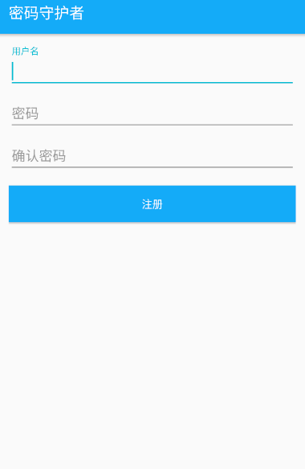
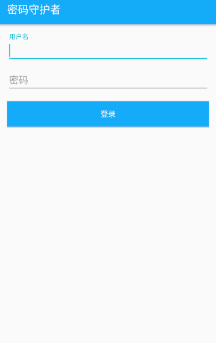
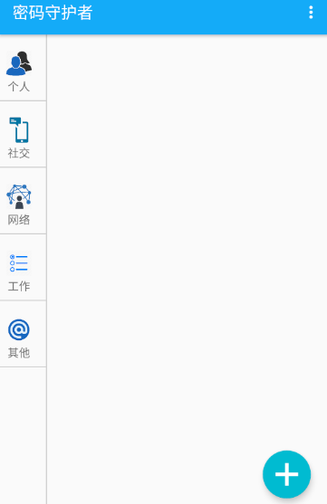
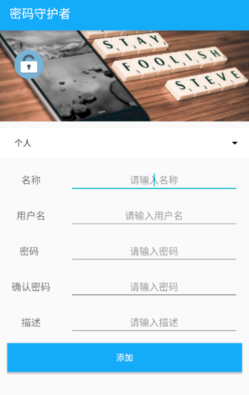
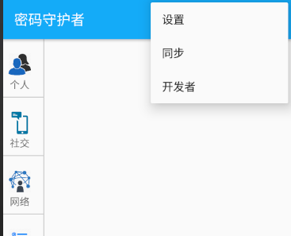
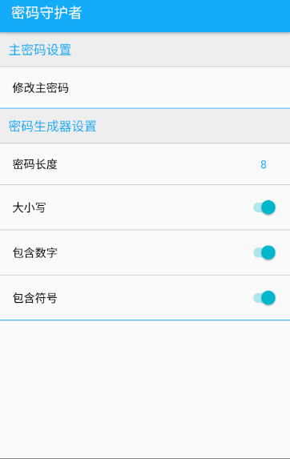

# 中山大学数据科学与计算机学院本科生实验报告
## （2018年秋季学期）
| 课程名称 | 手机平台应用开发 | 任课老师 | 郑贵锋 |
| :------------: | :-------------: | :------------: | :-------------: |
| 年级 | 大三 | 专业（方向） | 计应 |
| 学号 | 16340212 | 姓名 | 王季宁 |
| 电话 | 13306387484 | Email | 13371350035@163.com |
| 开始日期 | 2018.12.30 | 完成日期 |2019.1.17|

---

## 一、实验题目

PasswordKeeper：密码守护者

---

## 二、实现内容

完成了APP的UI设计，并且根据其他组员的需求及时对UI功能进行修改。

---

## 三、实验结果
### (1)项目功能截图及对应代码

- 启动页面动画效果


```HTML动画：rain.html```

```html
<!doctype HTML>
<html>
<head>
	<title>canvas代码流动态效果</title>
	<style type="text/css">
		*{margin:0;padding:0;}

	</style>
</head>
<body>
	<canvas id="canvas"></canvas>
	<script type="text/javascript">
		//获取屏幕大小
		var s = window.screen;
		var winW = s.width;
		var winH = s.height;
		//设置画布大小
		var canvas = document.getElementById("canvas");
		canvas.width = winW;
		canvas.height = winH;
		var cxt = canvas.getContext("2d");

		var fontSize = 14;
		var str = "0123456789qwertyuiopasdfghjklllzxcvbnm!@#$%^&*()_";
		var txts = str.split("");
		//共有多少行
		var cols = Math.floor(winW/fontSize);
		var drop = [];
		for(var i=0;i<cols;i++){
			//Y轴初始化位置
			drop.push(Math.floor(Math.random()*-100));
		}

		function draw(){
			//背景填充
			cxt.fillStyle = "rgba(59,160,247,0.05)";
			cxt.fillRect(0,0,winW,winH);

			//字体颜色
			cxt.fillStyle = "#ffffff";
			//字体
			cxt.font = "300px " + fontSize + "px 微软雅黑";
			for(var i=0;i<drop.length;i++){
				//设置绘画的文字
				cxt.fillText(txts[Math.floor(Math.random()*txts.length)],i*fontSize,drop[i]*fontSize);
				//如果绘满一屏或随机数大于0.95（此数可自行调整，效果会不同）
				if(drop[i]*fontSize > winH || Math.random() > 0.92){
					drop[i] = 0;
				}
				//用于Y轴坐标增加
				drop[i]++;
			}
			
		}

		setInterval(draw,33);
	</script>
</body>
</html>
 
```


```引用HTML文件并判断用户是否已经注册：SplashActivity.java```

```java
package com.example.password_keeper.ui;

import android.app.Activity;
import android.content.Intent;
import android.os.Bundle;
import android.support.annotation.Nullable;
import android.view.Window;
import android.view.WindowManager;
import android.webkit.WebView;
import android.webkit.WebViewClient;

import com.example.password_keeper.R;
import com.example.password_keeper.constants.Constants;
import com.example.password_keeper.storage.MySP;

import java.util.Timer;
import java.util.TimerTask;

import butterknife.ButterKnife;

/**
 *开机画面
 */
public class SplashActivity extends Activity {
    private MySP mMySP;

    @Override
    protected void onCreate(@Nullable Bundle savedInstanceState) {
        super.onCreate(savedInstanceState);
        mMySP = new MySP(this).getmMySP();//获取本地存储记录
        requestWindowFeature(Window.FEATURE_NO_TITLE);// 隐藏标题
        getWindow().setFlags(WindowManager.LayoutParams.FLAG_FULLSCREEN,
                WindowManager.LayoutParams.FLAG_FULLSCREEN);// 设置全屏
        setContentView(R.layout.activity_splash);
        WebView webView = (WebView)findViewById(R.id.webview);
        String url = "file:///android_asset/rain.html";
        //此方法可以在webview中打开链接而不会跳转到外部浏览器
        webView.setWebViewClient(new WebViewClient());
        //此方法可以启用html5页面的javascript
        webView.getSettings().setJavaScriptEnabled(true);
        webView.loadUrl(url);
        Timer timer = new Timer();
        //开机画面设置为三秒
        TimerTask timerTask = new TimerTask() {
            @Override
            public void run() {
                boolean flag = mMySP.load(Constants.IS_HAS_USER, false);
                if(flag) {
                    Intent intent = new Intent(SplashActivity.this, LoginActivity.class);
                    startActivity(intent);
                }
                else{
                    Intent intent = new Intent(SplashActivity.this, RegisterActivity.class);
                    startActivity(intent);
                }
                finish();
            }
        };
        timer.schedule(timerTask, 3200);
    }

}
```


```控制开机界面AndroidManifest.xml```

```xml
<?xml version="1.0" encoding="utf-8"?>
<manifest xmlns:android="http://schemas.android.com/apk/res/android"
    package="com.example.password_keeper">
    <uses-permission android:name="android.permission.GET_ACCOUNTS" />
    <uses-permission android:name="android.permission.READ_PROFILE" />
    <uses-permission android:name="android.permission.READ_CONTACTS" />
    <uses-permission android:name="android.permission.INTERNET"/>

    <application
        android:name=".MyApplication"
        android:allowBackup="true"
        android:icon="@drawable/app_icon"
        android:label="@string/app_name"
        android:roundIcon="@drawable/app_icon"
        android:supportsRtl="true"
        android:theme="@style/AppTheme">
        <!--欢迎界面-->
        <activity android:name=".ui.SplashActivity">
            <intent-filter>
                <action android:name="android.intent.action.MAIN" />
                <category android:name="android.intent.category.LAUNCHER" />
            </intent-filter>
        </activity>

        <!--主界面-->
        <activity android:name=".ui.MainActivity">
        </activity>

        <!--注册界面-->
        <activity android:name=".ui.RegisterActivity">
        </activity>

        <!--登录界面-->
        <activity android:name=".ui.LoginActivity">
        </activity>

        <!--条目详情界面-->
        <activity android:name=".ui.DetailActivity">
        </activity>

        <!--开发者介绍界面-->
        <activity android:name=".ui.DevActivity">
        </activity>

        <!--设置界面-->
        <activity android:name=".ui.SettingsActivity">
        </activity>

        <!--更改主密码界面-->
        <activity android:name=".ui.ChangePasswordActivity">
        </activity>
    </application>

</manifest>
```


- 注册界面

  

  ```activity_register.xml```

  ```xml
  <?xml version="1.0" encoding="utf-8"?>
  <LinearLayout xmlns:android="http://schemas.android.com/apk/res/android"
      xmlns:tools="http://schemas.android.com/tools"
      android:layout_width="match_parent"
      android:layout_height="match_parent"
      android:gravity="center_horizontal"
      android:orientation="vertical"
      android:paddingBottom="@dimen/activity_vertical_margin"
      android:paddingLeft="@dimen/activity_horizontal_margin"
      android:paddingRight="@dimen/activity_horizontal_margin"
      android:paddingTop="@dimen/activity_vertical_margin"
      tools:context="ui.LoginActivity">
  
      <android.support.design.widget.TextInputLayout
          android:layout_width="match_parent"
          android:layout_height="wrap_content">
  
          <EditText
              android:id="@+id/username_et"
              android:layout_width="match_parent"
              android:layout_height="wrap_content"
              android:hint="@string/username"
              android:maxLines="1"
              android:singleLine="true" />
  
      </android.support.design.widget.TextInputLayout>
  
      <android.support.design.widget.TextInputLayout
          android:layout_width="match_parent"
          android:layout_height="wrap_content">
  
          <EditText
              android:id="@+id/password1_et"
              android:layout_width="match_parent"
              android:layout_height="wrap_content"
              android:hint="@string/password"
              android:imeActionId="6"
              android:imeActionLabel="@string/action_sign_in_short"
              android:imeOptions="actionUnspecified"
              android:inputType="textPassword"
              android:maxLines="1"
              android:singleLine="true" />
  
      </android.support.design.widget.TextInputLayout>
  
      <android.support.design.widget.TextInputLayout
          android:layout_width="match_parent"
          android:layout_height="wrap_content">
  
          <EditText
              android:id="@+id/password2_et"
              android:layout_width="match_parent"
              android:layout_height="wrap_content"
              android:hint="@string/password2"
              android:imeActionId="6"
              android:imeActionLabel="@string/action_sign_in_short"
              android:imeOptions="actionUnspecified"
              android:inputType="textPassword"
              android:maxLines="1"
              android:singleLine="true" />
  
      </android.support.design.widget.TextInputLayout>
  
      <Button
          android:id="@+id/register_button"
          style="?android:textAppearanceSmall"
          android:layout_width="match_parent"
          android:layout_height="wrap_content"
          android:layout_marginTop="16dp"
          android:text="@string/register"
          android:textColor="@color/white"
          android:background="@color/colorPrimary" />
  
  </LinearLayout>
  ```


```RegisterActivity.java```

```java
package com.example.password_keeper.ui;

import android.app.AlertDialog;
import android.content.DialogInterface;
import android.content.Intent;
import android.os.Bundle;
import android.support.annotation.Nullable;
import android.support.v7.app.AppCompatActivity;
import android.view.View;
import android.widget.Button;
import android.widget.EditText;

import com.example.password_keeper.MyApplication;
import com.example.password_keeper.R;
import com.example.password_keeper.beans.User;
import com.example.password_keeper.constants.Constants;
import com.example.password_keeper.greendao.UserDao;
import com.example.password_keeper.secures.BCrypt;
import com.example.password_keeper.storage.MySP;

import butterknife.BindView;
import butterknife.ButterKnife;
import butterknife.OnClick;

/**
 * 注册界面
 */
public class RegisterActivity extends AppCompatActivity {


    EditText mUsernameEt;
    EditText mPassword1Et;
    EditText mPassword2Et;
    Button mrRgisterButton;
    private MySP mMySP;

    @Override
    protected void onCreate(@Nullable Bundle savedInstanceState) {
        super.onCreate(savedInstanceState);
        setContentView(R.layout.activity_register);
        ButterKnife.bind(this);
        mUsernameEt = findViewById(R.id.username_et);
        mPassword1Et = findViewById(R.id.password1_et);
        mPassword2Et = findViewById(R.id.password2_et);
        mrRgisterButton = findViewById(R.id.register_button);
        mMySP = new MySP(this).getmMySP();
        mMySP.save(Constants.IS_ALPHABAT_ON, true);
        mMySP.save(Constants.IS_NUMBER_ON, true);
        mMySP.save(Constants.IS_SYMBOL_ON, true);
        mMySP.save(Constants.KEY_LENGTH, 8);
        //注册按钮的点击事件
        mrRgisterButton.setOnClickListener(new View.OnClickListener() {
            @Override
            public void onClick(View view) {
                String username = mUsernameEt.getText().toString().trim();
                String password1 = mPassword1Et.getText().toString().trim();
                String password2 = mPassword2Et.getText().toString().trim();

                if(username.length() > 0
                        && password1.equals(password2)
                        && password1.length() > 8){
                    UserDao userDao = MyApplication.getInstance().getDaoSession().getUserDao();
                    //用户名直接存入数据库，密码加密后存入数据库
                    User user = new User();
                    user.setUsername(username);
                    user.setPassword(BCrypt.hashpw(password1, BCrypt.gensalt()));
                    userDao.insert(user);

                    mMySP.save(Constants.IS_HAS_USER, true);
                    Intent intent = new Intent(RegisterActivity.this, LoginActivity.class);
                    startActivity(intent);
                    finish();
                }
                else{
                    AlertDialog.Builder builder = new AlertDialog.Builder(RegisterActivity.this);
                    builder.setTitle("注意");
                    if (username.length() == 0) {
                        builder.setMessage("用户名不能为空，请仔细检查！");
                    }
                    else {
                        if (!password1.equals((password2))) {
                            builder.setMessage("两次输入密码不一致，请再次确认！");
                        }
                        else {
                            builder.setMessage("密码必须大于八位，请重新输入！");
                        }
                    }
                    builder.setPositiveButton("确定", new DialogInterface.OnClickListener() {
                        @Override
                        public void onClick(DialogInterface dialog, int which) {
                        }
                    });
                    builder.setNegativeButton("取消", null);
                    builder.create().show();
                }
            }
        });
    }

}
```


- 登录界面

  

  ```LoginActivity.java```

```java
package com.example.password_keeper.ui;

import android.app.AlertDialog;
import android.content.DialogInterface;
import android.content.Intent;
import android.os.Bundle;
import android.support.annotation.Nullable;
import android.support.v7.app.AppCompatActivity;
import android.view.View;
import android.widget.Button;
import android.widget.EditText;

import com.example.password_keeper.R;
import com.example.password_keeper.secures.BaseSecure;

import butterknife.BindView;
import butterknife.ButterKnife;

/**
 *登陆界面
 */
public class LoginActivity extends AppCompatActivity {


    EditText mUsernameEt;
    EditText mPasswordEt;
    Button mLoginButton;

    @Override
    protected void onCreate(@Nullable Bundle savedInstanceState) {
        super.onCreate(savedInstanceState);
        setContentView(R.layout.activity_login);
        mUsernameEt = findViewById(R.id.username);
        mPasswordEt = findViewById(R.id.password);
        mLoginButton = findViewById(R.id.login_button);
        mLoginButton.setOnClickListener(new View.OnClickListener() {
            @Override
            public void onClick(View v) {
                String username = mUsernameEt.getText().toString().trim();
                String password = mPasswordEt.getText().toString().trim();
                if(BaseSecure.isUserInputLegal(username, password)
                        && BaseSecure.authenticateUser(username, password))
                {
                    Intent intent = new Intent(LoginActivity.this, MainActivity.class);
                    startActivity(intent);
                    finish();
                }
                else{
                    AlertDialog.Builder builder = new AlertDialog.Builder(LoginActivity.this);
                    builder.setTitle("警告");
                    builder.setMessage("用户名或密码输入错误，请重新输入！");
                    builder.setNegativeButton("取消", null);
                    builder.create().show();
                }
            }
        });
    }
}

```


```activity_register.xml```


```
<?xml version="1.0" encoding="utf-8"?>
<LinearLayout xmlns:android="http://schemas.android.com/apk/res/android"
    xmlns:tools="http://schemas.android.com/tools"
    android:layout_width="match_parent"
    android:layout_height="match_parent"
    android:gravity="center_horizontal"
    android:orientation="vertical"
    android:paddingBottom="@dimen/activity_vertical_margin"
    android:paddingLeft="@dimen/activity_horizontal_margin"
    android:paddingRight="@dimen/activity_horizontal_margin"
    android:paddingTop="@dimen/activity_vertical_margin"
    tools:context="ui.LoginActivity">

    <android.support.design.widget.TextInputLayout
        android:layout_width="match_parent"
        android:layout_height="wrap_content">

        <EditText
            android:id="@+id/username_et"
            android:layout_width="match_parent"
            android:layout_height="wrap_content"
            android:hint="@string/username"
            android:maxLines="1"
            android:singleLine="true" />

    </android.support.design.widget.TextInputLayout>

    <android.support.design.widget.TextInputLayout
        android:layout_width="match_parent"
        android:layout_height="wrap_content">

        <EditText
            android:id="@+id/password1_et"
            android:layout_width="match_parent"
            android:layout_height="wrap_content"
            android:hint="@string/password"
            android:imeActionId="6"
            android:imeActionLabel="@string/action_sign_in_short"
            android:imeOptions="actionUnspecified"
            android:inputType="textPassword"
            android:maxLines="1"
            android:singleLine="true" />

    </android.support.design.widget.TextInputLayout>

    <android.support.design.widget.TextInputLayout
        android:layout_width="match_parent"
        android:layout_height="wrap_content">

        <EditText
            android:id="@+id/password2_et"
            android:layout_width="match_parent"
            android:layout_height="wrap_content"
            android:hint="@string/password2"
            android:imeActionId="6"
            android:imeActionLabel="@string/action_sign_in_short"
            android:imeOptions="actionUnspecified"
            android:inputType="textPassword"
            android:maxLines="1"
            android:singleLine="true" />

    </android.support.design.widget.TextInputLayout>

    <Button
        android:id="@+id/register_button"
        style="?android:textAppearanceSmall"
        android:layout_width="match_parent"
        android:layout_height="wrap_content"
        android:layout_marginTop="16dp"
        android:text="@string/register"
        android:textColor="@color/white"
        android:background="@color/colorPrimary" />

</LinearLayout>
```


- 密码显示界面

  

  ```MainActivity.java```

  ```
  package com.example.password_keeper.ui;
  
  import android.content.Intent;
  import android.os.Bundle;
  import android.support.v7.app.AppCompatActivity;
  import android.support.v7.widget.LinearLayoutManager;
  import android.support.v7.widget.RecyclerView;
  import android.view.Menu;
  import android.view.MenuItem;
  import android.view.View;
  import android.widget.LinearLayout;
  import android.widget.ProgressBar;
  import com.example.password_keeper.MyApplication;
  import com.example.password_keeper.R;
  import com.example.password_keeper.adapters.KeyListAdapter;
  import com.example.password_keeper.beans.Item;
  import com.example.password_keeper.constants.Constants;
  import com.example.password_keeper.greendao.ItemDao;
  import com.example.password_keeper.storage.MySP;
  import com.example.password_keeper.utils.LoadUtils;
  
  import java.util.List;
  
  import butterknife.BindView;
  import butterknife.ButterKnife;
  import butterknife.OnClick;
  
  /**
   * 主界面和菜单界面
   */
  public class MainActivity extends AppCompatActivity {
      private static final String TAG = "MainActivity";
  
      @BindView(R.id.category_self)
      LinearLayout mCategorySelf;
  
      @BindView(R.id.category_comm)
      LinearLayout mCategoryComm;
  
      @BindView(R.id.category_net)
      LinearLayout mCategoryNet;
  
      @BindView(R.id.category_work)
      LinearLayout mCategoryWork;
  
      @BindView(R.id.category_other)
      LinearLayout mCategoryOther;
  
      @BindView(R.id.category_layout)
      LinearLayout mCategoryLayout;
  
      @BindView(R.id.items_list)
      RecyclerView mItemsList;
  
      @BindView(R.id.progress)
      ProgressBar pro;
  
      private MySP mMySP;
  
      private Item[] mKeyItems;
  
      @Override
      protected void onCreate(Bundle savedInstanceState) {
          super.onCreate(savedInstanceState);
          setContentView(R.layout.activity_main);
          //绑定黄油刀
          ButterKnife.bind(this);
          mMySP = new MySP(this).getmMySP();
          mMySP.save("is_first_load", false);
          //通过枚举的CategoryId填充对应目录下的全部条目
          mKeyItems = LoadUtils.loadSelfKeyItemsByCategoryId(Constants.SELF_ID);
          mItemsList.setLayoutManager(new LinearLayoutManager(this));
          mItemsList.setAdapter(new KeyListAdapter(this, mKeyItems, Constants.SELF_ID));
      }
  
      //加载顶层按钮
      @Override
      public boolean onCreateOptionsMenu(Menu menu) {
          getMenuInflater().inflate(R.menu.top_menu, menu);
          return super.onCreateOptionsMenu(menu);
      }
  
      //顶层按钮的条目的点击事件
      @Override
      public boolean onOptionsItemSelected(MenuItem item) {
          int itemId = item.getItemId();
          if(itemId == R.id.menu_dev){
              Intent intent = new Intent(MainActivity.this, DevActivity.class);
              startActivity(intent);
              return true;
          }
          else if(itemId == R.id.menu_settings){
              Intent intent = new Intent(MainActivity.this, SettingsActivity.class);
              startActivity(intent);
              return true;
          }
          //同步选项的点击事件
          else if(itemId == R.id.menu_syn) {
              pro.setVisibility(View.VISIBLE);
              return true;
          }
          else {
              return super.onOptionsItemSelected(item);
          }
      }
  
      @Override
      protected void onStart() {
          super.onStart();
          mMySP = new MySP(this).getmMySP();
          mMySP.save("is_first_load", false);
          //通过枚举的CategoryId填充对应目录下的全部条目
          mKeyItems = LoadUtils.loadSelfKeyItemsByCategoryId(Constants.SELF_ID);
          mItemsList.setLayoutManager(new LinearLayoutManager(this));
          mItemsList.setAdapter(new KeyListAdapter(this, mKeyItems, Constants.SELF_ID));
          ItemDao itemDao = MyApplication.getInstance().getDaoSession().getItemDao();
          List<Item> itemList = itemDao.queryBuilder().where(ItemDao.Properties.CategoryId.eq(5)).list();
      }
  
      //使用黄油刀设置各个按钮的点击事件
      @OnClick({R.id.category_self, R.id.category_comm, R.id.category_net, R.id.category_work, R.id.category_other, R.id.add_button})
      public void onViewClicked(View view) {
          switch (view.getId()) {
              case R.id.category_self:
                  mKeyItems = LoadUtils.loadSelfKeyItemsByCategoryId(Constants.SELF_ID);
                  mItemsList.setAdapter(new KeyListAdapter(this, mKeyItems, Constants.SELF_ID));
                  break;
              case R.id.category_comm:
                  mKeyItems = LoadUtils.loadSelfKeyItemsByCategoryId(Constants.COMM_ID);
                  mItemsList.setAdapter(new KeyListAdapter(this, mKeyItems, Constants.COMM_ID));
                  break;
              case R.id.category_net:
                  mKeyItems = LoadUtils.loadSelfKeyItemsByCategoryId(Constants.NET_ID);
                  mItemsList.setAdapter(new KeyListAdapter(this, mKeyItems, Constants.NET_ID));
                  break;
              case R.id.category_work:
                  mKeyItems = LoadUtils.loadSelfKeyItemsByCategoryId(Constants.WORK_ID);
                  mItemsList.setAdapter(new KeyListAdapter(this, mKeyItems, Constants.WORK_ID));
                  break;
              case R.id.category_other:
                  mKeyItems = LoadUtils.loadSelfKeyItemsByCategoryId(Constants.OTHER_ID);
                  mItemsList.setAdapter(new KeyListAdapter(this, mKeyItems, Constants.OTHER_ID));
                  break;
              case R.id.add_button:
                  Intent intent = new Intent(MainActivity.this, DetailActivity.class);
                  Bundle bundle = new Bundle();
                  bundle.putInt(Constants.DETAIL_ACTIVITY_MODE, Constants.DETAIL_ACTIVITY_ADD);
                  intent.putExtra(Constants.DETAIL_ACTIVITY_MODE_DATA, bundle);
                  startActivity(intent);
                  break;
              default:
                  break;
          }
      }
  }
  
  ```


```activity_main.xml```

```
<?xml version="1.0" encoding="utf-8"?>
<LinearLayout xmlns:android="http://schemas.android.com/apk/res/android"
    xmlns:tools="http://schemas.android.com/tools"
    android:layout_width="match_parent"
    android:layout_height="match_parent"
    xmlns:app="http://schemas.android.com/apk/res-auto"
    tools:context=".ui.MainActivity"
    android:orientation="horizontal"
    android:weightSum="7">
    <LinearLayout
        android:id="@+id/category_layout"
        android:layout_width="match_parent"
        android:layout_height="match_parent"
        android:orientation="vertical"
        android:layout_weight="6">

        <ProgressBar
            android:id="@+id/progress"
            android:layout_width="wrap_content"
            android:layout_height="wrap_content"
            android:layout_gravity="center"
            android:visibility="gone"
            android:layout_centerInParent="true" />

        <!--目录1-->
        <LinearLayout
            android:id="@+id/category_self"
            android:layout_width="match_parent"
            android:layout_height="70dp"
            android:orientation="vertical"
            android:layout_marginTop="12dp">
            <ImageView
                android:layout_width="32dp"
                android:layout_height="32dp"
                android:background="@drawable/self_icon"
                android:layout_marginLeft="8dp"
                android:layout_marginTop="8dp" />
            <TextView
                android:layout_width="match_parent"
                android:layout_height="18dp"
                android:text="个人"
                android:textSize="14sp"
                android:layout_marginTop="3dp"
                android:gravity="center_vertical"
                android:layout_marginLeft="10dp"/>
        </LinearLayout>

        <View
            android:layout_width="match_parent"
            android:layout_height="1dp"
            android:background="@color/gray"/>

        <!--目录2-->
        <LinearLayout
            android:id="@+id/category_comm"
            android:layout_width="match_parent"
            android:layout_height="70dp"
            android:orientation="vertical"
            android:layout_marginTop="12dp">
            <ImageView
                android:layout_width="32dp"
                android:layout_height="32dp"
                android:background="@drawable/comm_icon"
                android:layout_marginLeft="8dp"
                android:layout_marginTop="8dp"/>

            <TextView
                android:layout_width="match_parent"
                android:layout_height="18dp"
                android:layout_marginTop="3dp"
                android:gravity="center_vertical"
                android:layout_marginLeft="10dp"
                android:text="社交"
                android:textSize="14sp" />
        </LinearLayout>

        <View
            android:layout_width="match_parent"
            android:layout_height="1dp"
            android:background="@color/gray"/>

        <!--网络-->
        <LinearLayout
            android:id="@+id/category_net"
            android:layout_width="match_parent"
            android:layout_height="70dp"
            android:orientation="vertical"
            android:layout_marginTop="12dp">
            <ImageView
                android:layout_width="32dp"
                android:layout_height="32dp"
                android:background="@drawable/net_icon"
                android:layout_marginLeft="8dp"
                android:layout_marginTop="8dp"/>

            <TextView
                android:layout_width="match_parent"
                android:layout_height="18dp"
                android:layout_marginTop="3dp"
                android:gravity="center_vertical"
                android:layout_marginLeft="10dp"
                android:text="网络"
                android:textSize="14sp" />
        </LinearLayout>

        <View
            android:layout_width="match_parent"
            android:layout_height="1dp"
            android:background="@color/gray"/>

        <!--工作-->
        <LinearLayout
            android:id="@+id/category_work"
            android:layout_width="match_parent"
            android:layout_height="70dp"
            android:orientation="vertical"
            android:layout_marginTop="12dp">
            <ImageView
                android:layout_width="32dp"
                android:layout_height="32dp"
                android:background="@drawable/work_icon"
                android:layout_marginLeft="8dp"
                android:layout_marginTop="8dp"/>

            <TextView
                android:layout_width="match_parent"
                android:layout_height="18dp"
                android:layout_marginTop="3dp"
                android:gravity="center_vertical"
                android:layout_marginLeft="10dp"
                android:text="工作"
                android:textSize="14sp" />
        </LinearLayout>

        <View
            android:layout_width="match_parent"
            android:layout_height="1dp"
            android:background="@color/gray"/>

        <!--其他-->
        <LinearLayout
            android:id="@+id/category_other"
            android:layout_width="match_parent"
            android:layout_height="70dp"
            android:orientation="vertical"
            android:layout_marginTop="12dp">
            <ImageView
                android:layout_width="32dp"
                android:layout_height="32dp"
                android:background="@drawable/other_icon"
                android:layout_marginLeft="8dp"
                android:layout_marginTop="8dp"/>

            <TextView
                android:layout_width="match_parent"
                android:layout_height="18dp"
                android:layout_marginTop="3dp"
                android:gravity="center_vertical"
                android:layout_marginLeft="10dp"
                android:text="其他"
                android:textSize="14sp" />
        </LinearLayout>

        <View
            android:layout_width="match_parent"
            android:layout_height="1dp"
            android:background="@color/gray"/>
    </LinearLayout>
    
    <View
        android:layout_width="1dp"
        android:layout_height="match_parent"
        android:background="@color/gray"/>

    <android.support.design.widget.CoordinatorLayout
        android:layout_width="match_parent"
        android:layout_height="match_parent"
        android:layout_weight="1">
        <android.support.v7.widget.RecyclerView
            android:id="@+id/items_list"
            android:layout_width="match_parent"
            android:layout_height="match_parent" />
        <android.support.design.widget.FloatingActionButton
            android:id="@+id/add_button"
            android:layout_width="60dp"
            android:layout_height="60dp"
            app:layout_anchor="@id/items_list"
            app:layout_anchorGravity="right|bottom"
            android:layout_marginRight="22dp"
            android:layout_marginBottom="22dp"
            android:src="@drawable/plus"/>
    </android.support.design.widget.CoordinatorLayout>
</LinearLayout>
```


- 点击+之后新增密码

  

  ```DetailActivity.java```

  ```java
  package com.example.password_keeper.ui;
  
  import android.annotation.SuppressLint;
  import android.app.AlertDialog;
  import android.content.ClipData;
  import android.content.ClipboardManager;
  import android.content.Context;
  import android.content.DialogInterface;
  import android.content.Intent;
  import android.os.Bundle;
  import android.support.annotation.Nullable;
  import android.support.v7.app.AppCompatActivity;
  import android.text.InputType;
  import android.text.TextUtils;
  import android.view.MotionEvent;
  import android.view.View;
  import android.widget.AdapterView;
  import android.widget.Button;
  import android.widget.EditText;
  import android.widget.ImageButton;
  import android.widget.ImageView;
  import android.widget.RelativeLayout;
  import android.widget.TextView;
  
  import com.example.password_keeper.MyApplication;
  import com.example.password_keeper.R;
  import com.example.password_keeper.beans.Item;
  import com.example.password_keeper.constants.Constants;
  import com.example.password_keeper.greendao.ItemDao;
  import com.example.password_keeper.secures.BaseSecure;
  import com.example.password_keeper.secures.GenKey;
  import com.squareup.picasso.Picasso;
  
  import org.angmarch.views.NiceSpinner;
  
  import java.util.Arrays;
  import java.util.LinkedList;
  import java.util.List;
  
  import butterknife.BindView;
  import butterknife.ButterKnife;
  import butterknife.OnClick;
  
  /**
   * 添加密码界面
   */
  public class DetailActivity extends AppCompatActivity {
      private static final String TAG = "DetailActivity";
  
      @BindView(R.id.nice_spinner)
      NiceSpinner mNiceSpinner;
  
      @BindView(R.id.name_et)
      EditText mNameEt;
  
      @BindView(R.id.username_et)
      EditText mUsernameEt;
  
      @BindView(R.id.password1_et)
      EditText mPassword1Et;
  
      @BindView(R.id.password2_et)
      EditText mPassword2Et;
  
      @BindView(R.id.desc_et)
      EditText mDescEt;
  
      @BindView(R.id.add_btn)
      Button mAddBtn;
  
      @BindView(R.id.del_btn)
      Button mDelBtn;
  
      @BindView(R.id.edit_ibt)
      ImageButton mEditIbt;
  
      @BindView(R.id.see_ibt)
      ImageButton mSeeIbt;
  
      @BindView(R.id.ibt_layout)
      RelativeLayout mIbtLayout;
  
      @BindView(R.id.password2_tv)
      TextView mPassword2Tv;
  
      @BindView(R.id.update_btn)
      Button mUpdateBtn;
  
      @BindView(R.id.top_image)
      ImageView mTopImage;
      @BindView(R.id.gen_key_ibt)
      ImageButton mGenKeyIbt;
  
      private int mDetailActivityMode;
  
      private String mSpinnerStr = "个人";
      private Long mItemId = 0L;
  
      @Override
      protected void onCreate(@Nullable Bundle savedInstanceState) {
          super.onCreate(savedInstanceState);
          setContentView(R.layout.activity_detail);
          ButterKnife.bind(this);
  
          //初始化组件
          initWidgets();
  
          //初始化动作
          initActions();
      }
  
      @Override
      protected void onStart() {
          super.onStart();
          initWidgets();
      }
  
      /**
       * 初始化组件
       */
      void initWidgets() {
          Intent intent = getIntent();
          Bundle bundle = intent.getBundleExtra(Constants.DETAIL_ACTIVITY_MODE_DATA);
          mDetailActivityMode = bundle.getInt(Constants.DETAIL_ACTIVITY_MODE);
  
          //添加模式
          if (mDetailActivityMode == Constants.DETAIL_ACTIVITY_ADD) {
              mIbtLayout.setVisibility(View.GONE);
              mUpdateBtn.setVisibility(View.GONE);
              List<String> dataset = new LinkedList<>(Arrays.asList("个人", "社交", "网络", "工作", "其他"));
              mNiceSpinner.attachDataSource(dataset);
              mDelBtn.setVisibility(View.GONE);
              Picasso.get().load(R.drawable.top_image_add).into(mTopImage);
          }
          //查看模式
          else {
              mAddBtn.setVisibility(View.GONE);
              mNiceSpinner.setVisibility(View.GONE);
              mUpdateBtn.setVisibility(View.GONE);
              mGenKeyIbt.setVisibility(View.GONE);
  
              mItemId = bundle.getLong(Constants.ITEM_ID);
              initTopImage(mItemId);
  
              ItemDao itemDao = MyApplication.getInstance().getDaoSession().getItemDao();
              Item item = itemDao.queryBuilder().where(ItemDao.Properties.Id.eq(mItemId)).unique();
              if (item != null) {
                  String name = item.getName();
                  String username = item.getUsername();
                  String password = item.getPassword();
                  String desc = item.getDesc();
  
                  mNameEt.setText(name);
                  mUsernameEt.setText(username);
                  mPassword1Et.setText(password);
                  mDescEt.setText(desc);
  
                  mNameEt.setEnabled(false);
                  mUsernameEt.setEnabled(false);
                  mPassword1Et.setEnabled(false);
                  mPassword2Tv.setVisibility(View.GONE);
                  mPassword2Et.setVisibility(View.GONE);
                  mDescEt.setEnabled(false);
              }
          }
      }
  
      /**
       * 根据Item的Id更改上方的图片
       *
       * @param mItemId
       */
      private void initTopImage(Long mItemId) {
          Long cursor = mItemId % 10;
          if (0L == cursor) {
              Picasso.get().load(R.drawable.top_image1).into(mTopImage);
          } else if (1L == cursor) {
              Picasso.get().load(R.drawable.top_image2).into(mTopImage);
          } else if (2L == cursor) {
              Picasso.get().load(R.drawable.top_image3).into(mTopImage);
          } else if (3L == cursor) {
              Picasso.get().load(R.drawable.top_image4).into(mTopImage);
          } else if (4L == cursor) {
              Picasso.get().load(R.drawable.top_image5).into(mTopImage);
          } else if (5L == cursor) {
              Picasso.get().load(R.drawable.top_image6).into(mTopImage);
          } else if (6L == cursor) {
              Picasso.get().load(R.drawable.top_image7).into(mTopImage);
          } else if (7L == cursor) {
              Picasso.get().load(R.drawable.top_image8).into(mTopImage);
          } else if (8L == cursor) {
              Picasso.get().load(R.drawable.top_image9).into(mTopImage);
          } else if (9L == cursor) {
              Picasso.get().load(R.drawable.top_image10).into(mTopImage);
          }
      }
  
      /**
       * 初始化动作
       */
      @SuppressLint("ClickableViewAccessibility")
      void initActions() {
          mNiceSpinner.setOnItemSelectedListener(new AdapterView.OnItemSelectedListener() {
              @SuppressLint("ClickableViewAccessibility")
              @Override
              public void onItemSelected(AdapterView<?> parent, View view, int position, long id) {
                  switch (position) {
                      case 0:
                          mSpinnerStr = "个人";
                          break;
                      case 1:
                          mSpinnerStr = "社交";
                          break;
                      case 2:
                          mSpinnerStr = "网络";
                          break;
                      case 3:
                          mSpinnerStr = "工作";
                          break;
                      case 4:
                          mSpinnerStr = "其他";
                          break;
                      default:
                          break;
                  }
              }
  
              @Override
              public void onNothingSelected(AdapterView<?> parent) {
                  mSpinnerStr = "个人";
              }
          });
  
          mSeeIbt.setOnTouchListener(new View.OnTouchListener() {
              @SuppressLint("ResourceAsColor")
              @Override
              public boolean onTouch(View v, MotionEvent event) {
                  switch (event.getAction()) {
                      case MotionEvent.ACTION_UP:
                          mPassword1Et.setInputType(InputType.TYPE_CLASS_TEXT | InputType.TYPE_TEXT_VARIATION_PASSWORD);
                          mPassword2Et.setInputType(InputType.TYPE_CLASS_TEXT | InputType.TYPE_TEXT_VARIATION_PASSWORD);
                          break;
                      case MotionEvent.ACTION_DOWN:
                          mPassword1Et.setInputType(InputType.TYPE_TEXT_VARIATION_VISIBLE_PASSWORD);
                          mPassword1Et.setTextColor(R.color.blue);
                          mPassword2Et.setInputType(InputType.TYPE_TEXT_VARIATION_VISIBLE_PASSWORD);
                          mPassword2Et.setTextColor(R.color.blue);
                          break;
                      default:
                          break;
                  }
                  return true;
              }
          });
      }
  
      @OnClick({R.id.add_btn, R.id.del_btn, R.id.update_btn, R.id.edit_ibt, R.id.gen_key_ibt})
      public void onViewClicked(View view) {
          switch (view.getId()) {
              case R.id.add_btn:
                  clickAddBtn();
                  break;
              case R.id.del_btn:
                  clickDeleteBtn();
                  break;
              case R.id.update_btn:
                  clickUpdateBtn();
                  break;
              case R.id.edit_ibt:
                  clickEditIbtn();
                  break;
              case R.id.gen_key_ibt:
                  clickGenKeyIbtn();
                  break;
              default:
                  break;
          }
  
      }
  
      /**
       * 点击生成密码按钮
       */
      private void clickGenKeyIbtn() {
          final String key = GenKey.genKey();
          AlertDialog.Builder builder = new AlertDialog.Builder(this);
          builder.setTitle("生成的密码为：");
          builder.setMessage(key);
          builder.setPositiveButton("复制", new DialogInterface.OnClickListener() {
              @Override
              public void onClick(DialogInterface dialog, int which) {
                  ClipboardManager clipManager = (ClipboardManager) getSystemService(Context.CLIPBOARD_SERVICE);
                  ClipData clip = ClipData.newPlainText("copy_key", key);
                  clipManager.setPrimaryClip(clip);
              }
          });
          builder.setNegativeButton("取消", null);
          builder.create().show();
      }
  
  
      /**
       * 点击编辑按钮
       */
      private void clickEditIbtn() {
          mIbtLayout.setVisibility(View.GONE);
          mDelBtn.setVisibility(View.GONE);
  
          mNameEt.setEnabled(true);
          mUsernameEt.setEnabled(true);
          mPassword1Et.setEnabled(true);
          mPassword2Tv.setVisibility(View.VISIBLE);
          mPassword2Et.setVisibility(View.VISIBLE);
          mDescEt.setEnabled(true);
  
          mUpdateBtn.setVisibility(View.VISIBLE);
          mGenKeyIbt.setVisibility(View.VISIBLE);
  
          mPassword2Et.setText(mPassword1Et.getText().toString().trim());
      }
  
      /**
       * 点击保存按钮
       */
      private void clickUpdateBtn() {
          String name = mNameEt.getText().toString().trim();
          String username = mUsernameEt.getText().toString().trim();
          String password1 = mPassword1Et.getText().toString().trim();
          String password2 = mPassword2Et.getText().toString().trim();
          String desc = mDescEt.getText().toString().trim();
  
          if (!TextUtils.isEmpty(name)
                  && !TextUtils.isEmpty(username)
                  && password1.equals(password2)
                  && password1.length() > 0) {
              ItemDao itemDao = MyApplication.getInstance().getDaoSession().getItemDao();
              Item item = itemDao.queryBuilder().where(ItemDao.Properties.Id.eq(mItemId)).unique();
              item.setName(name);
              item.setUsername(username);
              item.setPassword(password1);
              item.setDesc(desc.length() == 0 ? null : desc);
              itemDao.update(item);
  
              finish();
          } else {
              AlertDialog.Builder builder = new AlertDialog.Builder(this);
              builder.setTitle("注意");
              builder.setMessage("更新失败！");
              builder.setPositiveButton("确定", null);
              builder.create().show();
          }
      }
  
      /**
       * 点击删除按钮
       */
      private void clickDeleteBtn() {
          ItemDao itemDao = MyApplication.getInstance().getDaoSession().getItemDao();
          Item item = itemDao.queryBuilder().where(ItemDao.Properties.Id.eq(mItemId)).unique();
          if (item != null) {
              itemDao.delete(item);
              finish();
          }
      }
  
      /**
       * 点击添加按钮
       */
      private void clickAddBtn() {
          String name = mNameEt.getText().toString().trim();
          String username = mUsernameEt.getText().toString().trim();
          String password1 = mPassword1Et.getText().toString().trim();
          String password2 = mPassword2Et.getText().toString().trim();
          String desc = mDescEt.getText().toString().trim();
  
          if (!TextUtils.isEmpty(name)
                  && !TextUtils.isEmpty(username)
                  && password1.equals(password2)
                  && password1.length() > 0
                  && !BaseSecure.isItemRepeated(mSpinnerStr, name)) {
              ItemDao itemDao = MyApplication.getInstance().getDaoSession().getItemDao();
              Item item = new Item();
              item.setName(name);
              item.setUsername(username);
              item.setPassword(password1);
              item.setDesc(desc.length() == 0 ? null : desc);
              switch (mSpinnerStr) {
                  case "个人":
                      item.setCategoryId(Constants.SELF_ID);
                      break;
                  case "社交":
                      item.setCategoryId(Constants.COMM_ID);
                      break;
                  case "网络":
                      item.setCategoryId(Constants.NET_ID);
                      break;
                  case "工作":
                      item.setCategoryId(Constants.WORK_ID);
                      break;
                  case "其他":
                      item.setCategoryId(Constants.OTHER_ID);
                      break;
                  default:
                      break;
              }
              itemDao.insert(item);
  
              finish();
          } else {
              AlertDialog.Builder builder = new AlertDialog.Builder(this);
              builder.setTitle("注意");
              builder.setMessage("添加失败！");
              builder.setPositiveButton("确定", null);
              builder.create().show();
          }
      }
  }
  
  ```


```activity_detail.xml```

```
<?xml version="1.0" encoding="utf-8"?>
<ScrollView
    android:layout_width="match_parent"
    android:layout_height="match_parent"
    xmlns:android="http://schemas.android.com/apk/res/android"
    android:orientation="vertical"
    android:focusableInTouchMode="true"
    android:focusable="true">
    <LinearLayout
        android:layout_width="match_parent"
        android:layout_height="match_parent"
        android:orientation="vertical">

        <FrameLayout
            android:layout_width="match_parent"
            android:layout_height="160dp">
            <ImageView
                android:id="@+id/top_image"
                android:layout_width="match_parent"
                android:layout_height="150dp"
                android:scaleType="centerCrop"/>
            <ImageButton
                android:id="@+id/gen_key_ibt"
                android:layout_width="48dp"
                android:layout_height="48dp"
                android:background="@drawable/gen_key_icon"
                android:layout_marginLeft="24dp"
                android:layout_marginTop="32dp"/>
        </FrameLayout>

        <org.angmarch.views.NiceSpinner
            android:id="@+id/nice_spinner"
            android:layout_width="match_parent"
            android:layout_height="wrap_content"
            android:layout_marginTop="1dp"/>

        <RelativeLayout
            android:id="@+id/ibt_layout"
            android:layout_width="match_parent"
            android:layout_height="40dp"
            android:orientation="horizontal">
            <ImageButton
                android:id="@+id/edit_ibt"
                android:layout_width="28dp"
                android:layout_height="28dp"
                android:background="@drawable/edit_icon"
                android:layout_alignParentLeft="true"
                android:layout_marginTop="6dp"
                android:layout_marginLeft="12dp"
                android:layout_alignParentStart="true"
                android:layout_marginStart="12dp" />
            <ImageButton
                android:id="@+id/see_ibt"
                android:layout_width="28dp"
                android:layout_height="28dp"
                android:background="@drawable/see_icon"
                android:layout_alignParentRight="true"
                android:layout_marginTop="6dp"
                android:layout_marginRight="12dp"
                android:layout_alignParentEnd="true"
                android:layout_marginEnd="12dp" />
        </RelativeLayout>


        <LinearLayout
            android:layout_width="match_parent"
            android:layout_height="wrap_content"
            android:weightSum="4"
            android:orientation="horizontal">
            <TextView
                android:layout_width="match_parent"
                android:layout_height="wrap_content"
                android:text="名称"
                android:textSize="16sp"
                android:gravity="center"
                android:layout_marginLeft="12dp"
                android:layout_marginRight="12dp"
                android:layout_marginTop="16dp"
                android:layout_weight="3"/>
            <EditText
                android:id="@+id/name_et"
                android:layout_width="match_parent"
                android:layout_height="wrap_content"
                android:textSize="16sp"
                android:textColor="@color/black"
                android:hint="请输入名称"
                android:gravity="center"
                android:layout_marginLeft="12dp"
                android:layout_marginRight="18dp"
                android:layout_marginTop="16dp"
                android:layout_weight="1"
                android:lines="1"/>
        </LinearLayout>

        <LinearLayout
            android:layout_width="match_parent"
            android:layout_height="wrap_content"
            android:weightSum="4"
            android:orientation="horizontal">
            <TextView
                android:layout_width="match_parent"
                android:layout_height="wrap_content"
                android:text="用户名"
                android:textSize="16sp"
                android:gravity="center"
                android:layout_marginLeft="12dp"
                android:layout_marginRight="12dp"
                android:layout_marginTop="16dp"
                android:layout_weight="3"/>
            <EditText
                android:id="@+id/username_et"
                android:layout_width="match_parent"
                android:layout_height="wrap_content"
                android:textSize="16sp"
                android:textColor="@color/black"
                android:hint="请输入用户名"
                android:gravity="center"
                android:layout_marginLeft="12dp"
                android:layout_marginRight="18dp"
                android:layout_marginTop="16dp"
                android:layout_weight="1"
                android:lines="1"/>
        </LinearLayout>

        <LinearLayout
            android:layout_width="match_parent"
            android:layout_height="wrap_content"
            android:weightSum="4"
            android:orientation="horizontal">
            <TextView
                android:layout_width="match_parent"
                android:layout_height="wrap_content"
                android:text="密码"
                android:textSize="16sp"
                android:gravity="center"
                android:layout_marginLeft="12dp"
                android:layout_marginRight="18dp"
                android:layout_marginTop="16dp"
                android:layout_weight="3"/>
            <EditText
                android:id="@+id/password1_et"
                android:layout_width="match_parent"
                android:layout_height="wrap_content"
                android:textSize="16sp"
                android:textColor="@color/black"
                android:hint="请输入密码"
                android:gravity="center"
                android:layout_marginLeft="12dp"
                android:layout_marginRight="18dp"
                android:layout_marginTop="16dp"
                android:layout_weight="1"
                android:lines="1"
                android:inputType="textPassword"/>
        </LinearLayout>

        <LinearLayout
            android:layout_width="match_parent"
            android:layout_height="wrap_content"
            android:weightSum="4"
            android:orientation="horizontal">
            <TextView
                android:id="@+id/password2_tv"
                android:layout_width="match_parent"
                android:layout_height="wrap_content"
                android:text="确认密码"
                android:textSize="16sp"
                android:gravity="center"
                android:layout_marginLeft="12dp"
                android:layout_marginRight="12dp"
                android:layout_marginTop="16dp"
                android:layout_weight="3"/>
            <EditText
                android:id="@+id/password2_et"
                android:layout_width="match_parent"
                android:layout_height="wrap_content"
                android:textSize="16sp"
                android:textColor="@color/black"
                android:hint="请输入密码"
                android:gravity="center"
                android:layout_marginLeft="12dp"
                android:layout_marginRight="18dp"
                android:layout_marginTop="16dp"
                android:layout_weight="1"
                android:lines="1"
                android:inputType="textPassword"/>
        </LinearLayout>

        <LinearLayout
            android:layout_width="match_parent"
            android:layout_height="wrap_content"
            android:weightSum="4"
            android:orientation="horizontal">
            <TextView
                android:layout_width="match_parent"
                android:layout_height="wrap_content"
                android:text="描述"
                android:textSize="16sp"
                android:gravity="center"
                android:layout_marginLeft="12dp"
                android:layout_marginRight="12dp"
                android:layout_marginTop="16dp"
                android:layout_weight="3"/>
            <EditText
                android:id="@+id/desc_et"
                android:layout_width="match_parent"
                android:layout_height="wrap_content"
                android:textSize="16sp"
                android:textColor="@color/black"
                android:hint="请输入描述"
                android:gravity="center"
                android:layout_marginLeft="12dp"
                android:layout_marginRight="18dp"
                android:layout_marginTop="16dp"
                android:layout_weight="1"/>
        </LinearLayout>

        <Button
            android:id="@+id/add_btn"
            android:layout_width="match_parent"
            android:layout_height="wrap_content"
            android:text="添加"
            android:textColor="@color/white"
            android:layout_margin="12dp"
            android:background="@color/colorPrimary"/>

        <Button
            android:id="@+id/del_btn"
            android:layout_width="match_parent"
            android:layout_height="wrap_content"
            android:text="删除"
            android:textColor="@color/white"
            android:layout_margin="12dp"
            android:background="@color/colorPrimary"/>

        <Button
            android:id="@+id/update_btn"
            android:layout_width="match_parent"
            android:layout_height="wrap_content"
            android:text="保存"
            android:textColor="@color/white"
            android:layout_margin="12dp"
            android:background="@color/colorPrimary"/>
    </LinearLayout>
</ScrollView>
```


- 点击顶层小圆点



```top_menu.xml```

```
<menu xmlns:android="http://schemas.android.com/apk/res/android"
    xmlns:app="http://schemas.android.com/apk/res-auto"
    xmlns:tools="http://schemas.android.com/tools"
    tools:context="com.carlos.myapplication.MainActivity">
    <item
        android:id="@+id/menu_dev"
        android:orderInCategory="100"
        android:title="开发者"
        app:showAsAction="never" />
    <item
        android:id="@+id/menu_settings"
        android:title="设置"
        app:showAsAction="never"/>
    <item
        android:id="@+id/menu_syn"
        android:title="同步"
        app:showAsAction="never"/>
</menu>
```


```MainActivity.java```

```
 //加载顶层按钮
    @Override
    public boolean onCreateOptionsMenu(Menu menu) {
        getMenuInflater().inflate(R.menu.top_menu, menu);
        return super.onCreateOptionsMenu(menu);
    }

    //顶层按钮的条目的点击事件
    @Override
    public boolean onOptionsItemSelected(MenuItem item) {
        int itemId = item.getItemId();
        if(itemId == R.id.menu_dev){
            Intent intent = new Intent(MainActivity.this, DevActivity.class);
            startActivity(intent);
            return true;
        }
        else if(itemId == R.id.menu_settings){
            Intent intent = new Intent(MainActivity.this, SettingsActivity.class);
            startActivity(intent);
            return true;
        }
        //同步选项的点击事件
        else if(itemId == R.id.menu_syn) {
            pro.setVisibility(View.VISIBLE);
            return true;
        }
        else {
            return super.onOptionsItemSelected(item);
        }
    }

```


- 点击设置

  

  ```ChangePasswordActivity.java```

  ```
  package com.example.password_keeper.ui;
  
  import android.app.AlertDialog;
  import android.content.DialogInterface;
  import android.content.Intent;
  import android.os.Bundle;
  import android.support.annotation.Nullable;
  import android.support.v7.app.AppCompatActivity;
  import android.widget.Button;
  import android.widget.EditText;
  
  import com.example.password_keeper.MyApplication;
  import com.example.password_keeper.R;
  import com.example.password_keeper.beans.User;
  import com.example.password_keeper.constants.Constants;
  import com.example.password_keeper.greendao.UserDao;
  import com.example.password_keeper.secures.BCrypt;
  import com.example.password_keeper.secures.BaseSecure;
  import com.example.password_keeper.storage.MySP;
  
  import butterknife.BindView;
  import butterknife.ButterKnife;
  import butterknife.OnClick;
  
  /**
   * 更改密码界面
   */
  public class ChangePasswordActivity extends AppCompatActivity {
      private static final String TAG = "ChangePasswordActivity";
  
      @BindView(R.id.old_password_et)
      EditText mOldPasswordEt;
  
      @BindView(R.id.new_password1_et)
      EditText mNewPassword1Et;
  
      @BindView(R.id.new_password2_et)
      EditText mNewPassword2Et;
  
      @BindView(R.id.update_button)
      Button mUpdateButton;
  
  
      @Override
      protected void onCreate(@Nullable Bundle savedInstanceState) {
          super.onCreate(savedInstanceState);
          setContentView(R.layout.activity_change_password);
          ButterKnife.bind(this);
      }
  
  
      /**
       * 点击提交按钮
       */
      @OnClick(R.id.update_button)
      public void onViewClicked() {
          MySP mySP = new MySP(this).getmMySP();
          int minLength = mySP.load(Constants.KEY_LENGTH, 8);
          String oldPassword = mOldPasswordEt.getText().toString().trim();
          String newPassword1 = mNewPassword1Et.getText().toString().trim();
          String newPassword2 = mNewPassword2Et.getText().toString().trim();
  
          if(BaseSecure.isOldPasswordCorrect(oldPassword)
                  && newPassword1.length() > minLength
                  && newPassword1.equals(newPassword2)){
              UserDao userDao = MyApplication.getInstance().getDaoSession().getUserDao();
              User user = userDao.queryBuilder().where(UserDao.Properties.Id.eq(1L)).unique();
              user.setPassword(BCrypt.hashpw(newPassword1, BCrypt.gensalt()));
              userDao.update(user);
  
              Intent intent = new Intent(ChangePasswordActivity.this, LoginActivity.class);
              startActivity(intent);
              finish();
          }
          else{
              AlertDialog.Builder builder = new AlertDialog.Builder(this);
              builder.setTitle("注意");
              builder.setMessage("输入有误，请重新输入！");
              builder.setPositiveButton("确定", new DialogInterface.OnClickListener() {
                  @Override
                  public void onClick(DialogInterface dialog, int which) {
                      mOldPasswordEt.setText(null);
                      mNewPassword1Et.setText(null);
                      mNewPassword2Et.setText(null);
                  }
              });
              builder.setNegativeButton("取消", null);
              builder.create().show();
  
          }
      }
  }
  
  ```


```activity_change_password.xml```

```
<?xml version="1.0" encoding="utf-8"?>
<LinearLayout
    xmlns:android="http://schemas.android.com/apk/res/android"
    xmlns:tools="http://schemas.android.com/tools"
    android:layout_width="match_parent"
    android:layout_height="match_parent"
    android:gravity="center_horizontal"
    android:orientation="vertical"
    android:paddingBottom="@dimen/activity_vertical_margin"
    android:paddingLeft="@dimen/activity_horizontal_margin"
    android:paddingRight="@dimen/activity_horizontal_margin"
    android:paddingTop="@dimen/activity_vertical_margin"
    tools:context="ui.LoginActivity">

    <android.support.design.widget.TextInputLayout
        android:layout_width="match_parent"
        android:layout_height="wrap_content">

        <EditText
            android:id="@+id/old_password_et"
            android:layout_width="match_parent"
            android:layout_height="wrap_content"
            android:hint="输入旧密码"
            android:inputType="textPassword"
            android:maxLines="1"
            android:singleLine="true" />

    </android.support.design.widget.TextInputLayout>

    <android.support.design.widget.TextInputLayout
        android:layout_width="match_parent"
        android:layout_height="wrap_content">

        <EditText
            android:id="@+id/new_password1_et"
            android:layout_width="match_parent"
            android:layout_height="wrap_content"
            android:hint="输入新密码"
            android:imeActionId="6"
            android:imeActionLabel="@string/action_sign_in_short"
            android:imeOptions="actionUnspecified"
            android:inputType="textPassword"
            android:maxLines="1"
            android:singleLine="true" />

    </android.support.design.widget.TextInputLayout>

    <android.support.design.widget.TextInputLayout
        android:layout_width="match_parent"
        android:layout_height="wrap_content">

        <EditText
            android:id="@+id/new_password2_et"
            android:layout_width="match_parent"
            android:layout_height="wrap_content"
            android:hint="再次输入新密码"
            android:imeActionId="6"
            android:imeActionLabel="@string/action_sign_in_short"
            android:imeOptions="actionUnspecified"
            android:inputType="textPassword"
            android:maxLines="1"
            android:singleLine="true" />

    </android.support.design.widget.TextInputLayout>

    <Button
        android:id="@+id/update_button"
        style="?android:textAppearanceSmall"
        android:layout_width="match_parent"
        android:layout_height="wrap_content"
        android:layout_marginTop="16dp"
        android:text="提交"
        android:textColor="@color/white"
        android:background="@color/colorPrimary" />

</LinearLayout>
```


- 点击开发者

  


```DevActivity.java```

```
package com.example.password_keeper.ui;

import android.os.Bundle;
import android.support.annotation.Nullable;
import android.support.v7.app.AppCompatActivity;
import com.example.password_keeper.R;
/**
 * 显示开发者介绍界面
 */
public class DevActivity extends AppCompatActivity {
    @Override
    protected void onCreate(@Nullable Bundle savedInstanceState) {
        super.onCreate(savedInstanceState);
        setContentView(R.layout.activity_dev);
    }
}

```


```activity_dev.xml```

```
<?xml version="1.0" encoding="utf-8"?>
<LinearLayout
    xmlns:android="http://schemas.android.com/apk/res/android"
    android:layout_width="match_parent"
    android:layout_height="match_parent"
    android:orientation="vertical"
    android:background="@color/white">
    <ImageView
        android:layout_width="match_parent"
        android:layout_height="200dp"
        android:background="@drawable/dev_image"/>
    <TextView
        android:layout_width="match_parent"
        android:layout_height="wrap_content"
        android:gravity="center"
        android:text="作者：wjn、wk、wgh"
        android:textStyle="bold"
        android:textSize="36sp"
        android:layout_marginTop="24dp"/>
    <TextView
        android:layout_width="match_parent"
        android:layout_height="wrap_content"
        android:gravity="center"
        android:text="时间：2018年12月31日"
        android:textSize="24sp"
        android:textStyle="bold"
        android:layout_marginTop="18dp"/>
</LinearLayout>
```


### (2)实验遇到的困难以及解决思路

- 如何在安卓中引入本地HTML文件。

  > - 新建assets目录，用来存放html页面。右键app->new->folder->assetsfolder。
  >
  > - //实例化WebView对象 
  >   ​        webview = new WebView(this); 
  >
  > - //设置WebView属性，能够执行Javascript脚本 
  >   ​        webview.getSettings().setJavaScriptEnabled(true);
  >
  > - 打开页面的地址改为本地页面地址
  >
  >   webview.loadUrl("file:///android_asset/index.html");

- 如何在界面中添加菜单。

  > public boolean onCreateOptionsMenu(Menu menu)
  > 此方法用于初始化菜单，其中menu参数就是即将要显示的Menu实例。返回true则显示该menu,false 则不显示;  (只会在第一次初始化菜单时调用)

- 如何引入和使用黄油刀。

  > 见https://www.jianshu.com/p/1d80c7dd01ba

---

## 四、个人总结与个人贡献评分

在期末项目中，我主要负责了外观的设计这一部分。由于这是一个密码守护的APP，而想到密码就想到安全，想到安全就想到黑客，想到黑客就想到黑客帝国，所以我计划做一个黑客帝国风的APP。但由于队友们觉得黑绿的背景太过压抑，所以我更新成了明快的蓝白色。在完成外观设计的过程中，我参考了网上的许多资料，不少知识都是从无到有，以前用APP时觉得很炫的一些特效，也终于自己亲手做了出来。但外观虽然设计到的文件繁杂，知识面较广，编写时间也较长，但涉及的知识并不深，不需要用到太多的脑力劳动，因此我给自己的个人贡献评分是百分之三十三。

---

## 五、思想感悟

在设计整个应用外观的过程中，我逐渐感受到，这并不是完全只属于我一个人的事，不仅仅是把我脑中的设想变为现实，还需要与整个团队紧密沟通。每个人对于自己的部分都会产生新的想法，而每个想法又需要对外观进行一些全新的修改，在此过程中，既要保证应用外观上的整体基调不会被新的更改破坏，又要满足大家的需求，如何掌握这之间的平衡，是一个很关键的问题。

---

