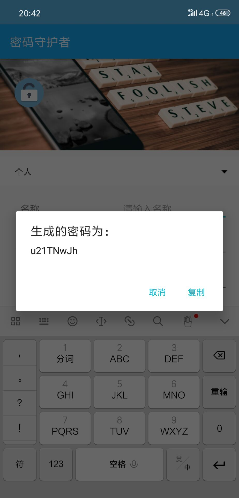
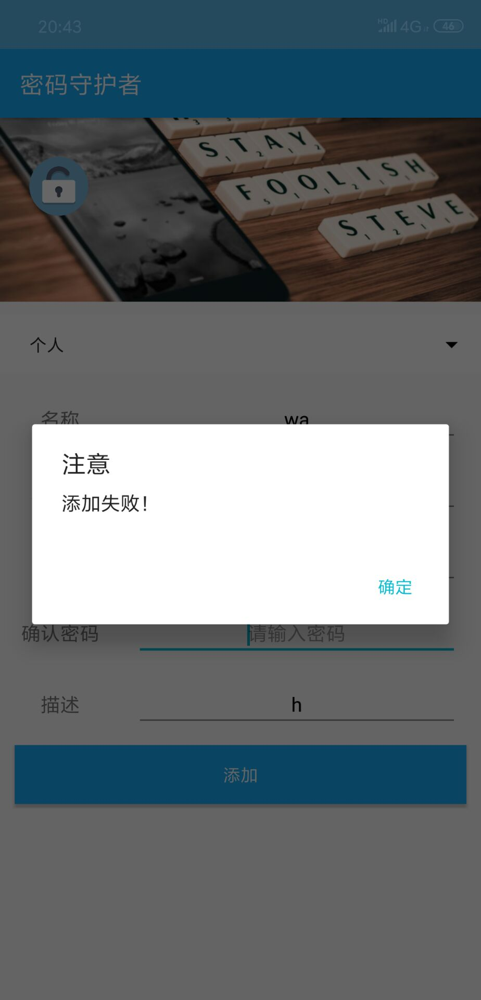
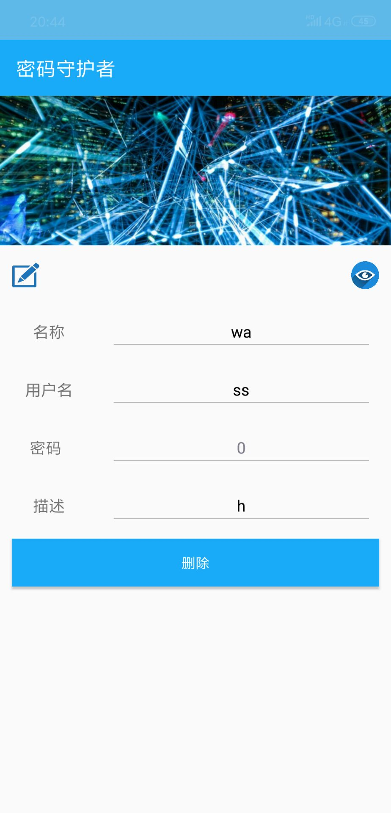
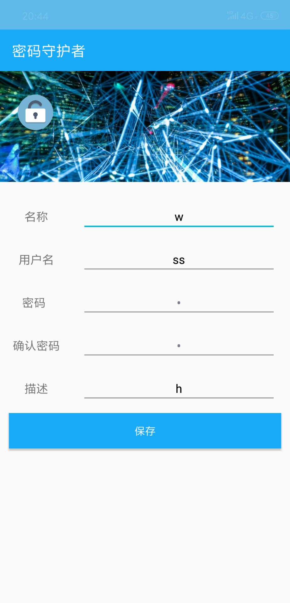

### 用户使用手册--PasswordKeeper

#### App说明

该应用实现了一个密码管理软件。用户首先需要创建一个针对于本app的用户名和密码，这样自己的密码就不会被其他人看到。然后登录之后进入主页面，自己的密码被分为各种类型，可以通过点击来查看各种类型的密码。添加密码的时候可以自动生成一段密码。自动生成的密码的格式可以进行设置。密码加密过后被保存到数据库当中。

#### 使用方式

- 打开应用，产生一个初始的页面，3秒后进入注册页面。

  

  

- 然后输入用户名和密码，来创建一个用户。初次打开页面的话是注册页面，注册之后再打开就是登录页面。

  

- 登录失败的话会提示密码不正确

  

- 登录之后进入主页面

  

- 点击左侧的各种类型来显示保存的对应类型的密码。点击右下角的加号按钮进入添加密码页面。

  

- 点击上面的小锁按钮可以自动生成密码

  

- 密码的类型可以通过下拉框选择

  

- 输入不同的密码回添加失败

  

- 密码两次输入相同之后就会成功添加，回到主页面，添加的密码显示出来

  

- 点击新添加的密码可以显示密码详情，点击删除按钮会直接删除此密码。

  

- 按住“眼睛”按钮可以看到密码的内容

  

- 点击编辑按钮按钮可以进入密码的编辑页面

  

- 修改之后会显示修改后的密码

  

- 点击右上角的按钮弹出功能框

  

- 点击设置进入设置页面

  

- 点击开发者

  

- 由于时间问题，同步功能未实现。
