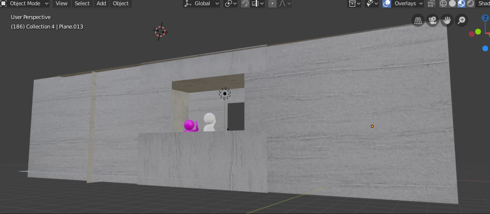
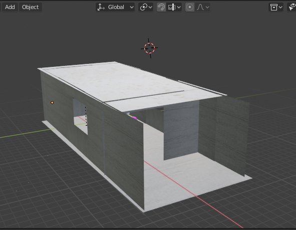

# 中山大学数据科学与计算机学院本科生实验报告

## （2019年春季学期）

| 课程名称 | 动画原理与网络游戏设计 |   任课老师   |        郑贵锋        |
| :------: | :--------------------: | :----------: | :------------------: |
|   年级   |         2016级         | 专业（方向） | 软件工程（数字媒体） |
|   学号   |        16340189        |     姓名     |        邵梓硕        |
|   电话   |      15902013516       |    Email     |  1315404687@qq.com   |
| 开始日期 |       2019.6.16        |   完成日期   |      2019.7.15       |

------

### 分工

- 人物模型的修改和绑定
- 部分场景搭建，灯光设置
- 0~200帧（约0~9秒）的人物动画

### 实现细节

#### 1. 人物模型的修改和绑定

人物模型原型由另一位组员制作：

原型有一个比较大的缺陷：身体有一个圆柱构成，没有所谓的“腰部”，实际上人的躯干主要有三个：胸腔、腹部/腰部、骨盆。因此采用原型的时候一些转身，后仰，前仰时会很不自然，修改的主要步骤：

- 在原躯干的基础上进行3次分割，进行2次以上是为了在弯曲的时候会更加自然
- 对最上方的部分进行形状上的修改，使之尽量符合人体结构
- 调整分割线的大小，形成有粗细变化的躯干

最终效果：

 

由于关节处有球体代表，因此利用自动权重比较合适，骨架由Blender自带的基本人类骨架去除胸部的骨头后，修改脊椎部分的比例来贴合蒙皮：

#### 2. 场景搭建

场景比较简单，是模仿一个小屋的空间。

外部预览：

主要包括：天花板、地面、四面墙、三扇窗户、一道门。都是由Plane物体构成。

在灯光上，一开始会出现虽然有灯光但是却没有光照效果在物体上，这是由于灯光的照射范围设置过短：

选择灯光 --》 属性面板 --》 灯光 --》半径

上面也可以看到一些其他的属性：颜色，高光等等，在下方也有关于阴影的设置，常用的是阴影的尖锐度。除此之外，灯光的位置也很重要。在原素材中是来自外界的自然光（忽略剧组的打光），但是对于现在的我们来说利用外界的光和室内的全局光照过于困难，因此我们之模仿了室内光照，将灯光放到了天花板中间，具体效果：

#### 3. 人物动画

复现部分：

##### 摄像机

从这段打斗中我们可以分析出它利用了三个主要机位：A斜后方机位1，AB之间的机位2，B斜后方的机位3。因此在实际制作过程中，这段我利用了三个摄像机，渲染出三个视频片段后通过剪辑得到最终的片段。

##### 摄像机表

| 摄像机 | 机位                                              | 镜头数 |
| ------ | ------------------------------------------------- | ------ |
| 1号机  | A的斜背后（五个经典机位中的2号位），可以看到B。   | 3      |
| 2号机  | A，B之间（五个经典机位中的3号机），可以看到A和B。 | 3      |
| 3号机  | B的斜背后（五个经典机位中的4号机），可以看到A。   | 2      |

这里还牵涉到怎么在渲染的过程中怎么切换到其他摄像机：

属性面板 --》 场景 --》 摄像机，渲染时选择相应的摄像机。

##### 人物动作

| 主要动作节点    | 1               | 2                        | 3                                   | 4                        | 5        | 6                  | 7                                | 8        |
| --------------- | --------------- | ------------------------ | ----------------------------------- | ------------------------ | -------- | ------------------ | -------------------------------- | -------- |
| A（**邹兆龙**） | 屈臂对B进行肘击 | 反身用另一只手臂进行攻击 | 抓住B的肩膀跳跃，并在下落时进行肘击 | 后仰回避                 | 右脚踢击 | 连续向前直击双拳   | 大幅度挥臂攻击。从下方向上拳击   | 右拳击   |
| B（**甄子丹**） | 回避            | 单臂防御                 | 弯腰，被肘击时进行单臂防御          | 顺势用另一只手臂挥臂反击 | 左臂防御 | 两臂弯曲在头前防御 | 单臂防御挥臂，单手向旁边推开拳击 | 右转回避 |

上方列出了这200帧中的主要动作，其中一些动作的难度较大，有些则可以基本上复制粘贴使用，分别取一个例子来说一下：

##### （1）5号动作节点

5号动作节点的主要动作是A的踢击，然而单单用两个关键帧：初始的站立姿势，空中的踢腿姿势是远远不够的。这里需要了解一下动画的运动法则之二：预备动作和时间间距。

**预备动作**：运动对象要进行一个动作时，会有一个向相反方向趋向的预备动作，比如A要跳起来踢向B，会有一个屈膝向下的蓄力动作

**时间间距**：动画中两个关键帧之间时间间隔越短，动作发生地越快，对于蓄力+踢击过程，为了显示踢击的力度，一般会让蓄力的时间 >> 踢击的时间，简单地调整节奏会让动作效果更好。

##### （2）6号动作节点

6号动作节点的主要动作是连续的直拳，因此省力的方法就是做好左直拳和右直拳的两个动作，之后直接复制粘贴这两个动作，只调节人物的水平位置即可。但也不是简单的平移即可，要注意人物的左右脚的移动，左脚向前保证右脚在原地，右脚向前保证左脚在原地，防止穿帮。

##### （3）速度曲线

就像上面讲的，动画师通过控制时间间隔来控制动作节奏，比如两个关键帧：屈臂和伸臂，来模仿直拳，但是想要实现的效果不同可能会有淡入（屈臂到伸臂的前半段时间较长）和淡出（屈臂到伸臂的后半段时间较长），这个可以在曲线图中进行调节。

#### 自动补帧的缺点

3D动画的优点，也是缺点之一：自动补帧，它使得动画师可以相比于传统动画师利用更少的枚数（动画师需要绘制的画面数）来实现动作，并且使动作更加流畅，但它也带来了相对于传统作画的劣势：打击感。

传统作画中会有许多方式来增加动作的打击感：空气特效、速度线、形变、模糊、周围环境的反应等等，在自动补帧的作用下，使得形变、速度线、模糊这些操作反而变得麻烦或不可靠，

另一个传统作画中打击感的优秀例子是两步作画，它只利用两个打击的过程：超长的蓄力/慢动作，夸张的打击结果，它没有“打击”这一个动作，直接在蓄力的后面接上了夸张的打击结果，在超长蓄力/慢动作的对比下会获得惊人的打击效果，这也是时间间距的实例，代表画师为日本的中村丰。而自动补帧由于它主要来赋予两个关键帧之间“过渡”，反而不利于这种方法的实现。

因此自动补帧下生成的动画往往打击感上会比不上传统动画，特别是像这样拳拳到肉的互博，我也只能尽量调整帧之间的速度变化来补救。

---

### 个人体会

我必须承认自己低估了这短短9秒的工作量，之前还打算每个人做20秒......认真扣起人物的动作、节奏、镜头的话根本没完没了，只能在有限的时间和能力里做到这个样子了。从进度报告中可以看出来决定内容画的时间和具体做的时间是差不多长的，其他科的作业堆到了一起也是一个原因，主要还是没想到时间会这么紧，任务这么重。课上学到的操作真的只是很小很小的一部分，用来做一个能看得上眼的动画还远远不够，而我也低估了这次的作业，导致只能用已学的知识和自己掌握的一些动画原理尽量让它变得不那么“难看”了。看到自己做的部分剪好之后，虽然短，但还是有很多感触的，至少把它做出来了，一些动作也有点那感觉，虽然还长路漫漫，会绕弯路，但一直坚持下去总会有成果的。

