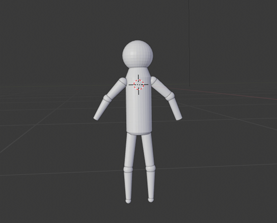
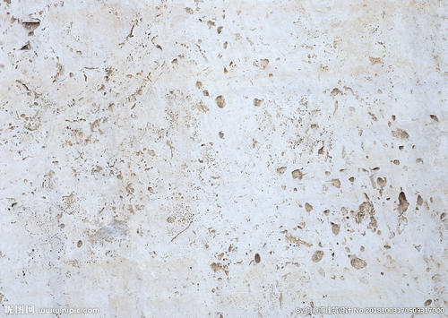
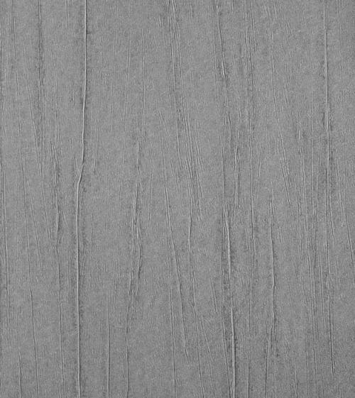
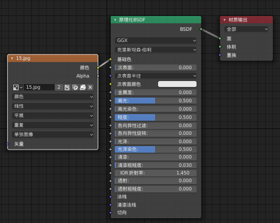
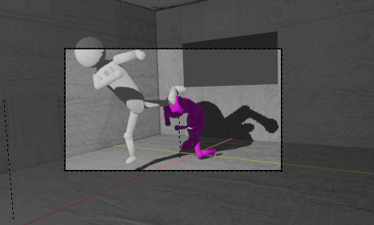
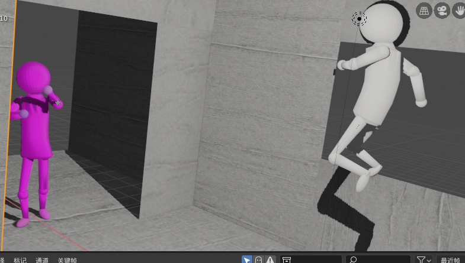

# 中山大学数据科学与计算机学院本科生实验报告

## （2019年春季学期）

| 课程名称 | 动画原理与网络游戏设计 |   任课老师   |        郑贵锋        |
| :------: | :--------------------: | :----------: | :------------------: |
|   年级   |         2016级         | 专业（方向） | 软件工程（电子政务） |
|   学号   |        16340210        |     姓名     |        王德超        |
|   电话   |      15213554491       |    Email     |   318015961@qq.com   |
| 开始日期 |       2019.6.16        |   完成日期   |      2019.7.15       |

------

### 分工

- 人物建模
- 部分场景及纹理设置
- 0~200帧（约0~10秒）的人物动画

### 实现细节

#### 1. 人物建模

以上是此次动画的模型原型。其主要的构成是由圆柱体和球体两个基本的几何体搭建起来的。骨关节和头部用球体实现，躯干、肢体等是通过圆柱体通过适当的变形、分割、平面内凸实现的，其中球的变化主要是放缩，躯干则涉及到insert face、面的平移，肢体则涉及到面的放缩，以此来实现肢体的一边大，一边小。具体的建模过程较为简单，在基础的几何体经过变形后通过简单的拼接来构造出，而变形的主要方法则是通过几何体点与面的平移、放缩来实现的。整体上模型的设计构思来自于火柴人。

#### 2. 场景与纹理

场景主要的搭建过程由另一位小组成员完成，我主要设计到对于场景的一些细节之处的修改，包括场景多余面板的删除、适当添加新的面板。

对于场景我主要负责的还是纹理部分，纹理采用的是图片纹理。整个场景中采用了两幅图片，分别用于天花板、地板、墙壁，其中地板和墙壁采用同一个纹理，类似于水泥地那种，而天花板这采用的大理石类似的。而任务采用的主要是纯色的纹理，一个灰白色，一个为紫色。图片纹理如下：

大理石：

水泥地：

添加纹理的方法简单，只要在rendering栏中为每个对象创建新的纹理即可。并添加新的图片纹理，选择对应图片变生成了对应的纹理。然后将为作为要渲染物体的基础色即可。如下图：

#### 3. 人物动画

复现部分：

##### 摄像机

这里只采用了一个摄像机，主要位于三个位置，分别关注不同打斗动作。

##### 摄像机表

| 摄像机  | 场面                                                       |
| ------- | ---------------------------------------------------------- |
| 1号位置 | 白色人物回旋踢，紫色人物前翻滚。白色任务飞踢，紫色人物后退 |
| 2号位置 | 白色人物踩窗飞踢                                           |
| 3号位置 | 白色人物重拳，紫色人物格挡                                 |

##### 人物动作

| 主要动作节点    | 1          | 2                | 3            | 4        | 5        |
| --------------- | ---------- | ---------------- | ------------ | -------- | -------- |
| A（**邹兆龙**） | 回旋踢     | 奔跑飞踢         | 踩窗飞踢     | 奔跑重拳 | 摆手奔跑 |
| B（**甄子丹**） | 前滚翻躲避 | 单臂防御并向后退 | 单臂继续防御 | 双手格挡 | 弓背防御 |

以上是一些主要的动作，其它的诸如什么奔跑、手的摆放姿势和脚的摆放姿势没有细说。当然那个以上也是动作的主要难点。其中回旋踢和踩窗飞踢都不是那么容易实现的。回旋踢的摆姿在我看来是最难的了，动不动就会出现摆姿的变形，而且两个关键帧之间的间隔也不掌握，很容易是动作的连续性变得很别扭。加上模型上本身上的一些缺点，摆姿显得困哪，尤其是涉及到腿部摆姿时，脚以抬高就会使模型的变形很严重。所以说涉及到腿部摆姿时，比如那几个踢腿的动作，工作量相比于仅仅是手的摆姿，难度有所提高。下面是回旋踢和踩踩窗飞踢的截图：

### 过程中的不足

虽然整体上看上去有动画的效果，各个关键帧之间的间隔在我看来是很难把握的。我在这次的效果中对于关键帧的间隔的把握不是很好，导致最终总体上的效果中任务的动作显得很不自然，如果连个动作之间的间隔太长，则动作的连续性上显得很僵硬，如果间隔太多，那么动多切换的太快，则又会动作不够清楚。所除了摆姿，对于关键帧的间隔把握也很重要。然而我在之后才明白这一点，导致有些动作有些僵硬，虽然后来也试图修改关键帧的位置来改善效果。但是由于多个物体各自的关键帧是相互关联的，同时又有并不是玩去哪同步的，修改一个对象的关键帧的话，其它的对象也必须修改，这样就得冒一个风险，一旦修改之后，多个对象之间的关键帧对应不上，就会使得整体的效果显得很‘莫名其妙’。最终我保持了原来的效果。

---

### 个人体会

首先谈谈自己的收获，最重要的收获是blender的使用。毕竟除了开学之初使用blender建模动画之后就没再用过，所以操作上陌生了很多。经过这次动画大作业的洗礼，对于blender建模、纹理和动画制作上的熟练度有所提升。自己也认识到动画制作不仅仅是将动画的关键帧做出来就可以了，对于关键帧的选取、间隔控制也显得很重要。尤其是在利用计算机自动补全其它的帧的时候，由于计算机是简单的线性差值来补帧，如果帧间间隔搞不好，动画就会显得别扭，过慢，动作僵硬；过快，动作不清楚，所以会所无论是怎样的，关键帧的选取和间隔控制都必须足够重视。最后在说说自己对于此次大项目的过程的体验。刚开始，感觉没多少内容，毕竟有了第一次的动画的事件经验，感觉不会太复杂。而在实际的操作中，确实不复杂，但是工作量却很大，一个简单的在平常看起来再简单不过的踢腿动作，也要花很长时间去摆姿啊，原本一个下午搞完，最总成功地拖到了晚上，而且还是在最终的效果缩水的情况下。在这个摆姿的过程中，短时间还好，时间长了就会让人很烦躁，就好像在很大袋米中寻找小石子的那种感觉，很烦但是又无可奈何。所以说，这个摆姿的过程我算是见识了。不过，最终还是有一个几秒的效果出来了，感觉也不错，有所成就。