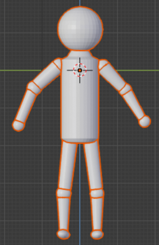

# 中山大学数据科学与计算机学院本科生实验报告

## （2019年春季学期）

| 课程名称 | 动画原理与网络游戏设计 |   任课老师   |      郑贵锋       |
| :------: | :--------------------: | :----------: | :---------------: |
|   年级   |         2016级         | 专业（方向） | 软件工程（电政）  |
|   学号   |        16340211        |     姓名     |      w王广浩      |
|   电话   |      17620124723       |    Email     | 1299927852@qq.com |
| 开始日期 |       2019.6.16        |   完成日期   |     2019.7.15     |

------

### 分工

- 人物模型的创建和修改
- 200帧（约8秒）的人物动画

### 实现细节

#### 1. 人物模型的创建和修改

人物模型原型由我和另一个队友合作制作：

 

原型是一个比较基本的火柴人，驱赶部分是一个整体的圆柱，顶部进行了处理，形成了脖子。下身分为3部分：大腿、小腿、脚。胳膊同样分为3个部分，与骨骼类似。头部直接采用了一个球体。在附加骨骼和蒙皮后，发现在做一些比较大幅度的动作时，骨骼会整个露出，同时动作也很不自然。主要是在躯干部分。原因是我们采用了内置的人体骨架，对于躯干部分，采用了3块骨骼，解决办法是在圆柱上进行细分，将圆柱面分割为几个部分。

#### 2. 人物动画

复现部分：

##### 人物动作

| 主要动作节点    | 1      | 2                        | 3            | 4                           | 5        | 6        | 7                  | 8            |
| --------------- | ------ | ------------------------ | ------------ | --------------------------- | -------- | -------- | ------------------ | ------------ |
| A（**邹兆龙**） | 右拳击 | 左拳击                   | 右拳击       | 双手抓住B的肩膀将其推倒墙上 | 左肘击   | 左肘击   | 左腿踢             | 左腿踢破箱子 |
| B（**甄子丹**） | 回避   | 反身用另一只手臂进行攻击 | 低头躲避攻击 | 双手抱A头                   | 左臂防御 | 右臂防御 | 两臂弯曲在头前防御 | 快速起身逃跑 |

动作中最难的应该是两次左腿踢，尤其是第二次，踢的同时移动，又踢破了箱子，做了很久这个动作，但是感觉还是不那么自然，尤其的右腿的摆放问题。其次就是甄子丹逃跑的动作，必须在脚到之前，还要弯腰抱头，同时是侧着躲避攻击的，这部分在很多的时间却插了7个帧。

摄像机采用了一个，对于不同的镜头，对摄像机进行位移变换和旋转变化，有一个变化幅度较大，画面出现了轻微的抖动。

---

### 个人体会

此次作业做的还是比较仓促的，这学期选了很多课都是期末项目的，到了第10周开始，整个时间都比较紧，虽然只有200帧的动画，但是插了近百个关键帧，同时要分别对两个人物和摄像机进行插帧，整个项目的工作量也是比较大的，虽然最后渲染只有近9秒。由于采用了一个摄像机，渲染出结果后也不需要过多的剪接，只要和队友的部分拼接在一起就可以了。整个来说，这次项目收获还是很多的，比之前做作业的时候用到的东西多了很多，大部分还是需要从网上查找资料。

