# 中山大学数据科学与计算机学院本科生实验报告
## （2019年春季学期）
| 课程名称 | 动画原理与网络游戏设计 | 任课老师 | 郑贵锋 |
| :------------: | :-------------: | :------------: | :-------------: |
| 年级 | 2016级 | 专业（方向） | 电政 |
| 学号 | 16340211 | 姓名 | 王广浩 |
| 电话 | 17620124723 | Email | 1299927852@qq.com |
| 开始日期 | 3.18 | 完成日期 |3.19|

---

## 一、实验题目

PAOGD个人作业1-弹出的小球-简单建模、插值动画

---

## 二、实现内容

- 镜头1：小球在盒子中

- 镜头2：盒子底部升起，小球被弹出

- 镜头3：小球掉落在地

- 镜头4：小球从地面反弹

- 镜头5：小球平稳落下

#### 实现要求

- 利用关键帧插值的方式完成动画
- 在动画过程中体现物体的旋转、平移、形变等
- 利用shape key控制物体形变
- 利用曲线编辑器graph editor调整物体在动画过程中的属性变化
- 加分项：尝试给物体添加材质或纹理，使动画更加美观
- 在满足要求的前提下可适当自由发挥

---

## 三、实验结果
### (1)实验截图

**小球在盒子里**

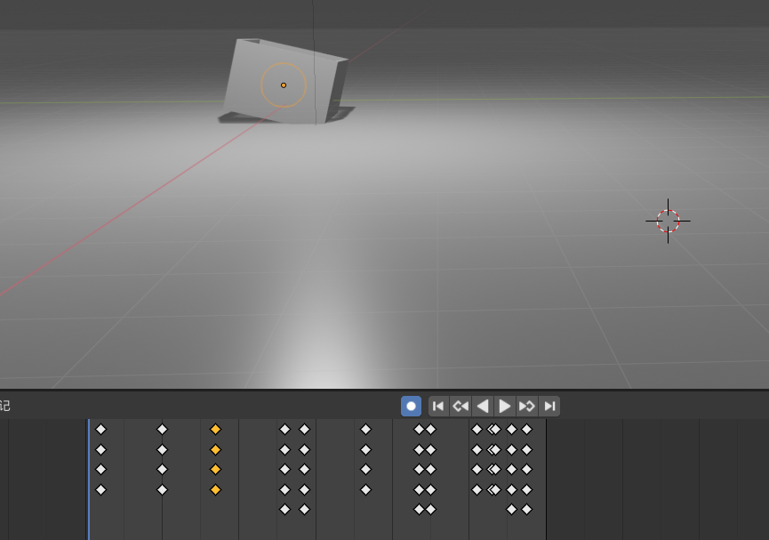

**小球和木板到达盒子顶部**

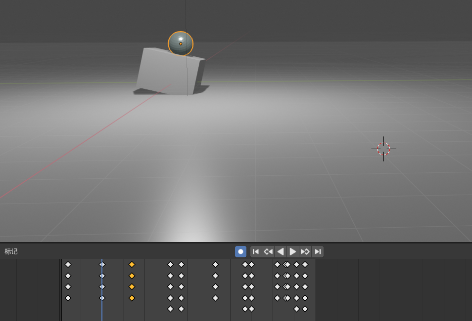

**小球旋转飞出到最高点**

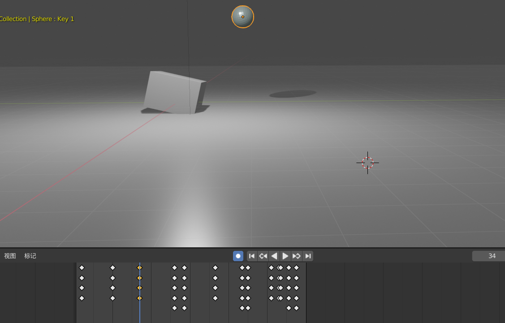

**小球第一次落地，可以观察到轻微形变**

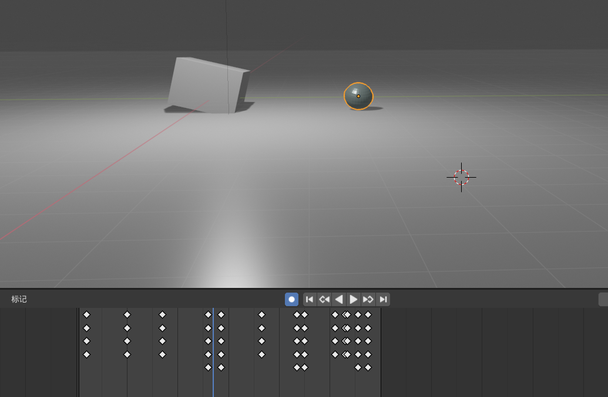

**小球弹起**

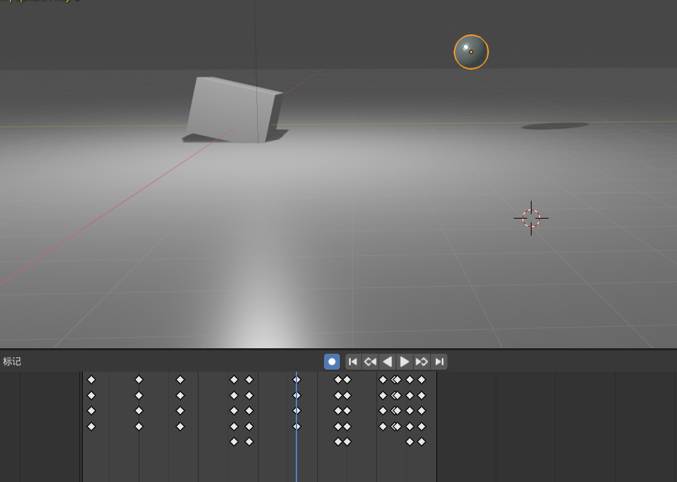

**小球再次落地，发生形变**

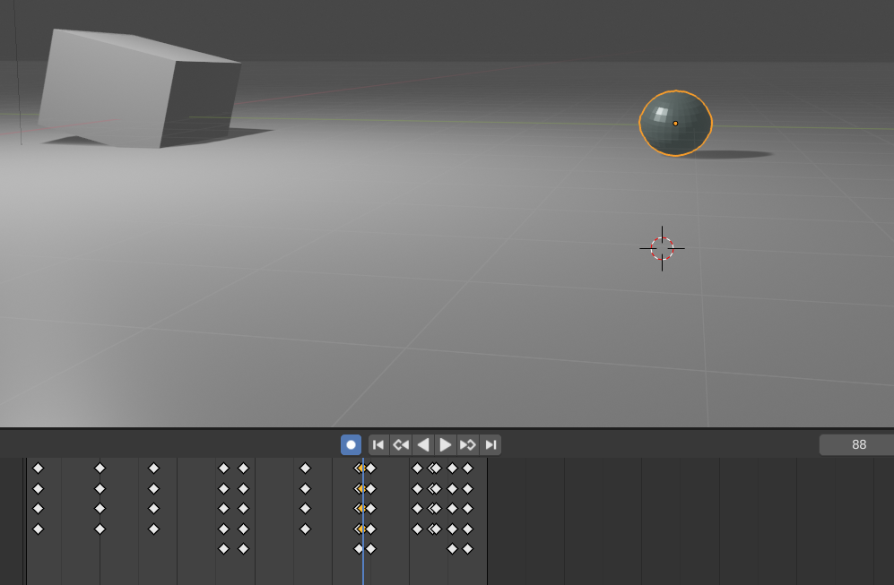

**小球弹起的瞬间，恢复为球形**

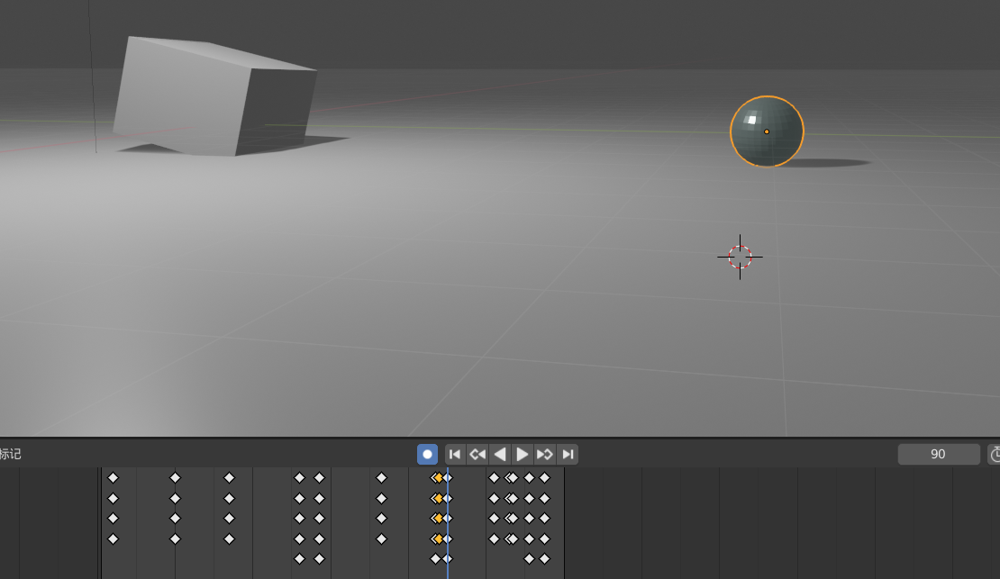

**小球最终停止**

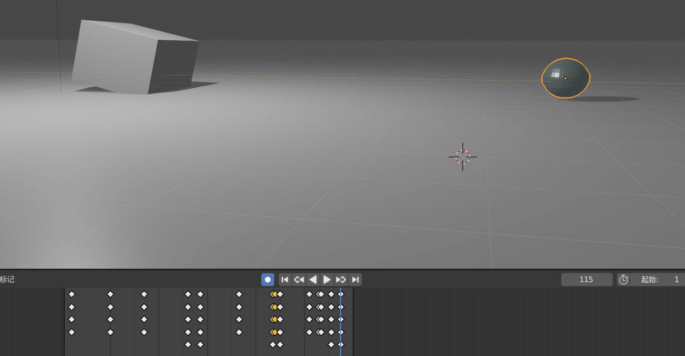

**正方体shape key以及graph editor**

 

 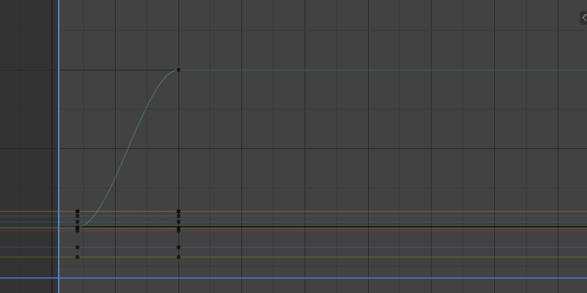

**球体shape key以及graph editor**

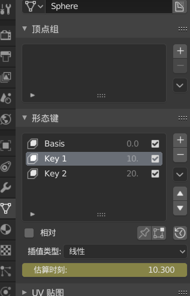 

 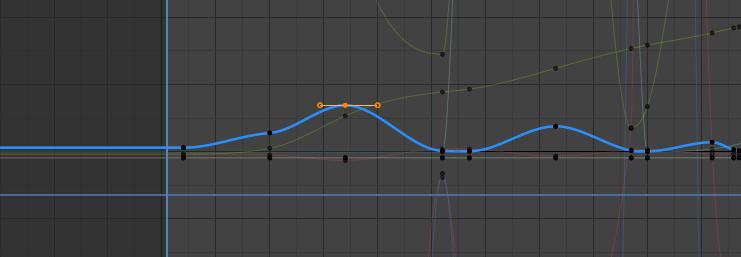 

### (2)实验步骤

1. 添加一个正方体、平面和球体，调整位置和大小。
2. 为正方体和球体添加shape key
3. 对于每个key，在编辑模式下修改正方体和球体的形变
4. 设置插值动画，在特定位置插入关键帧
5. 在shape 中，对应的形态键时刻插入关键帧
6. 在graph editor中修改球体和正方体的运动曲线
7. 为球体设置材质，修改为深灰色

### (3)实验遇到的困难以及解决思路

shape key如何插入到动画中：本来一直是想将key添加到关键帧上，但是没有作用，之后看了一些视频，发现是将关键帧插入到key上

---

## 四、实验思考及感想

本次对于render还不是很熟悉，所以就做了球体的染色，本来想在球体上插入图片的，总体来说，经过这次实验，对于blender的操作熟悉了一些，不像之前只是看了视频，发现实操起来，还是有些难度的，可能是初步接触的原因，再接再厉。