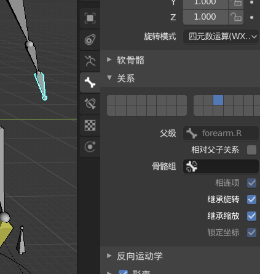

# 中山大学数据科学与计算机学院本科生实验报告
## （2019年春季学期）
| 课程名称 | 动画原理与网络游戏设计 | 任课老师 | 郑贵锋 |
| :------------: | :-------------: | :------------: | :-------------: |
| 年级 | 2016级 | 专业（方向） | 电政 |
| 学号 | 16340211 | 姓名 | 王广浩 |
| 电话 | 17620124723 | Email | 1299927852@qq.com |
| 开始日期 | 4.8 | 完成日期 |4.12|

---

## 一、实验题目

PAOGD个人作业2-角色动画基础

---

## 二、实现内容

实现一个简单的行走循环动画

#### Tips

- 导入模型,得到角色网格（根目录下的stickman.obj或其他模型，可自己构造，在report中说明）
- 在角色网格的基础上创建基础骨架(Armature)

- 为骨架添加约束器,利用反向运动学(Inverse Kinematics)实现腿部装配

- 进入权重绘制(Weight Paint)模式修改顶点权重

- 在动作编辑器(Action Editor)模式创建行走动作

- 利用姿态镜像使创建的动作可循环
- 在NonLinear Animation模式下重复Walk动作

- 添加曲线,并让小人沿着曲线行走
- 合理地摆放、控制镜头

---

## 三、实验结果
### (1)实验截图

#### 人性骨架

 

 

####  父子关系：

躯干与大腿：

 

##### 大腿与小腿：

 

#####  躯干与胳膊：

 

##### 三段胳膊：

 

 

##### 躯干与头部：

 

##### 脚没有父：

 

##### 脚掌与指向骨骼

  

#### 反向运动学

在小腿处设置IK：

目标为脚掌，极向目标为小腿前面的骨骼，链长设置为2

 

另一只小腿同样进行设置：

 

#### 蒙皮权重：

 

#### 在动作编辑器(Action Editor)模式创建行走动作：

 

#### 曲线编辑器：

 

 

#### NonLinear Animation模式下重复Walk动作：

 

#### 成品：

 

### (2)实验步骤

1. 导入模型，将模型移到中心，将其关于X轴对称。
2. 在模型的基础上，创建骨架
3. 设置骨骼约束、反向运动学
4. 进行蒙皮，设置自动权重，再进行局部修改
5. 创建一个圆环，命名为manControl，设置为模型和骨架的父级
6. 在动作编辑器(Action Editor)模式创建行走动作
7. 在NonLinear Animation模式下重复Walk动作
8. 在graph editor中修改manControl的运动曲线
9. 设置照相机锁定到模型

### (3)实验遇到的困难以及解决思路

- 在模型的基础上创建骨架：难点主要在与模型之间的拟合，在手臂和腿上设置多段骨骼
- 设置行走动作：使用反向运动学，使用脚掌控制大腿的运动，同时设置极向骨骼，控制大腿方向
- 如何控制模型位移：在网上找到一个教程，在脚下创建一个圆环，设置为模型和骨架的父级，当圆环移动的同时，骨骼与模型同时进行移动。

---

## 四、实验思考及感想

本次加深了对于render的熟悉，使用了骨骼、反向运动学、蒙皮、曲线编辑器、NLA等