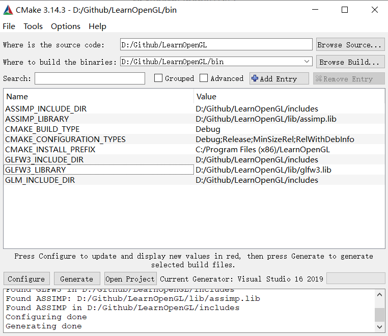
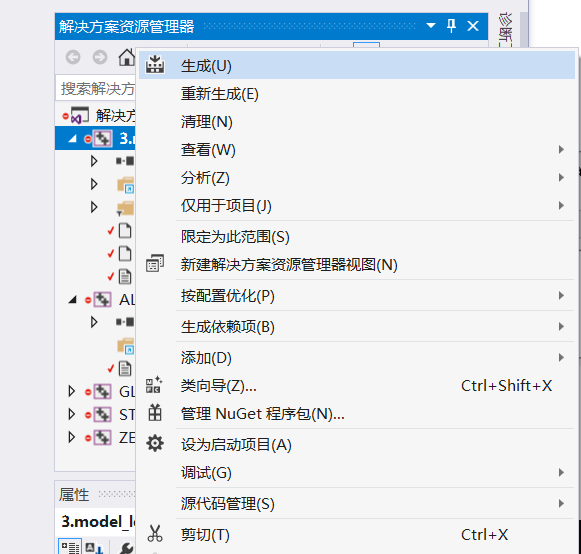
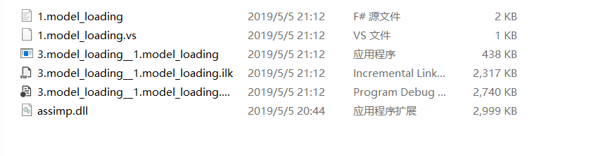
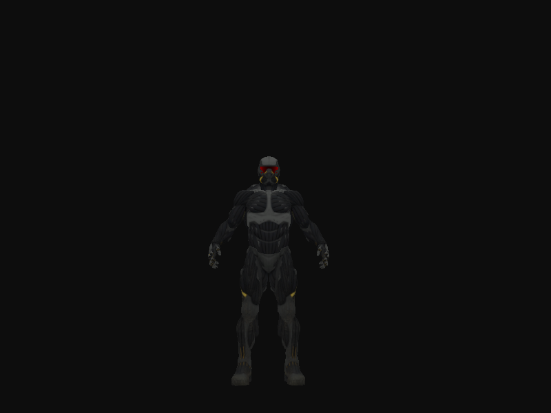
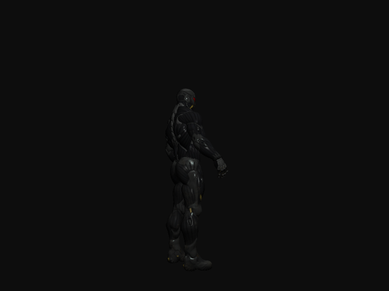
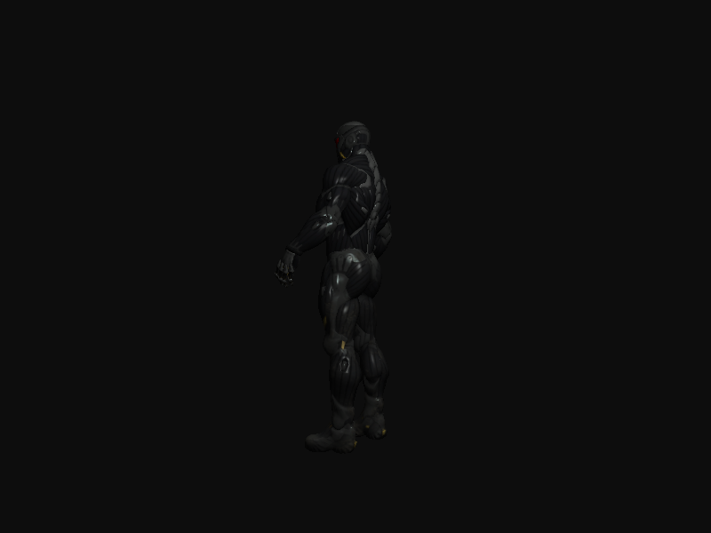
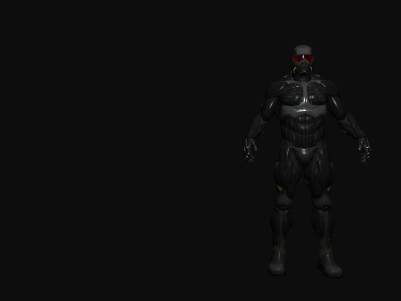
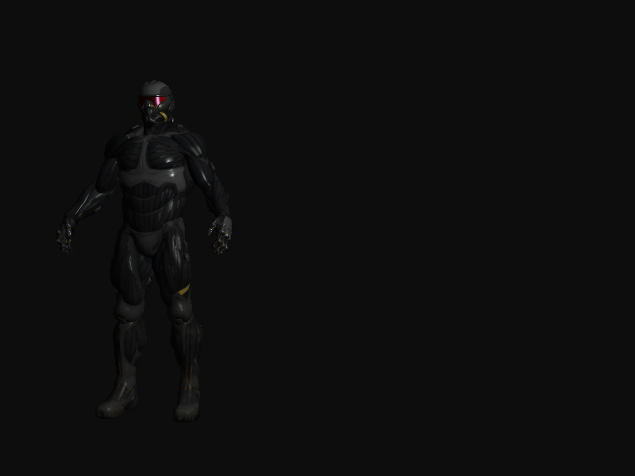
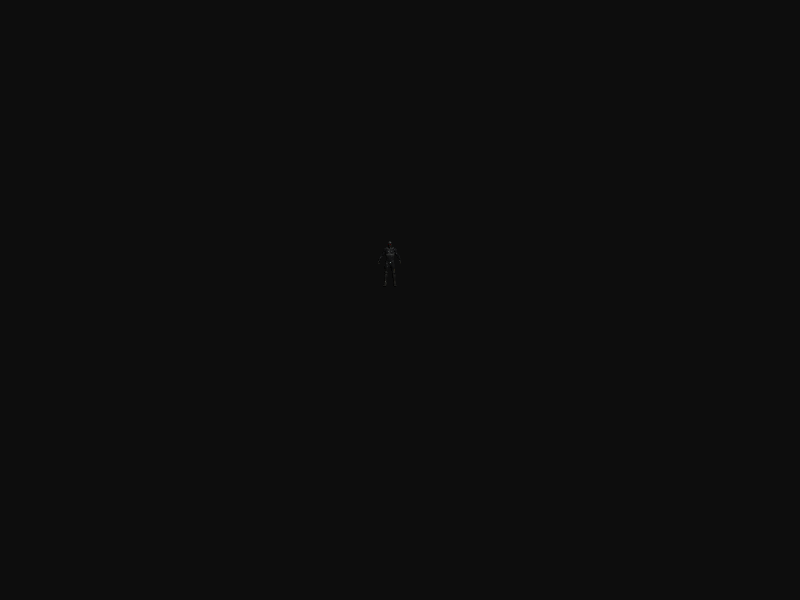
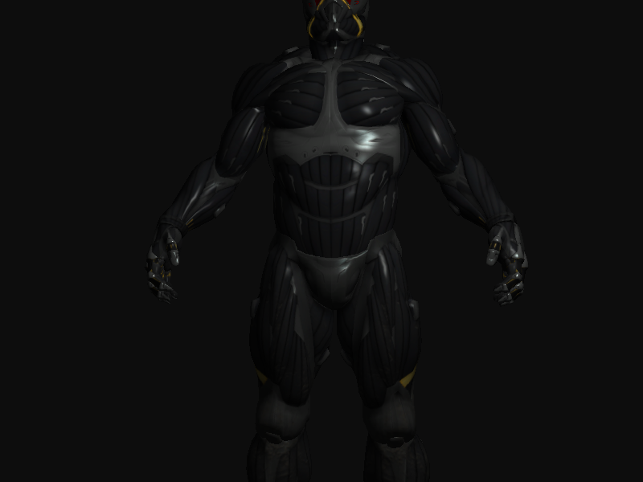

HW3 OpenGL初步

### 重要资源

- [教程:https://learnopengl.com/](https://learnopengl.com/)
- [代码仓库:https://github.com/JoeyDeVries/LearnOpenGL.git](https://github.com/JoeyDeVries/LearnOpenGL.git)

现代OpenGL编程的基础知识都可以在教程跟范例代码中找到

### 开发环境要求

- **Ubuntu 16.04** 
- OpenGL 3.3
- GLFW
- GLAD

### DeadLine: 5月5日 **22** 点

### 安装教程

1. `apt-get install g++ cmake git`
2. `apt-get install libsoil-dev libglm-dev libassimp-dev libglew-dev libglfw3-dev libxinerama-dev libxcursor-dev libxi-dev`
3. `git clone https://github.com/JoeyDeVries/LearnOpenGL.git`
4. `cd LearnOpenGL`
5. `mkdir build`
6. `cd build`
7. `cmake ..`
8. `make -j8`

编译完成后,各章节Demo可执行文件会在build/bin 目录下

### 任务

- 在model loading的Demo中, 示范了如何在OpenGL中导入一个.obj文件
  - 运行范例程序,我们会看到如下画面.同时,我们可以利用鼠标和键盘(WASD),控制镜头的移动
    
- 试编写一个程序,实现模型自身的旋转,平移,缩放
  - 功能需求: 
    - 按下J键, 模型随着时间绕着自身Z轴旋转
    - 按下K键, 模型沿着水平方向往复移动
    - 按下L键, 模型在一定范围内不断放大缩小
- **注意**
  - **不允许提交所有的范例程序**,请务必新建工程并重新编写CMakeList.txt
  - 确保在你的个人目录下,代码能够独立地编译和执行
  - 确保只保留必要的代码和资源等文件(可以复用范例代码中的文件)
  - 不要上传build目录下的内容
- 报告要求
  - 你是如何利用CMake生成你的可执行程序的
  - .obj格式的文件是怎么保存模型信息的
  - OpenGL与Blender的联系?
  - OpenGL中的坐标系统是怎么样的
  - 你是如何实现功能需求的(简述思路)
  - 你的工程中包含了哪些文件,这些文件的作用是什么

### 提交要求及命名格式

- /src 存放项目文件
- /report 存放项目报告

### 个人项目提交方式

1. 布置的个人项目先fork到个人仓库下；
2. clone自己仓库的个人项目到本地目录；
3. 在个人项目中，在src、report目录下，新建个人目录，目录名为“学号+姓名”，例如“**12345678WangXiaoMing**”；
4. 在“src\12345678WangXiaoMing”目录下，保存项目，按要求完成作业
5. 实验报告以md的格式，写在“report\12345678WangXiaoMing”目录下；
6. 完成任务需求后，Pull Request回主项目的master分支，PR标题为“学号+姓名”， 如“**12345678王小明**”；
7. 一定要在deadline前PR。因为批改后，PR将合并到主项目，所有同学都能看到合并的结果，所以此时是不允许再PR提交作业的。 


### 实验结果

使用 CMake 生成可执行程序

版本3.14.3

修改learnOpengl文件：

* `src` 保留 `3.model_loading`文件夹
* `CmakeLists.txt`：删除对应文档结构中除3的 `set`

* 创建 `bin` 目录，用以保存生成的项目文件
* 在 Cmake 中进行 MakeFile 生成 VS2019 的项目文件
* 先进行Configure 在进行Generate 最后进行Open Project，个人选择的是vs2019 win32



在 VS 2019中打开，在解决方案中右键选择生成解决方案。

 

运行后发现确少assimp.dll，直接在dll文件中找到assimp源码放到可执行文件夹



运行可执行程序



可以进行wsad进行移动

#### `.obj` 格式的文件是怎么保存模型信息的

obj文件是3D模型文件格式。OBJ文件是一种文本文件，可以直接打开进行查看和编辑修改。

OBJ文件不需要任何种文件头(File Header)，尽管经常使用几行文件信息的注释作为文件的开头。

OBJ文件由一行行文本组成，注释行以一个“井”号(#)为开头，空格和空行可以随意加到文件中以增加文件的可读性。有字的行都由一两个标记字母也就是关键字(Keyword)开头，关键字可以说明这一行是什么样的数据。多行可以逻辑地连接在一起表示一行，方法是在每一行最后添加一个连接符(\)。

#### OpenGL 与 Blender 的联系？

Blender 制作出的模型导出的 `.obj` 模型文件，在 OpenGL 中导入该模型。 OpenGL 对这个模型进行一些移动操作和模型的渲染。

* Blender Blender 是一款开源的跨平台全能三维动画制作软件，提供从建模、动画、材质、渲染、到音频处理、视频剪辑等一系列动画短片制作解决方案。blender是 3D 建模工具，用于各种精美复杂模型的制作。使用了 OpenGL 的接口来构建了一个开发平台，具有一系列完备的工具/部件。
* OpenGL（全写Open Graphics Library）是一个跨编程语言、跨平台的编程接口规格的专业的图形程序接口。它是一个功能强大，调用方便的底层图形库，包含了一系列可以操作图形、图像的函数。

#### OpenGL 中的坐标系统是怎么样的

- 局部空间 (对象坐标系 )：这是对象在被应用任何变换之前的初始位置和方向所在的坐标系，也就是当前绘图坐标系。该坐标系不是固定的，且仅对该对象适用。在默认情况下，该坐标系与世界坐标系重合。这里能用到的函数有glTranslatef()，glScalef(), glRotatef()，当用这些函数对当前绘图坐标系进行平移、伸缩、旋转变换之后， 世界坐标系和当前绘图坐标系不再重合。改变以后，再用glVertex3f()等绘图函数绘图时，都是在当前绘图坐标系进行绘图，所有的函数参数也都是相对当前绘图坐标系来讲的。如图则是对物体进行变换后，对象坐标系与世界坐标系的相对位置。对象坐标系也叫本地（局部）坐标系。
- 世界空间：世界坐标是OpenGL中用来描述场景的坐标，Z+轴垂直屏幕向外，X+从左到右，Y+轴从下到上，是右手笛卡尔坐标系统。我们用这个坐标系来描述物体及光源的位置。将物体放到场景中也就是将物体平移到特定位置、旋转一定角度，这些操作就是坐标变换。OpenGL中提供了glTranslate*/glRotate*/glScale*三条坐标变换命令，利用OpenGL的矩阵运算命令，则可以实现任意复杂的坐标变换。
- 观察空间 (眼坐标系)：眼坐标是以视点为原点，以视线的方向为Z+轴正方向的坐标系中的方向。OpenGL管道会将世界坐标先变换到眼坐标，然后进行裁剪，只有在视线范围(视见体)之内的场景才会进入下一阶段的计算。
- 裁剪空间： 眼坐标到裁剪坐标是通过投影完成的。眼坐标通过乘以GL_PROJECTION矩阵变成了裁剪坐标。这个GL_PROJECTION矩阵定义了视景体( viewing volume)，即确定哪些物体位于视野之内，位于视景体外的对象会被剪裁掉。除了视景体，投影变换还定义了顶点是如何投影到屏幕上的，是透视投影(perspective projection)还是正交投影(orthographic projection)。透视投影似于日常生活看到的场景，远处物体看起来小，近处看起来大。使用透视投影函数glFrustum()和gluPerspective().
- 屏幕空间 (屏幕坐标系)：通常将屏幕上的设备坐标称为屏幕坐标。设备坐标又称为物理坐标，是指输出设备上的坐标。设备坐标用对象距离窗口左上角的水平距离和垂直距离来指定对象的位置，是以像素为单位来表示的，设备坐标的 X 轴向右为正，Y 轴向下为正，坐标原点位于窗口的左上角。从NDC坐标到屏幕坐标基本上是一个线性映射关系。通过对NDC坐标进行视口变换得到。这时候就要用到函数glViewport()，该函数用来定义渲染区域的矩形，也就是最终图像映射到的区域。


#### 你是如何实现功能需求的(简述思路)

实现结果

添加控制按键

```
if (glfwGetKey(window, GLFW_KEY_J) == GLFW_PRESS)
		stateNow = TRANSFORMATION::ROTATE;
	if (glfwGetKey(window, GLFW_KEY_K) == GLFW_PRESS)
		stateNow = TRANSFORMATION::TRANSLATE;
	if (glfwGetKey(window, GLFW_KEY_L) == GLFW_PRESS)
		stateNow = TRANSFORMATION::SCALE;
```

按下 `J` 键，模型随着时间绕着自身 Z 轴旋转，使用 `glm::rotate` 函数，调用 `glfwGetTime` 来获取时间，根据时间的改变修改 

```c++
model = glm::translate(model, glm::vec3(0.0f, -1.75f, 0.0f));
			model = glm::rotate(model, (GLfloat)glfwGetTime() * glm::radians(50.0f), glm::vec3(0.0f, 1.0f, 0.0f));
			model = glm::scale(model, glm::vec3(0.2f, 0.2f, 0.2f));	
```





按下 `K` 键，模型沿着水平方向往复移动，使用 `glm::rotate` 函数，以及 `glfwGetTime` 函数来实现

```c++
model = glm::translate(model, (GLfloat)sin(glfwGetTime()) * glm::vec3(2.0f, 0.0f, 0.0f));
			model = glm::translate(model, glm::vec3(0.0f, -1.75f, 0.0f)); 
			model = glm::scale(model, glm::vec3(0.2f, 0.2f, 0.2f));	
```





按下 `L` 键，模型在一定范围内不断放大缩小，使用 `glm::scale` 函数和`glfwGetTime` 函数来实现缩放随时间的变化，缩放通过使用三角函数 `sin` 来实现

```c++
model = glm::scale(model, abs((GLfloat)sin(glfwGetTime()) * glm::vec3(2.0f)));
			model = glm::translate(model, glm::vec3(0.0f, -1.75f, 0.0f)); 
			model = glm::scale(model, glm::vec3(0.2f, 0.2f, 0.2f));
```






#### 你的工程中包含了哪些文件，这些文件的作用是什么

* `build`：生成的项目文件，在 VS 中生成解决方案后即包括最终的可执行程序（不需要提交）
* `cmake`：包含将在 Cmake 中用到的 `.cmake` 文件
* `configuration`：配置文件
* `dlls`：存放动态链接库
* `lib`：必要的库文件
* `includes`：头文件
* `resources`：资源文件（模型和纹理）（只保留本次作业的资源）
* `src`：源代码
* `CMakeLists.txt`：控制 Cmake 生成 bin 文件


