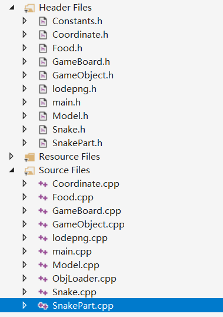
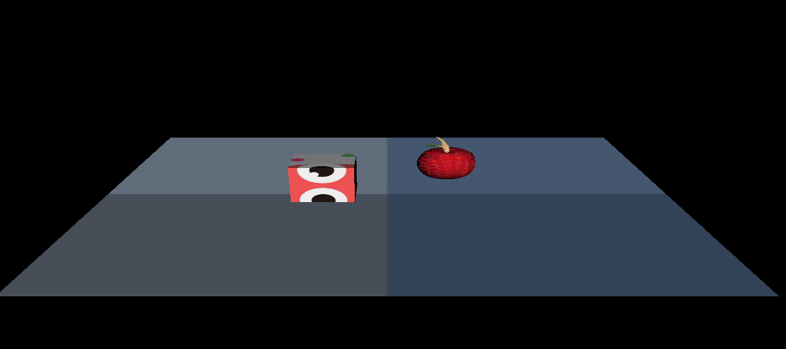
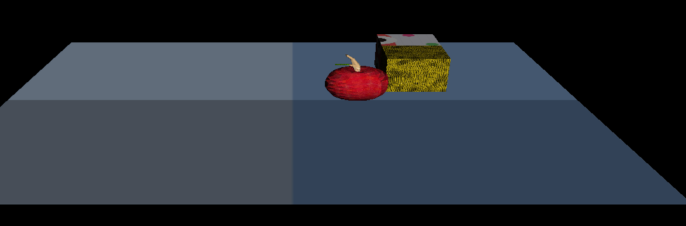
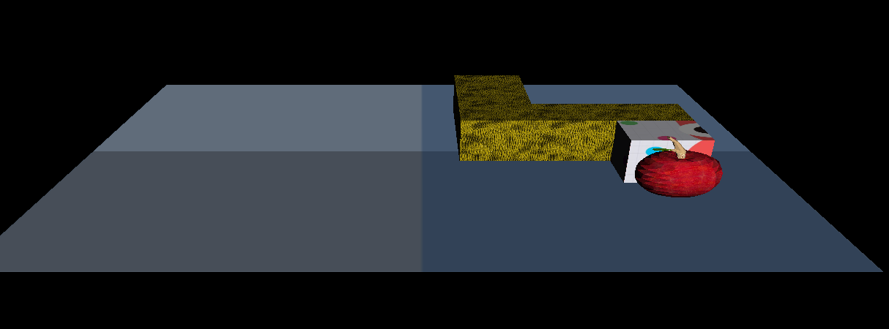
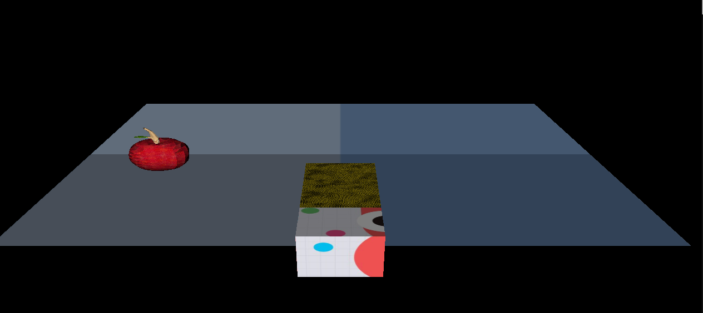

# HW4 利用OpenGL设计贪吃蛇游戏

#### 任务介绍
- 贪吃蛇游戏：玩家控制贪吃蛇在游戏区域里驰骋，避免碰到自己或障碍物，尽可能地吃更多的食物以生长！

##### 游戏玩法：
- WASD控制蛇的移动
- 游戏开始，每隔一定时间会在地图空闲位置刷新一个食物，蛇触碰到食物后食物消失，蛇会增加一个单位的长度
- 当蛇触碰到自己或者障碍物，则游戏失败
- 当蛇接触到地图边界，蛇会在地图另一端重新进入地图

#### 开发环境
- OpenGL3
- GLFW
- GLAD


#### DeadLine： 5月27日（周一）晚22点


#### Tips 一个简单的贪吃蛇游戏demo需要包括（代码以教程breakout为例） ：
1. 主程序：程序窗口管理、按键响应、游戏对象管理、状态传递（维护程序状态）

3. 精灵类：维护精灵状态，提供渲染接口

3. 工具类：管理着色器、纹理的加载（也有人习惯把这部分代码耦合到精灵类中!）

2. 游戏类：维护游戏状态，提供更新状态的接口供主程序调用，进行碰撞检测等


虽然一个完整游戏包含的内容远不止上面提到的四点，实现了这些内容，游戏的主体部分就大致完成了

#### 要求：
1. 完成贪吃蛇游戏的框架搭建（60%）
2. 完成蛇以及食物的 **3D** 精灵加载和渲染，其中模型可以用简单的纯色几何模型实现如立方体、球体；或者网上下载合适的3D模型如[Apple-Poly](https://poly.google.com/view/5hRReRDr0v4)、[Snake-Poly](https://poly.google.com/view/2ovwPNrRijL)（20%）
3. 实现蛇的控制（20%）
4. Bonus：蛇的碰撞检测与响应

#### 参考资料

1. [OpenGL游戏-框架设计](https://learnopengl.com/In-Practice/2D-Game/Setting-up)
2. [OpenGL游戏-精灵渲染](https://learnopengl.com/In-Practice/2D-Game/Rendering-Sprites)
3. [OpenGL游戏-碰撞检测](https://learnopengl.com/In-Practice/2D-Game/Collisions/Collision-detection)
4. [OpenGL模型创建](https://learnopengl.com/Getting-started/Hello-Triangle)
5. [Google Poly-3D模型库](https://poly.google.com)

## 实验结果：

### 项目环境

项目运行在VS2019 X86平台，使用的第三方库已经包含

### 项目框架



- `GameBoard`负责地图，同时监控蛇的操作以及是否吃了食物
- `GameObject`加载纹理
- `Snake`控制蛇头的转弯、生长、移动、旋转等
- `SnakerPart`控制蛇身的转弯、生长、移动、旋转等
- `Food`负责食物随机生成
- `main`主函数调用
- `ObjLoader`obj文件加载基类
- `Model`模型基类
- `lodepng`第三方库，加载png图片到模型
- `Coordinate`位置映射

### 实验结果：









##### 已实现：

- 游戏框架设计
- 模型加载
- 贪吃蛇的移动（WSAD）
- 根据位置做的碰到苹果吃的碰撞检测
- 吃果子后蛇身边长

##### 未实现

- 自身身体的碰撞检测
- 与边界的碰撞检测
- 地图上的未设置障碍物

#### 部分设计代码

蛇与果子的碰撞检测

```c
bool GameBoard::checkIfSnakeAteFood() {
	const float radius = 0.4;
	bool comparedX = comparePosition(radius, this->foodPosition.getX(), this->snakeHeadPosition.getX());
	bool comparedY = comparePosition(radius, this->foodPosition.getY(), this->snakeHeadPosition.getY());
	return (comparedX && comparedY);
}

```

检测到吃了果子后蛇身变长

```c
if (gameBoard->checkIfSnakeAteFood()) {
		std::vector<Coordinate> coordinates;
		for (auto &snakePart : snakeParts) {
			coordinates.push_back(snakePart.getCurrentPosition2());
		}
		food->respawnInNewPlace(4, gameBoard, coordinates);
		this->growing = true;
	}
void Snake::grow() {
	glm::mat4 M = glm::mat4(1.0f);
	SnakePart snakePart(&M, false, snakeParts[length-1].getDirection(), &this->tex);

	this->snakeParts.push_back(snakePart);
	
	this->length++;
	this->growing = false;
} 
```

蛇身的移动

```c
void SnakePart::move(Coordinate * coordinate, glm::mat4 * relativeM, float degree) {
	this->M = glm::mat4(1.0f);
	this->M = glm::rotate(*relativeM, 0.1f, glm::vec3(0, 1.0f, 0));
	this->M = glm::translate(*relativeM, glm::vec3(0, 1.0f, 0));

	this->M = glm::translate(this->M, glm::vec3(coordinate->getX(), 0.0f, coordinate->getY()));
	this->currentPosition.setX(coordinate->getX());
	this->currentPosition.setY(coordinate->getY());
}
```

食物随机生成

```c
this->M = glm::translate(*gameBoard->getM(), glm::vec3(randomTranslateX, 1, randomTranslateY));
	float newX = randomTranslateX;
	float newY = randomTranslateY;
	this->currentPosition.setX(newX);
	this->currentPosition.setY(newY);
	gameBoard->updateFoodPosition(this->currentPosition);
```

初始化模型

```c
	
	gameBoard.init("floor.png", "floor.obj");
	apple.init("apple.png", "apple.obj");
	snake.init("snake.png", "cube.obj");
	snake.setInitPosition(0, 1, 0);

void Snake::init(char *pathImage, char *pathObj) {
	this->snakeParts[0].init(pathImage, pathObj);

	std::vector<unsigned char> image;   
	unsigned width, height;   
	unsigned imageTextureLoadingStatus = lodepng::decode(image, width, height, "snakepart.png");

	glGenTextures(1, &this->tex); 
	glBindTexture(GL_TEXTURE_2D, this->tex); 
											 
	glTexImage2D(GL_TEXTURE_2D, 0, 4, width, height, 0,
		GL_RGBA, GL_UNSIGNED_BYTE, (unsigned char*)image.data());

	glTexParameteri(GL_TEXTURE_2D, GL_TEXTURE_MIN_FILTER, GL_LINEAR);
	glTexParameteri(GL_TEXTURE_2D, GL_TEXTURE_MAG_FILTER, GL_LINEAR);

	glEnable(GL_TEXTURE_2D);
    
   
```

蛇的控制

```c
	if (key == GLFW_KEY_A) {
			if (snake.getTurn() == 0) {
				snake.turnLeft();
			}
		}
		if (key == GLFW_KEY_D) {
			if (snake.getTurn() == 0) {
				snake.turnRight();
			}
		}
		if (key == GLFW_KEY_EQUAL) zoom -= 0.5;
		if (key == GLFW_KEY_MINUS) zoom += 0.5;
		if (key == GLFW_KEY_W) {
			if (speed != 100) speed -= 100;
		}
		if (key == GLFW_KEY_S) speed += 100;
```

